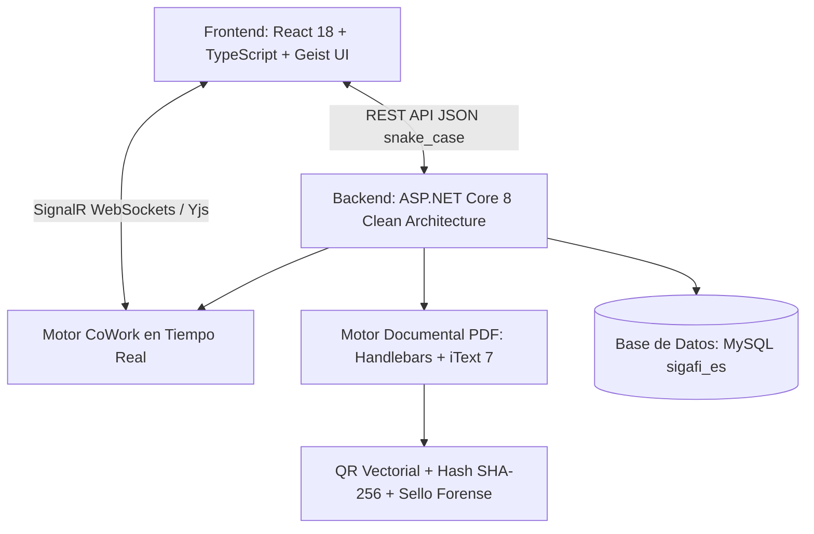
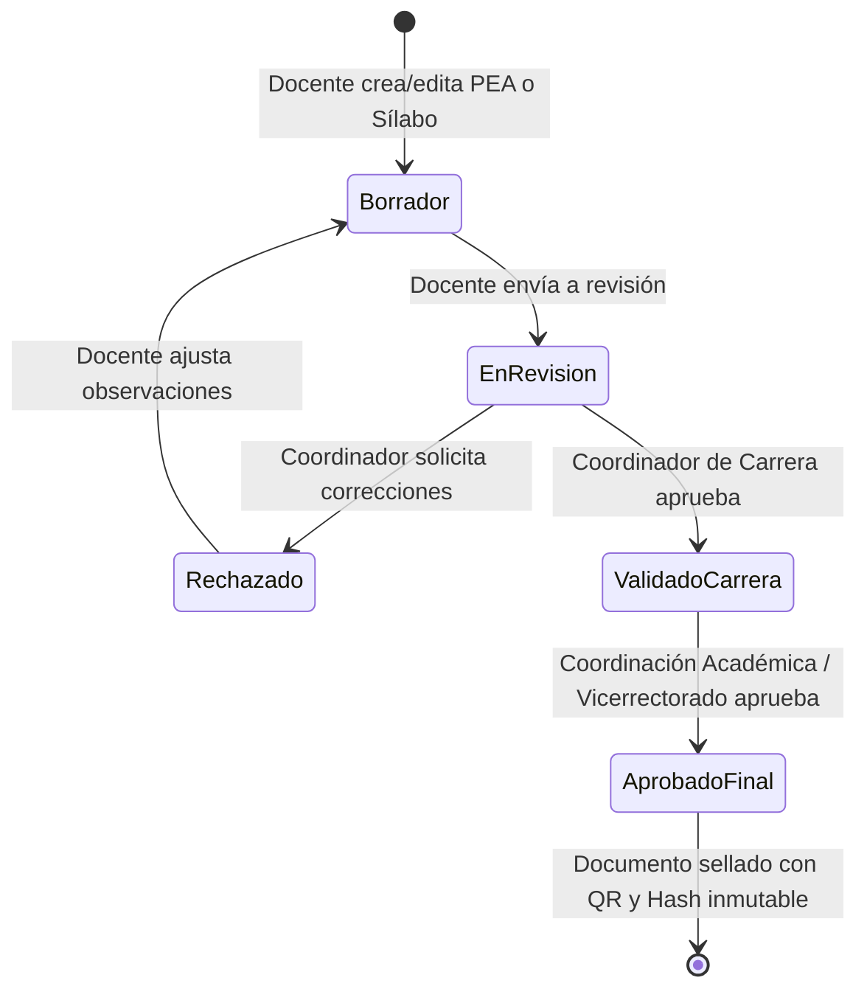

# DOSIER - Sistema Web de Gestión de Documentación Institucional Docente (ISTPET)

> **Documento de Contexto, Arquitectura y Hoja de Ruta para la Tesis de Grado**  
> **Institución:** Instituto Superior Tecnológico Mayor Pedro Traversari (ISTPET) — Quito, Ecuador  
> **Sistema:** Plataforma Clean Architecture DOSIER  
> **Repositorio Independiente:** `c:\Users\DESARROLLADOR\Desktop\Proyectos\dosier`

---

## 1. Visión General del Proyecto

**DOSIER** es un sistema web concebido para la gestión, co-redacción colaborativa y formalización de la documentación académica docente por períodos en el ISTPET. Automatiza la redacción del **Programa de Estudio de la Asignatura (PEA)**, **Planes Analíticos (Sílabos)**, **Guías Práctico-Experimentales (APE)** y **Guías de Estudio**, garantizando el cumplimiento matemático de las mallas curriculares vigentes y generando reportes oficiales listos para auditorías de acreditación del **CACES**.

### 1.1. Objetivos de la Tesis

* **Objetivo General:** Desarrollar un sistema web para la gestión de documentación académica docente por períodos en el ISTPET, para la redacción de PEAs y planes analíticos, validando la correspondencia de horas y créditos curriculares, generando una documentación docente acorde a los formatos institucionales oficiales.
* **Objetivo Específico 1:** Recopilar requerimientos e historias de usuario a partir del análisis de los 4 formatos oficiales institucionales.
* **Objetivo Específico 2:** Desarrollar los módulos lógicos (co-redacción en tiempo real, validación curricular matemática y generación PDF oficial).
* **Objetivo Específico 3:** Configurar y ejecutar el despliegue del sistema en la nube (AWS) para su acceso en producción por parte de los docentes.

---

## 2. Los 4 Documentos Oficiales del ISTPET

| # | Documento Oficial | Propósito y Contenido Clave | Regla de Negocio / Validación Crítica |
| :---: | :--- | :--- | :--- |
| **1** | **PEA (Programa de Estudio de la Asignatura)** | Datos generales, horas por componente, objetivos, prerrequisitos, resultados de aprendizaje de carrera/asignatura, unidades y firmas. | La suma de horas de contacto docente, práctico-experimental y autónomo debe coincidir con la malla curricular. |
| **2** | **Plan Analítico / Sílabo** | Matriz semanal de 19 semanas: distribución por componente (Docencia, APE, Autónomo), metodologías, semanas de evaluaciones parciales y final. | Validación matemática semanal: $\sum \text{Horas Semana} = \text{Total Horas Malla}$. Co-redacción síncrona entre docentes de la misma cátedra. |
| **3** | **Guía Práctico-Experimental (APE)** | Formato para cada práctica: fundamentos, objetivos, resultados de aprendizaje del PEA, rúbrica de evaluación, procedimiento paso a paso y normas de seguridad. | Vinculación obligatoria con los Resultados de Aprendizaje definidos en el PEA activo. |
| **4** | **Guía de Estudio** | Desarrollo de contenidos teóricos por unidades y temas, cuadros comparativos, preguntas guía y glosarios. | Mapeo directo de temas y subtemas establecidos en el PEA y el Sílabo. |

---

## 3. Arquitectura del Sistema

DOSIER cuenta con una arquitectura de alta disponibilidad y motores especializados probados en producción:

### 3.1. Motores Activos
1. **Motor CoWork (`SignalRDriver` + `Yjs` + `<CoWorkField>`):** Permite a múltiples docentes editar el mismo PEA o Sílabo al mismo tiempo sin sobrescribirse.
2. **Motor Documental PDF (`DocumentEngine`):** Renderiza plantillas HTML oficiales con Handlebars.Net y genera PDFs vectoriales con iText 7.
3. **Inmutabilidad Forense:** Cada documento aprobado genera un snapshot JSON (`data_snapshot_json`), un hash inmutable SHA-256 y un código QR de verificación pública sin login.
4. **Conexión Institucional (`sigafi_es`):** Conectado directamente a las tablas institucionales (`malla`, `detalle_malla`, `prerequisito`, `parcial`, `profesor`, `asignatura`).

---

## 4. Jerarquía de Roles y Flujo de Aprobación

DOSIER implementa la jerarquía académica institucional:

* **Docente:** Redacta y co-redacta PEAs, Sílabos y Guías APE de sus asignaturas asignadas en el período activo.
* **Coordinador de Carrera:** Revisa coherencia curricular y pertinencia de contenidos.
* **Coordinador Académico / Vicerrectorado:** Emite la aprobación final y firma de responsabilidad oficial.

---

## 5. Hoja de Ruta de Implementación (Paso a Paso)

### Fase 1: Limpieza del Chasis e Identidad DOSIER (Backend & Frontend)
* [x] Renombrar proyectos .NET a `dosier_api`, `dosier_domain`, `dosier_application`, `dosier_infrastructure`.
* [x] Adaptar modelos y servicios a la arquitectura de Portafolio Docente.
* [x] Renombrar frontend a `dosier_web`, purgar rutas no académicas y actualizar diseño Vercel Geist.
* [x] Actualizar reglas del proyecto (`.agents/AGENTS.md`) y skills (`backend-dosier`, `frontend-dosier`, `styles-dosier`).

### Fase 2: Modelo de Datos Curricular y Endpoints Base
* [ ] Mapear lectura de Asignaturas, Docentes y Períodos activos desde `sigafi_es`.
* [ ] Crear entidades y DTOs para **PEA** (`doc_pea`, unidades, resultados de aprendizaje).
* [ ] Crear entidades y DTOs para **Sílabo** (`doc_silabo`, matriz de 19 semanas).
* [ ] Implementar la función de **Herencia/Duplicación de período anterior** (ahorro del 80% de digitación).

### Fase 3: Plantillas Oficiales Handlebars (PDF)
* [ ] `pea_template.html`: Maquetación idéntica al formato oficial del ISTPET con logos, tablas y firmas.
* [ ] `silabo_template.html`: Maquetación de la matriz de 19 semanas y distribución horaria.
* [ ] `guia_ape_template.html`: Maquetación de la guía de prácticas de laboratorio/taller.
* [ ] `guia_estudio_template.html`: Maquetación para el compendio de estudio.

### Fase 4: Interfaces Web en React (Geist UI + CoWork)
* [ ] **Dashboard Docente:** Vista de materias asignadas en el período activo y estado de sus documentos.
* [ ] **Editor de PEA:** Formulario por secciones con CoWork en tiempo real.
* [ ] **Editor de Sílabo:** Matriz dinámica interactiva con **validador de horas en vivo** (alerta visual si la suma semanal no cuadra con la malla).
* [ ] **Editor de Guías APE:** Generación de prácticas asociadas al PEA.
* [ ] **Bandeja de Revisión y Aprobación:** Panel para Coordinador de Carrera y Vicerrectorado.

### Fase 5: Despliegue en AWS y Documentación de Tesis
* [ ] Configuración de contenedor Docker / Nginx / .NET 8 / MySQL.
* [ ] Despliegue en instancia AWS EC2 / RDS.
* [ ] Pruebas con docentes reales del ISTPET y recolección de métricas para la redacción de la tesis.
