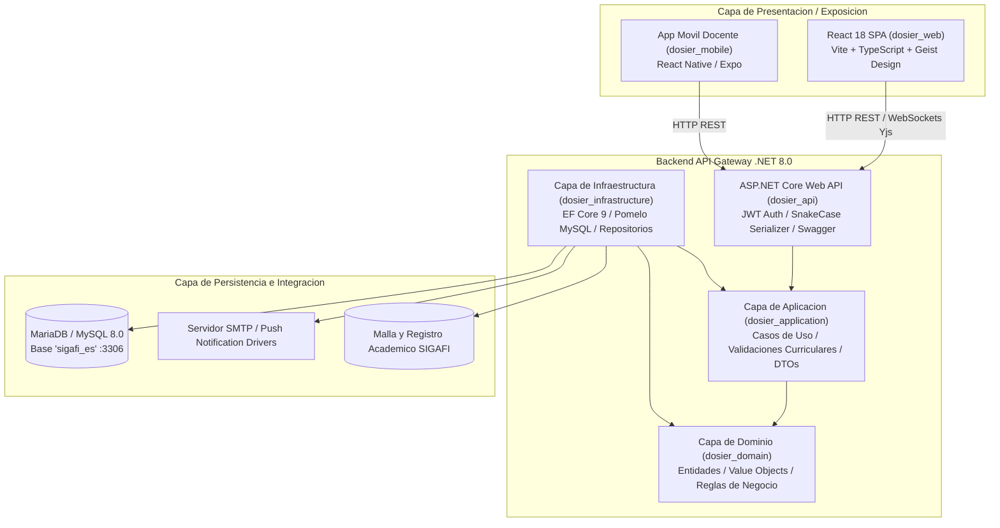
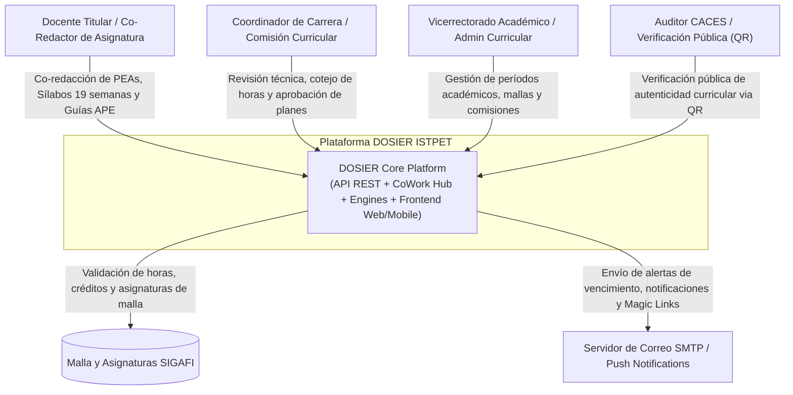
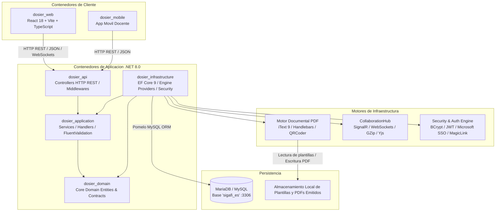

# Macro-Arquitectura del Sistema y Clean Architecture

## 1. Resumen Ejecutivo y Alcance del Sistema

**DOSIER** (*Sistema Web para la Gestión de Documentación Institucional Docente del ISTPET*) es la plataforma tecnológica institucional encargada de gestionar el ciclo de vida, co-redacción y validación de la planificación curricular docente en el Instituto Superior Tecnológico Mayor Pedro Traversari (ISTPET) de Quito.

El sistema resuelve la problemática de la manualidad y desarticulación en la elaboración de los cuatro documentos docentes oficiales de la institución:
1. **Programa de Estudio de la Asignatura (PEA)** — Nivel Macro-Curricular.
2. **Plan Analítico o Sílabo (19 Semanas)** — Nivel Meso-Curricular.
3. **Guía de Prácticas de Aprendizaje Práctico-Experimental (Guías APE)** — Nivel Micro-Curricular.
4. **Guía de Estudio Institucional** — Material pedagógico de acompañamiento al estudiante.

El sistema está diseñado bajo estrictos criterios de integridad matemática (correspondencia de horas en los componentes de docencia, práctico-experimental y autónomo vs. malla curricular vigente), inmutabilidad forense (SHA-256), trazabilidad, firma digital y acreditación institucional ante el CACES, bajo el marco de la LOES, el Reglamento de Régimen Académico (RRA) y la LOPDP.

---

## 2. Visión General de la Arquitectura de Solución

La solución adopta un modelo desacoplado basado en una aplicación de página única (SPA) en el Frontend y una API RESTful construida bajo Clean Architecture (Arquitectura Limpia) en el Backend.

---

## 3. Diagramas de Arquitectura C4

### Nivel 1: Diagrama de Contexto del Sistema

El diagrama de contexto ilustra los actores principales que interactúan con DOSIER y los sistemas externos integrados.

### Nivel 2: Diagrama de Contenedores

El diagrama de contenedores detalla los bloques tecnológicos principales y sus protocolos de comunicación.

---

## 4. Desglose de Proyectos en la Solución Backend (.NET 8.0)

La solución backend `dosier.slnx` implementa Clean Architecture segregada en cinco proyectos independientes:

### 1. `dosier_domain` (Capa de Dominio)
* **Responsabilidad:** Contener la lógica central del negocio y las entidades puras sin dependencias de infraestructura.
* **Componentes principales:** Entidades (`ProyectoBase`, `InvestigacionProyecto`, `DocumentInstance`, `DocumentTemplate`, `DocumentAuditEntry`), enumeraciones de dominio y contratos de interfaces.

### 2. `dosier_application` (Capa de Aplicación)
* **Responsabilidad:** Orquestar los casos de uso del sistema, procesar DTOs y ejecutar validaciones de negocio.
* **Componentes principales:** Interfaces de servicios (`IProjectOrchestrator`, `IDocumentInstanceService`, `IWorkflowEngineService`), validadores con FluentValidation y contratos de transferencia de datos.

### 3. `dosier_infrastructure` (Capa de Infraestructura)
* **Responsabilidad:** Implementar el acceso a datos, servicios externos, criptografía, generación documental y canales de comunicación.
* **Componentes principales:** `DosierContext` (EF Core 9 con Pomelo MySQL), `DocumentEngine`, `DocumentDataOrchestrator`, `CollaborationHub` (SignalR), `RbacService`, `MagicLinkService`, `MicrosoftAuthService`, `SignatureStamper`, `EmailMasterLayoutRenderer`.

### 4. `dosier_api` (Capa de Exposición Web API)
* **Responsabilidad:** Exponer los endpoints HTTP REST, administrar autenticación JWT, gestionar la política de serialización JSON y configurar inyección de dependencias.
* **Componentes principales:** 23 controladores especializados, Swagger OpenAPI, filtros de autorización y middlewares de manejo global de excepciones.

### 5. `dosier_tests` (Capa de Pruebas Automáticas)
* **Responsabilidad:** Verificación unitaria e integración de componentes del sistema.

---

## 5. Matriz del Stack Tecnológico Completo

| Capa / Módulo | Tecnología / Paquete | Versión Exacta | Función en el Sistema |
| :--- | :--- | :--- | :--- |
| **Plataforma Backend** | .NET SDK (ASP.NET Core) | `8.0` | Entorno de ejecución backend. |
| **ORM / Acceso a Datos** | Entity Framework Core | `9.0.0` | Mapeo objeto-relacional y gestión de migraciones. |
| **Conector MySQL** | Pomelo.EntityFrameworkCore.MySql | `9.0.0` | Provider optimizado para MariaDB/MySQL (`sigafi_es`). |
| **Compilador PDF** | iText 7 / pdfHTML | `9.6.0` / `6.3.2` | Renderizado de HTML/CSS a PDF. |
| **Motor de Plantillas** | Handlebars.Net | `2.1.6` | Evaluación e inyección de expresiones en HTML. |
| **Generación QR** | QRCoder | `1.8.0` | Generación de códigos QR vectoriales para verificación pública. |
| **Criptografía / Auth** | BCrypt.Net-Next / Portable.BouncyCastle | `4.1.0` / `1.9.0` | Hashing de claves y gestión de certificados digitales. |
| **Documentación API** | Swashbuckle (Swagger) | `6.6.2` | Generación de especificación OpenAPI. |
| **Capa de Validación** | FluentValidation.AspNetCore | `11.3.1` | Validación declarativa de DTOs en la capa de aplicación. |
| **Frontend Web** | React + TypeScript | `18+` | Interfaz SPA modular. |
| **Bundler Frontend** | Vite | `latest` | Servidor de desarrollo y empaquetador de producción. |
| **Motor Colaborativo** | Yjs + SignalR WebSockets | `latest` | Sincronización de estado CRDT en tiempo real. |

---

## 6. Estrategia de Persistencia y Separación de Entornos

1. **Base de Datos:** MariaDB / MySQL en base de datos `sigafi_es`, expuesta localmente en el puerto `3306`.
2. **Control de Borrado:** Implementación de Soft Delete en entidades sensibles; los registros eliminados se transfieren lógicamente a la papelera gestionada por `RecycleBinController`.
3. **Bitácora de Auditoría:** La tabla `audit_logs` registra el identificador de usuario, dirección IP, acción, timestamp UTC y snapshots del estado anterior y posterior de cada mutación.
4. **Configuración Desacoplada:** Variables de entorno parametrizadas mediante `appsettings.json` (Backend) y `.env` (Frontend) para la migración entre Desarrollo, Staging y Producción.
