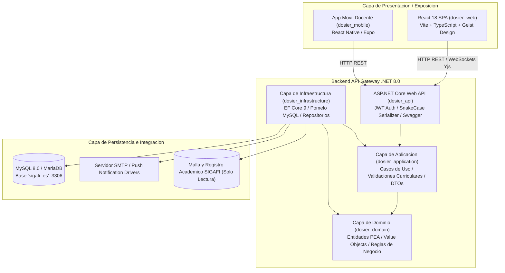
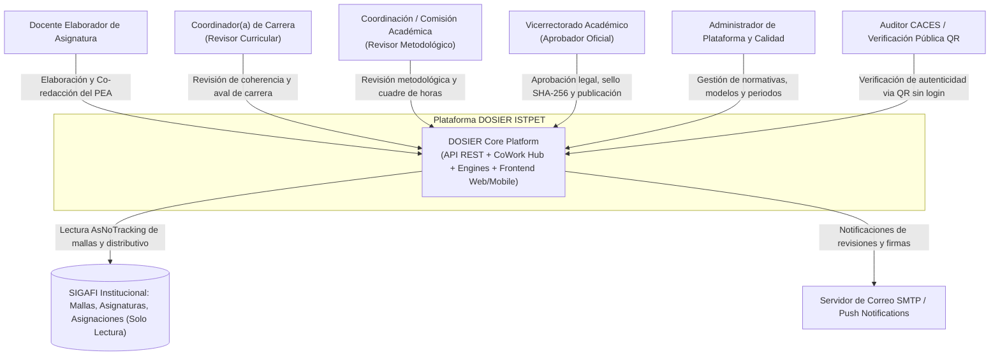
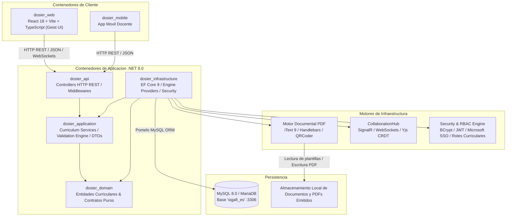

# Macro-Arquitectura del Sistema y Clean Architecture

## 1. Resumen Ejecutivo y Alcance del Sistema

**DOSIER** (*Sistema Web para la Gestión de Documentación Curricular Docente del ISTPET*) es la plataforma tecnológica institucional encargada de gestionar el ciclo de vida, co-redacción y validación de la planificación curricular docente en el Instituto Superior Tecnológico Mayor Pedro Traversari (ISTPET) de Quito, Ecuador.

El sistema resuelve la problemática de la dispersión documental y la desconexión operativa entre las disposiciones de los organismos reguladores (CES, CACES, SENESCYT), la planificación académica registrada en SIGAFI y los entregables microcurriculares docentes:
1. **Programa de Estudio de la Asignatura (PEA):** Formato oficial institucional normalizado en sus **11 secciones reglamentarias (a - k)**, implementado de extremo a extremo en la tesis de grado.
2. **Plan Analítico o Sílabo (19 Semanas):** Matriz semanal articulada por unidades, estrategias y evaluaciones.
3. **Guías de Aprendizaje Práctico-Experimental (Guías APE):** Planificación detallada de prácticas de laboratorio y talleres.
4. **Guías de Estudio Institucional:** Compendio teórico, glosarios y cuestionarios de autoevaluación autónoma.

El sistema está diseñado bajo estrictos criterios de integridad matemática (correspondencia de horas de docencia, práctico-experimental y autónomo vs. `detallemallas` de SIGAFI), inmutabilidad forense (SHA-256), trazabilidad, firma digital PKCS#12 (.p12) / FirmaEC y aseguramiento de la calidad ante el CACES, bajo el marco de la Ley Orgánica de Educación Superior (LOES), el Reglamento de Régimen Académico (RRA) y la Ley Orgánica de Protección de Datos Personales (LOPDP).

---

## 2. Visión General de la Arquitectura de Solución

La solución adopta un modelo desacoplado compuesto por una aplicación de página única (SPA) en el Frontend y una API RESTful construida bajo Clean Architecture (Arquitectura Limpia) en el Backend.

---

## 3. Diagramas de Arquitectura C4

### Nivel 1: Diagrama de Contexto del Sistema

El diagrama de contexto ilustra los actores principales que interactúan con DOSIER y los sistemas externos integrados.

### Nivel 2: Diagrama de Contenedores

El diagrama de contenedores detalla los bloques tecnológicos principales y sus protocolos de comunicación.

---

## 4. Desglose de Proyectos en la Solución Backend (.NET 8.0)

La solución backend `dosier.slnx` implementa Clean Architecture segregada en cinco proyectos independientes:

### 1. `dosier_domain` (Capa de Dominio)
* **Responsabilidad:** Contener las entidades curriculares puras, enumeraciones, constantes de permisos y contratos fundamentales sin dependencias de base de datos ni frameworks externos.
* **Componentes principales:** Entidades del PEA (`DocPea`, `DocPeaUnidad`, `DocPeaTema`, `DocPeaResultadoAprendizaje`, `DocPeaActividadPractica`, `DocPeaEvaluacion`, `DocPeaBibliografia`, `DocPeaObservacion`, `DocPeaTrazabilidad`), gobernanza curricular (`DocExpedienteCurricular`, `DocExpedienteAsignacion`, `DocNormativa`, `DocModeloEducativo`, `DocPerfilEgreso`), motor de plantillas (`DocDocumentTemplate`, `DocDocumentosInstancia`, `DocDocumentAudit`), enumeraciones y constantes de permisos (`Permissions.cs`).

### 2. `dosier_application` (Capa de Aplicación)
* **Responsabilidad:** Orquestar los casos de uso curriculares, procesar DTOs de entrada/salida y ejecutar validaciones de negocio.
* **Componentes principales:** Interfaces de servicios (`IPeaService`, `INormativasService`, `IExpedienteCurricularService`, `IAsignaturasDocenteService`, `IDocumentInstanceService`), validadores con FluentValidation y contratos de transferencia de datos con mapeo canónico.

### 3. `dosier_infrastructure` (Capa de Infraestructura)
* **Responsabilidad:** Implementar el acceso a datos relacionales, servicios externos, criptografía, generación documental y canales de comunicación en tiempo real.
* **Componentes principales:** `DosierContext` (EF Core 9 con Pomelo MySQL), `PeaService`, `CurricularValidationEngine`, `AcademicContextResolver`, `CollaborationHub` (SignalR + Yjs), `RbacService`, `FirmaElectronicaService`, `DocumentEngine` (iText 9 + Handlebars.Net), `QRCoder` y drivers de notificación.

### 4. `dosier_api` (Capa de Exposición Web API)
* **Responsabilidad:** Exponer los endpoints HTTP REST, administrar autenticación JWT, gestionar la política de serialización JSON `snake_case` y configurar inyección de dependencias.
* **Componentes principales:** Controladores curriculares (`PeaController`, `NormativasController`, `ExpedienteCurricularController`, `AuthController`, `SignaturesController`, `CatalogsController`, etc.), Swagger OpenAPI, filtros de autorización RBAC y middlewares de manejo global de excepciones.

### 5. `dosier_tests` (Capa de Pruebas Automáticas)
* **Responsabilidad:** Verificación unitaria y de integración de reglas de negocio curriculares, pruebas de firma electrónica y validaciones matemáticas horarias (`PeaFirmaTests`, `RbacServiceTests`, `AuthServiceTests`).

---

## 5. Matriz del Stack Tecnológico Completo

| Capa / Módulo | Tecnología / Paquete | Versión Exacta | Función en el Sistema |
| :--- | :--- | :--- | :--- |
| **Plataforma Backend** | .NET SDK (ASP.NET Core) | `8.0` | Entorno de ejecución backend Clean Architecture. |
| **ORM / Acceso a Datos** | Entity Framework Core | `9.0.0` | Mapeo objeto-relacional y control de concurrencia. |
| **Conector MySQL** | Pomelo.EntityFrameworkCore.MySql | `9.0.0` | Provider optimizado para MySQL 8.0/MariaDB (`sigafi_es`). |
| **Compilador PDF** | iText 7 / pdfHTML | `9.6.0` / `6.3.2` | Generación vectorial de documentos institucionales. |
| **Motor de Plantillas** | Handlebars.Net | `2.1.6` | Evaluación de plantillas HTML oficiales. |
| **Generación QR** | QRCoder | `1.8.0` | Generación de códigos QR vectoriales para verificación pública. |
| **Criptografía / Auth** | BCrypt.Net-Next / BouncyCastle | `4.1.0` / `1.9.0` | Hashing de claves y gestión de certificados PKCS#12 (.p12). |
| **Documentación API** | Swashbuckle (Swagger) | `6.6.2` | Especificación interactiva OpenAPI. |
| **Frontend Web** | React + TypeScript | `18.3.1` | Interfaz SPA modular. |
| **Bundler Frontend** | Vite | `5.4.2` | Servidor de desarrollo y compilador de producción. |
| **Sistema de Diseño** | Tailwind CSS v4 + Geist UI | `4.0.0` | Sistema visual Vercel Geist con fondos 100% sólidos. |
| **Motor Colaborativo** | SignalR + Yjs CRDT | `latest` | Sincronización multi-docente concurrente sin colisiones. |

---

## 6. Estrategia de Persistencia y Modo Solo Lectura

1. **Base de Datos Institucional:** MySQL 8.0 en base `sigafi_es`, puerto local `3306`.
2. **Frontera Estricta de Solo Lectura:** Las tablas de la gestión académica institucional (`carreras`, `mallas`, `detallemallas`, `mallas_periodos`, `asignaciones_profesores`, `periodos`, `profesores`) se consultan exclusivamente mediante `.AsNoTracking()`. DOSIER jamás escribe sobre estas tablas.
3. **Módulo Curricular Dedicado:** Todas las tablas de gobernanza, expedientes, PEA, observaciones y trazabilidad operan bajo el prefijo `doc_*`, gestionadas íntegramente por DOSIER.
4. **Filtro Institucional Obligatorio:** Toda consulta curricular aplica obligatoriamente `carreras.esInstituto = 1`, aislando por completo la oferta de la Escuela de Conducción.
5. **Auditoría Forense Inmutable:** Cada cambio de estado, observación y firma registra el identificador de usuario, IP, User-Agent, fecha UTC y hash SHA-256 inalterable en `doc_pea_trazabilidad` y `doc_document_audit`.
