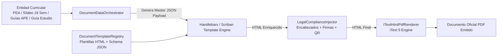
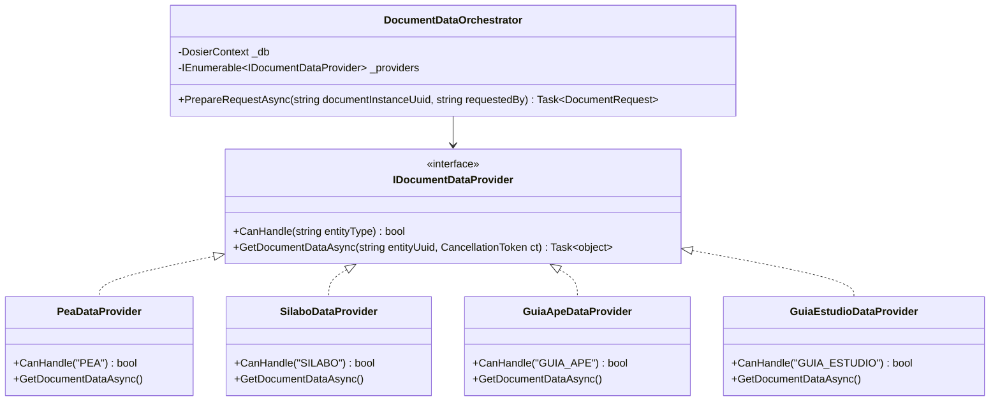
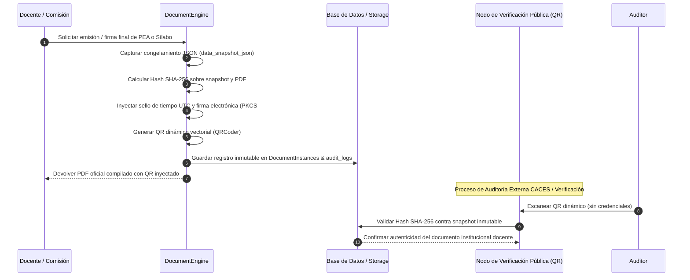
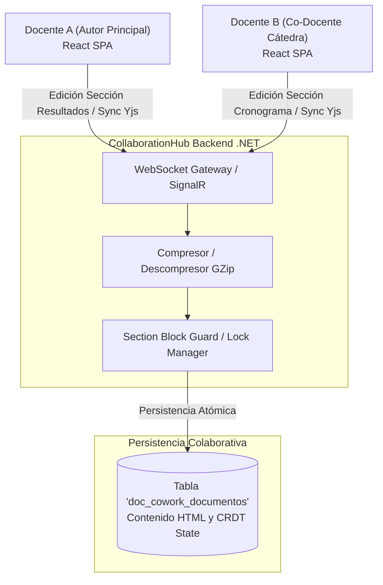
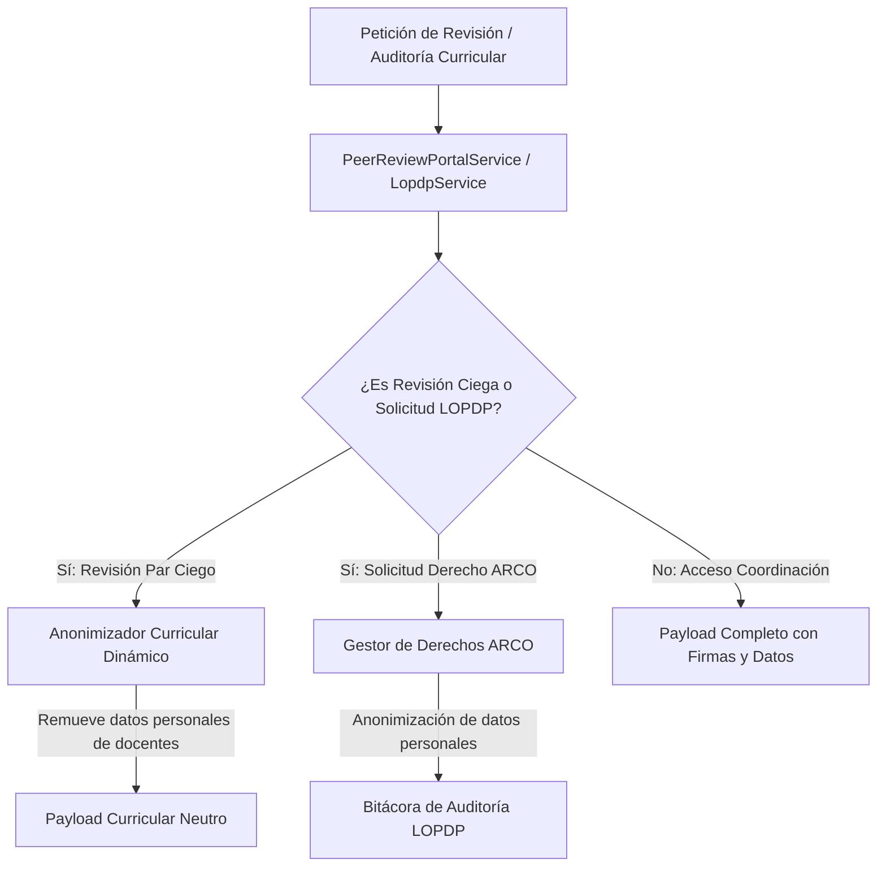

# Micro-Arquitecturas Internas, Patrones y Motores Especializados

## 1. Visión General

La plataforma DOSIER integra en su capa de infraestructura y dominio patrones y motores especializados diseñados para la gestión académica y curricular del ISTPET. Estos motores atienden el cumplimiento de normativas de acreditación institucional (CACES 2026), resiliencia forense, validación curricular de mallas SIGAFI, protección de datos (LOPDP) y co-redacción distribuida en tiempo real de programas y sílabos.

---

## 2. Metadata-Driven Architecture (Arquitectura Guiada por Metadatos)

El subsistema documental de DOSIER opera de forma agnóstica respecto a las entidades académicas. En lugar de codificar plantillas rígidas en C#, el motor procesa estructuras dinámicas en formato JSON (`JsonElement`) adaptadas a los formatos oficiales del ISTPET.

### Componentes Clave
* **`DocumentTemplateRegistry`:** Registro centralizado de plantillas HTML y esquemas de metadatos para PEA, Sílabo de 19 semanas, Guías APE y Guías de Estudio.
* **`HandlebarsTemplateEngine` / `Scriban`:** Motores de evaluación que inyectan variables curriculares (prerrequisitos, correquisitos, desglose semanal, resultados de aprendizaje, bibliografía) en el marcado HTML de la plantilla.
* **Resiliencia y Escalabilidad:** El motor no requiere modificaciones de código C# para incorporar nuevos formatos documentales institucionales; basta con registrar la nueva plantilla HTML y su contrato de metadatos.

---

## 3. Provider / Strategy Pattern Architecture (Desacoplamiento de Datos Curriculares)

Para resolver el acoplamiento de datos entre las distintas figuras curriculares, el sistema implementa el patrón **Strategy** mediante la interfaz `IDocumentDataProvider`.

### Principio de Funcionamiento
1. El `DocumentDataOrchestrator` recibe una petición de emisión documental identificada por la instancia (`documentInstanceUuid`).
2. Identifica el tipo de entidad curricular origen (`PEA`, `SILABO`, `GUIA_APE`, `GUIA_ESTUDIO`).
3. Selecciona el proveedor adecuado en tiempo de ejecución (`_providers.FirstOrDefault(p => p.CanHandle(entityType))`).
4. Extrae la información académica de la asignatura desde SIGAFI (horas, créditos, campo de formación, prerrequisitos) y la combina con el contenido colaborativo en vivo procedente del módulo CoWork, devolviendo un payload unificado (`DocumentRequest`).

---

## 4. Curricular Validation Engine (Motor de Validación Matemática de Horas y Créditos)

Para evitar incongruencias en la planificación docente, el sistema incorpora un motor de validación curricular que verifica las restricciones académicas antes de permitir el envío o aprobación del documento:

$$\text{Horas Totales Asignatura} = \text{Horas Docencia (CD)} + \text{Horas APE (Prácticas)} + \text{Horas Autónomo (TA)}$$
$$\sum_{w=1}^{19} (\text{Horas CD}_w + \text{Horas APE}_w + \text{Horas TA}_w) \equiv \text{Total Horas Malla SIGAFI}$$

### Reglas de Validación Automática
1. **Consistencia con Malla Vigente:** Las horas semanales no pueden exceder ni ser inferiores a la carga asignada en el plan de estudios aprobado por el CES/CACES.
2. **Distribución Semanal en Sílabo:** Validación de 19 semanas lectivas estructuradas en 2 evaluaciones parciales y 1 examen/evaluación final o de recuperación.
3. **Mapeo de Guías APE:** La suma de horas de las prácticas planificadas en las Guías APE debe coincidir exactamente con el componente APE del Sílabo.

---

## 5. Snapshot Forensic & Cryptographic Verification Architecture

Para responder a auditorías del CACES y validar la autenticidad del portafolio docente, DOSIER implementa una estrategia de resiliencia forense basada en tres capas de seguridad criptográfica:

### Elementos de Seguridad Forense
* **Inmutabilidad de Datos (`data_snapshot_json`):** Aunque la asignatura cambie de docente o se ajuste la malla en períodos futuros, el documento curricular emitido conserva el snapshot exacto del período académico en que fue dictada.
* **Firma Electrónica y Sellado (`SignatureStamper`):** Inyección de la firma electrónica de los docentes autores, miembros de la comisión de revisión curricular y el Coordinador de Carrera / Vicerrectorado.
* **Verificación Pública mediante QR:** Permite a estudiantes, evaluadores del CACES y directivos validar el documento oficial sin requerir sesión activa.

---

## 6. State Machine Engine & State Locking (Ciclo de Vida Curricular)

El flujo de aprobación de la documentación docente se administra a través del `WorkflowEngineService`. Las transiciones entre estados están sujetas a reglas de validación académica:

$$\text{Borrador} \xrightarrow[\text{Co-redacción}]{\text{Envío a Revisión}} \text{Revisión por Comisión/Par} \xrightarrow[\text{Aprobación}]{\text{Validación Carrera}} \text{Aprobado / Vigente} \xrightarrow[\text{Fin de Período}]{\text{Portafolio Final}}$$

### Mecanismo de State Locking
Cuando un PEA o Sílabo avanza a la etapa de revisión por comisión o aprobación por coordinación, el orquestador activa un bloqueo de escritura (*State Locking*). Las peticiones HTTP y eventos de CoWork que intenten modificar secciones durante estos estados son rechazadas automáticamente.

---

## 7. CRDT Realtime Collaboration Architecture (CoWork Engine para Docentes)

Para permitir que los docentes que comparten una misma cátedra o nivel redacten el PEA y Sílabo de manera colaborativa y síncrona, el sistema utiliza una arquitectura basada en **CRDT (Conflict-free Replicated Data Types)** mediante **Yjs** y **SignalR WebSockets**.

### Características Técnicas
* **Compresión GZip (`GZipHelper`):** Los paquetes binarios de actualización Yjs se comprimen antes de transmitirse sobre SignalR, permitiendo baja latencia aún en conexiones institucionales saturadas.
* **Bloqueo Granular de Secciones (`SectionBlockGuard`):** Protege sub-secciones del plan analítico mientras son editadas activamente por un docente particular.

---

## 8. Privacy & Anonymization Architecture (LOPDP y Revisión Curricular Ciega)

Para cumplir la Ley Orgánica de Protección de Datos Personales (LOPDP) y facilitar revisiones objetivas de calidad académica:

### Modos de Operación
1. **Blind Mode (Revisión Curricular por Pares):** El `PeerReviewPortalService` oculta los datos de identificación del docente responsable cuando una comisión evalúa el rigor metodológico del Sílabo o Guías APE.
2. **Cumplimiento LOPDP (`LopdpService`):** Procesa solicitudes de derechos ARCO (Acceso, Rectificación, Cancelación y Oposición), gestionando consentimientos informados y anonimización en logs de auditoría.
