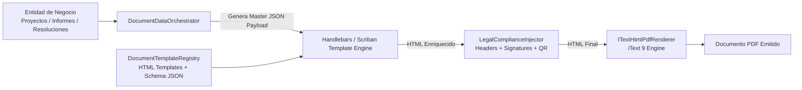
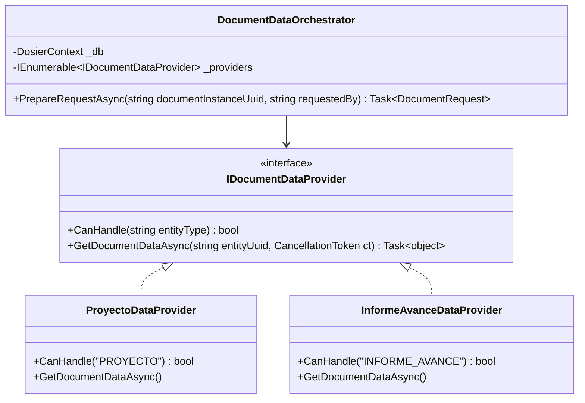
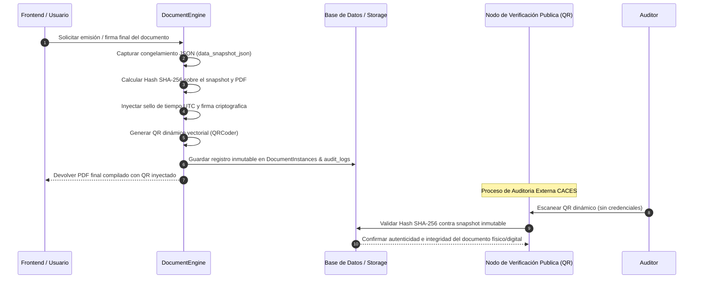
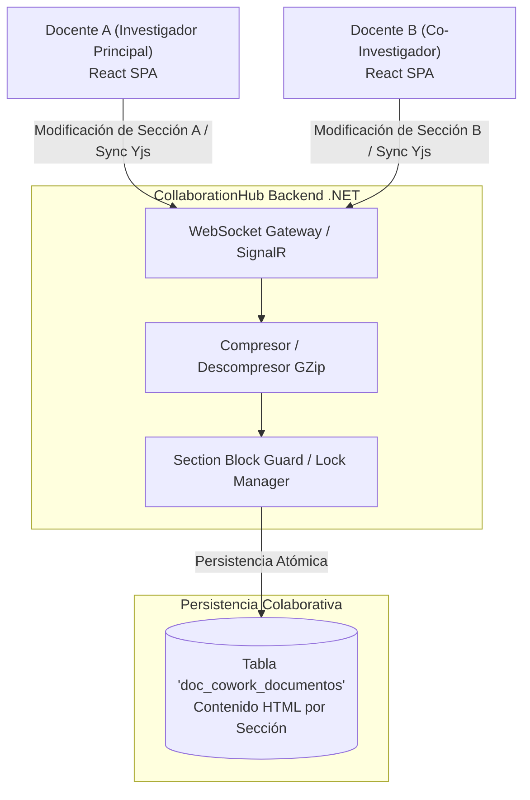
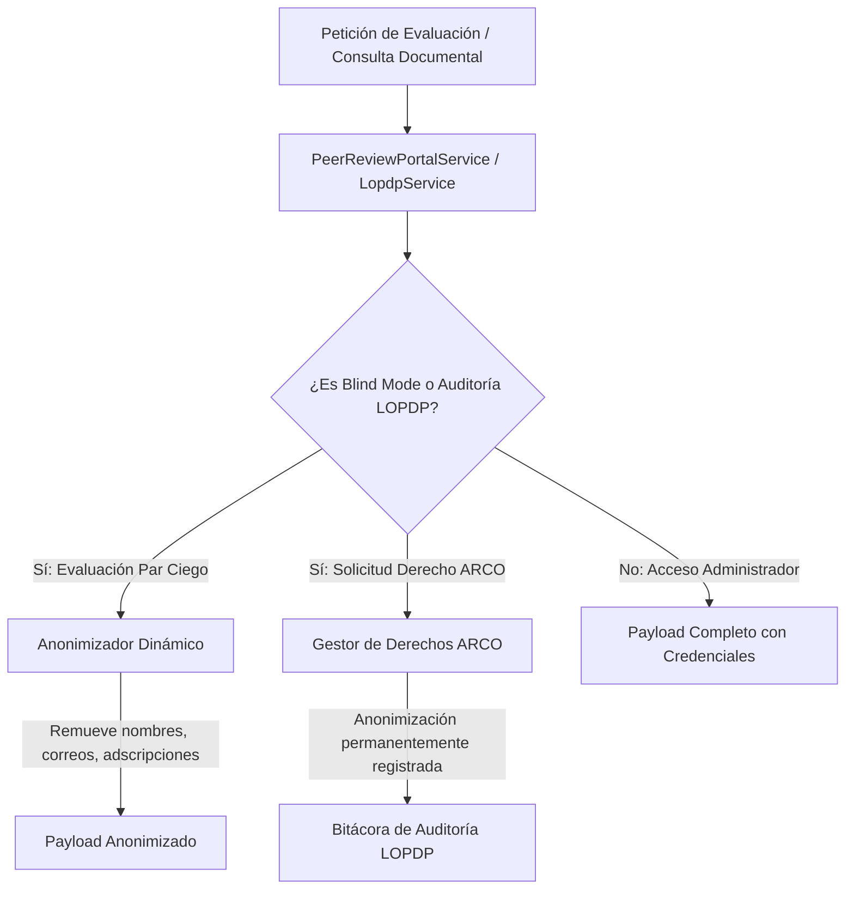

# Micro-Arquitecturas Internas, Patrones y Motores Especializados

## 1. Visión General

La plataforma DOSIER integra en su capa de infraestructura y dominio patrones y motores especializados. Estos motores atienden el cumplimiento de normativas de acreditación (CACES 2026), resiliencia forense, protección de datos (LOPDP) y colaboración distribuida en tiempo real.

---

## 2. Metadata-Driven Architecture (Arquitectura Guiada por Metadatos)

El subsistema documental de DOSIER opera de forma agnóstica respecto a las entidades de negocio. En lugar de codificar plantillas rígidas en C#, el motor procesa estructuras dinámicas en formato JSON (`JsonElement`).

### Componentes Clave
* **`DocumentTemplateRegistry`:** Registro centralizado de plantillas HTML y esquemas de metadatos.
* **`HandlebarsTemplateEngine` / `Scriban`:** Motores de evaluación que inyectan variables, condicionales y listas iterativas en el marcado HTML de la plantilla.
* **Resiliencia y Escalabilidad:** El motor no requiere modificaciones de código C# para incorporar nuevos formatos documentales institucionales; basta con registrar la nueva plantilla HTML y su contrato de metadatos.

---

## 3. Provider / Strategy Pattern Architecture (Desacoplamiento de Datos)

Para resolver el acoplamiento de datos, el sistema implementa el patrón **Strategy** mediante la interfaz `IDocumentDataProvider`.

### Principio de Funcionamiento
1. El `DocumentDataOrchestrator` recibe una petición de emisión documental identificada por la instancia (`documentInstanceUuid`).
2. Identifica el tipo de entidad origen (`PROYECTO`, `INFORME_AVANCE`, `RESOLUCION`).
3. Selecciona el proveedor adecuado en tiempo de ejecución (`_providers.FirstOrDefault(p => p.CanHandle(entityType))`).
4. Ensambla los datos base con el contenido colaborativo en vivo procedente del módulo CoWork, devolviendo un payload unificado (`DocumentRequest`).

---

## 4. Snapshot Forensic & Cryptographic Verification Architecture

Para responder a auditorías externas del CACES, DOSIER implementa una estrategia de resiliencia forense basada en tres capas de seguridad criptográfica:

### Elementos de Seguridad Forense
* **Inmutabilidad de Datos (`data_snapshot_json`):** Aunque los datos del proyecto varíen en el futuro (ej. cambio de equipo o reestructuración de presupuesto), el documento emitido conserva el snapshot exacto de la fecha de emisión.
* **Firma Criptográfica y Sellado (`SignatureStamper`):** Inyección de la firma de responsabilidad del docente o autoridad y sello de tiempo UTC.
* **Verificación Pública mediante QR:** Permite a terceros validar el documento sin requerir autenticación en el sistema.

---

## 5. State Machine Engine & State Locking (Máquina de Estados)

El ciclo de vida de los proyectos de investigación se administra a través del `WorkflowEngineService`. Las transiciones entre estados están sujetas a reglas de validación.

$$\text{Borrador} \xrightarrow[\text{Técnica}]{\text{Validación}} \text{Evaluación por Pares} \xrightarrow[\text{Comité}]{\text{Aprobación}} \text{Ejecución} \xrightarrow[\text{Final}]{\text{Informe}} \text{Cierre}$$

### Mecanismo de State Locking
Cuando un proyecto avanza a etapas de evaluación por pares o aprobación final, el orquestador activa un bloqueo de escritura (*State Locking*). Las peticiones HTTP que intenten modificar campos del formulario principal durante estos estados son rechazadas por los controladores y servicios de infraestructura.

---

## 6. CRDT Realtime Collaboration Architecture (CoWork Engine)

Para permitir que múltiples docentes investigadores redacten secciones del proyecto de forma concurrente, el sistema utiliza una arquitectura basada en **CRDT (Conflict-free Replicated Data Types)** mediante **Yjs** y **WebSockets**.

### Características Técnicas
* **Compresión GZip (`GZipHelper`):** Los paquetes de actualización de estado enviados por los clientes se comprimen mediante GZip antes de ser retransmitidos al Hub de SignalR, optimizando el uso de ancho de banda.
* **Bloqueo Granular de Secciones (`SectionBlockGuard`):** Bloquea secciones específicas que están siendo editadas activamente por otro usuario para evitar sobrescrituras.

---

## 7. Privacy & Anonymization Architecture (LOPDP & Pares Ciegos)

Para cumplir la Ley Orgánica de Protección de Datos Personales (LOPDP) y mantener la imparcialidad en evaluaciones académicas, el sistema implementa una capa de anonimización.

### Modos de Anonimización
1. **Blind Mode (Evaluación por Pares Ciegos):** El `PeerReviewPortalService` remueve automáticamente los nombres de los autores, filiaciones institucionales y correos electrónicos de la propuesta antes de enviarla a los evaluadores.
2. **Cumplimiento LOPDP (`LopdpService`):** Procesa solicitudes de derechos ARCO (Acceso, Rectificación, Cancelación y Oposición), gestionando consentimientos informados y anonimización de datos en la base de datos de auditoría.
