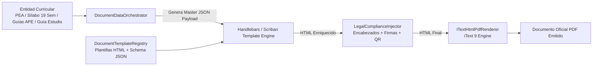
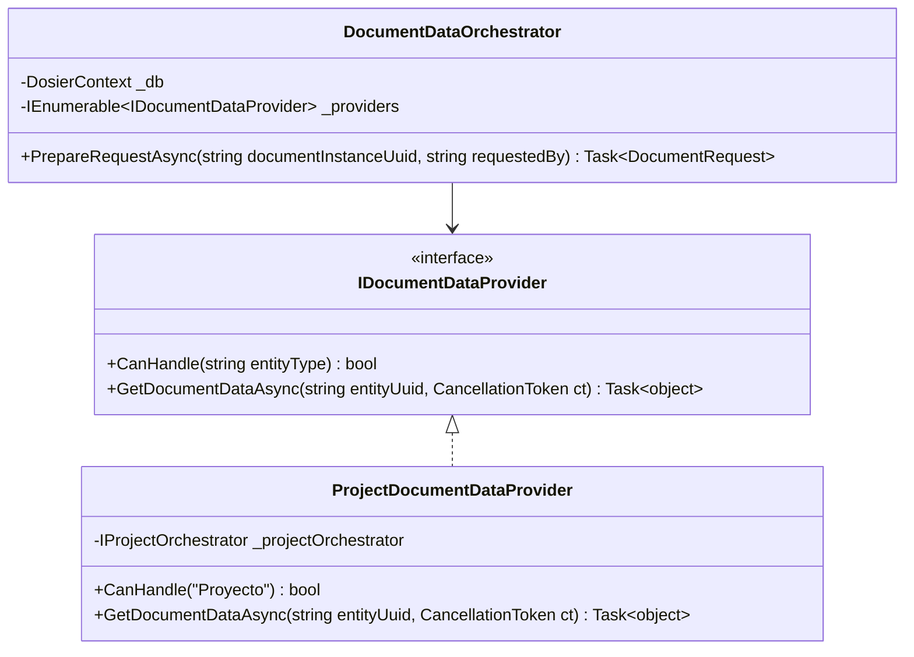
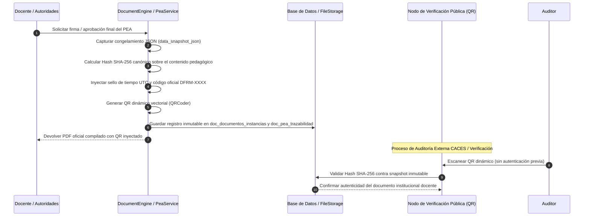
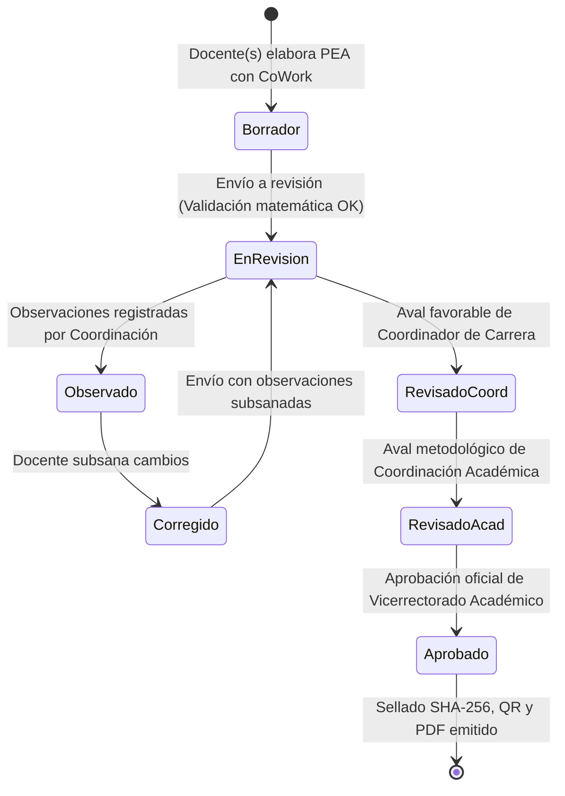
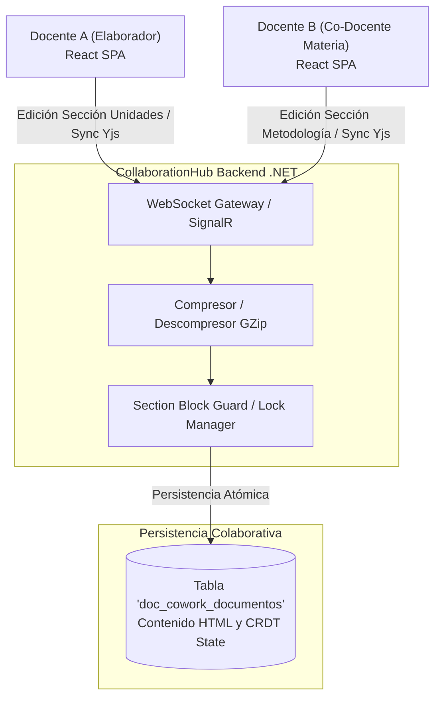

# Micro-Arquitecturas Internas, Patrones y Motores Especializados

## 1. Visión General

La plataforma DOSIER integra en su capa de infraestructura y dominio patrones y motores especializados diseñados para la gestión curricular del ISTPET. Estos motores atienden el cumplimiento de normativas de acreditación institucional (CACES 2026), resiliencia forense, validación curricular de mallas SIGAFI, protección de datos (LOPDP) y co-redacción distribuida en tiempo real de programas docentes oficiales.

---

## 2. Metadata-Driven Architecture (Arquitectura Guiada por Metadatos)

El subsistema documental de DOSIER opera de forma agnóstica respecto a las entidades académicas. En lugar de codificar plantillas rígidas en C#, el motor procesa estructuras dinámicas en formato JSON (`JsonElement`) adaptadas a los formatos oficiales del ISTPET.

### Componentes Clave
* **`DocumentTemplateRegistry`:** Registro centralizado de plantillas HTML y esquemas de metadatos para PEA, Sílabo de 19 semanas, Guías APE y Guías de Estudio.
* **`HandlebarsTemplateEngine` / `Scriban`:** Motores de evaluación que inyectan variables curriculares (prerrequisitos, correquisitos, desglose semanal, resultados de aprendizaje, bibliografía) en el marcado HTML de la plantilla.
* **Resiliencia y Escalabilidad:** El motor no requiere modificaciones de código C# para incorporar nuevos formatos documentales institucionales; basta con registrar la nueva plantilla HTML y su contrato de metadatos.

---

## 3. Provider / Strategy Pattern Architecture (Desacoplamiento de Datos Curriculares)

Para resolver el acoplamiento de datos entre las distintas figuras curriculares, el sistema implementa el patrón **Strategy** mediante la interfaz `IDocumentDataProvider`.

### Principio de Funcionamiento
1. El `DocumentDataOrchestrator` recibe una petición de emisión documental identificada por la instancia (`documentInstanceUuid`).
2. Identifica el tipo de entidad origen y evalúa los proveedores disponibles mediante `CanHandle(entityType)`.
3. `ProjectDocumentDataProvider` resuelve los datos consolidados de la entidad académica (asignatura, equipo docente, períodos, fechas).
4. Extrae la información académica de la asignatura desde SIGAFI (horas, créditos, campo de formación, prerrequisitos) y la combina con el contenido colaborativo persistido por el módulo CoWork, devolviendo un payload unificado (`DocumentRequest`) para la compilación PDF.

---

## 4. Curricular Validation Engine (Motor de Validación Matemática de Horas y Créditos)

Para evitar incongruencias en la planificación docente, el sistema incorpora un motor de validación curricular (`CurricularValidationEngine`) que verifica las restricciones académicas antes de permitir el guardado o envío del documento a revisión:

$$\text{Horas Totales Asignatura} = \text{Horas Docencia (CD)} + \text{Horas APE (Prácticas)} + \text{Horas Autónomo (TA)}$$
$$\sum_{u=1}^{n} (\text{Horas CD}_u + \text{Horas APE}_u + \text{Horas TA}_u) \equiv \text{Total Horas Malla SIGAFI}$$

### Reglas de Validación Bloqueantes
1. **Consistencia con Malla Vigente:** Las horas de las unidades temáticas y los componentes no pueden exceder ni ser inferiores a la carga oficial de `detallemallas`.
2. **Componente APE:** Las horas asignadas a actividades prácticas no pueden superar el total de horas APE autorizadas para la materia.
3. **Aporte al Perfil de Egreso:** Todo resultado de aprendizaje (RDA) formulado en la asignatura debe articularse obligatoriamente con al menos un RDA del Perfil de Egreso oficial de la carrera.
4. **Bibliografía Obligatoria:** Exigencia de al menos una referencia básica con justificación pedagógica debidamente registrada.

---

## 5. Snapshot Forensic & Cryptographic Verification Architecture

Para responder a auditorías del CACES y validar la autenticidad del portafolio docente, DOSIER implementa una estrategia de resiliencia forense basada en tres capas de seguridad criptográfica:

### Elementos de Seguridad Forense
* **Inmutabilidad de Datos (`data_snapshot_json`):** Aunque la asignatura cambie de docente o se ajuste la malla en períodos futuros, el documento curricular emitido conserva el snapshot exacto del período académico en que fue legalizado.
* **Firma Electrónica y Sellado (`SignatureStamper` / `FirmaElectronicaService`):** Integración de firma electrónica avanzada (PKCS#12 `.p12`) o firma digital HMAC institucional con verificación de identidad.
* **Verificación Pública mediante QR:** Permite a estudiantes, evaluadores del CACES y directivos validar el documento oficial sin requerir sesión activa en el sistema.

---

## 6. State Machine Engine & State Locking (Ciclo de Vida Curricular del PEA)

El flujo de aprobación de la documentación docente se administra a través del circuito colegiado institucional de 4 estados:

### Mecanismo de State Locking
Cuando el PEA avanza a la etapa `EnRevision`, `RevisadoCoord` o `Aprobado`, el orquestador activa un bloqueo estricto de escritura (*State Locking*). Las peticiones HTTP y eventos de CoWork que intenten modificar secciones durante estos estados son rechazadas automáticamente, preservando la inmutabilidad de la evidencia.

---

## 7. CRDT Realtime Collaboration Architecture (CoWork Engine para Docentes)

Para permitir que los docentes que imparten la misma materia o colaboran en su diseño redacten el PEA de manera concurrente y síncrona, el sistema utiliza una arquitectura basada en **CRDT (Conflict-free Replicated Data Types)** mediante **Yjs** y **SignalR WebSockets**.

### Características Técnicas
* **Compresión GZip (`GZipHelper`):** Los paquetes binarios de actualización Yjs se comprimen antes de transmitirse sobre SignalR, permitiendo baja latencia aún en conexiones institucionales saturadas.
* **Componente `<CoWorkField>`:** Abstrae la sincronización colaborativa en el cliente React, exponiendo un área de texto con presencia en vivo de otros autores y convergencia determinista sin colisiones.

---

## 8. Privacy & Adaptaciones Curriculares (Cumplimiento LOPDP)

Para cumplir con la Ley Orgánica de Protección de Datos Personales (LOPDP) de la República del Ecuador:

1. **Aislamiento de Adaptaciones Curriculares:** La información de adaptaciones curriculares para estudiantes con necesidades educativas específicas se administra de forma segregada respecto al cuerpo general del PEA que se distribuye ampliamente.
2. **Consentimientos y Bitácora (`LopdpService`):** Registro inalterable del consentimiento para tratamiento de firmas digitales y control de acceso granular auditado en `doc_lopdp_auditoria_datos`.
