# Modelo de Dominio y Entidades del Sistema (Domain Layer)

## 1. Fundamentos y Filosofía de Diseño del Dominio

La capa de dominio (`dosier_domain`) constituye el núcleo tecnológico y conceptual de la plataforma **DOSIER**. Diseñada bajo los cánones de Clean Architecture y Domain-Driven Design (DDD), esta capa alberga las entidades maestras, objetos de valor, enumeraciones y reglas de negocio puras, manteniendo una **independencia total** de frameworks web, motores de base de datos o librerías de infraestructura externa.

Todas las entidades están modeladas como POCOs (Plain Old CLR Objects), permitiendo que la lógica del currículo institucional (PEA, asignaturas, horas, créditos, firmas y auditoría forense) se preserve inmutable frente a cambios en la capa de persistencia Pomelo MySQL o en los controladores ASP.NET Core.

---

## 2. Mapa Arquitectónico de Subsistemas del Dominio

```mermaid
classDiagram
    direction TB
    
    namespace Common_Documents {
        class DocumentTemplate {
            +int Id
            +string Code
            +string HtmlContent
            +int Version
            +DocumentCategory Category
            +bool RequiresLopdpClause
            +bool RequiresTraceabilityCode
            +bool RequiresElectronicSignature
            +string SignatureType
            +string ThemeConfigJson
        }
        class DocumentInstance {
            +int Id
            +string Uuid
            +string TemplateCode
            +int TemplateVersion
            +string EntityUuid
            +DocumentState State
            +string FileHash
            +string TraceabilityCode
            +string DataSnapshotJson
        }
        class DocumentAuditEntry {
            +int Id
            +string TraceabilityCode
            +string TemplateCode
            +DocumentCategory Category
            +DateTime GeneratedAt
            +string FileHash
            +string DataSnapshotJson
        }
    }

    namespace Curriculum_Core {
        class DocExpedienteCurricular {
            +int IdExpediente
            +string Uuid
            +string CodigoExpediente
            +string IdPeriodo
            +int IdCarrera
            +int IdAsignatura
            +string EstadoGeneral
        }
        class DocPea {
            +int IdPea
            +string Uuid
            +int TotalHorasAsignatura
            +decimal Creditos
            +int HorasContactoDocente
            +int HorasPracticoExperimental
            +int HorasAutonomo
            +string Estado
            +int Version
        }
        class DocPeaUnidad {
            +int IdUnidad
            +int NumeroUnidad
            +string NombreUnidad
            +int TotalHorasUnidad
            +int HorasDocencia
            +int HorasPracticoExp
            +int HorasAutonomo
        }
        class DocPeaTema {
            +int IdTema
            +int NumeroTema
            +string TituloTema
            +string DescripcionSubtemas
        }
        class DocPeaObservacion {
            +int IdObservacion
            +string RolObservador
            +string SeccionAfectada
            +string TextoObservacion
            +string Estado
        }
        class DocPeaTrazabilidad {
            +int IdTrazabilidad
            +string EstadoAnterior
            +string EstadoNuevo
            +string HashIntegridadSha256
            +DateTime FechaTransicion
        }
    }

    namespace Identity_RBAC {
        class User {
            +int IdUsuario
            +string IdSigafi
            +string TablaSigafi
            +string EmailInstitucional
            +bool Activo
            +bool Administrador
        }
        class Role {
            +int IdRol
            +string Nombre
            +string CodigoRol
            +bool EsActivo
        }
        class UserRole {
            +int IdUsuarioRol
            +DateOnly FechaCreacion
            +bool EsActivo
        }
    }

    DocExpedienteCurricular "1" --> "*" DocPea : Consolida
    DocPea "1" --> "*" DocPeaUnidad : Contiene
    DocPeaUnidad "1" --> "*" DocPeaTema : Desglosa
    DocPea "1" --> "*" DocPeaObservacion : Registra
    DocPea "1" --> "*" DocPeaTrazabilidad : Audita
    User "1" --> "*" UserRole : Asigna
    Role "1" --> "*" UserRole : Vincula
    DocumentInstance --> DocumentTemplate : Tipifica
```



---

## 3. Subsistema Común y Motor Documental (`Common/`)

### 3.1. Contratos Base y Enumeraciones (`Common/Interfaces.cs`, `Common/Enums.cs`)

* **`IEntity<TId>`:** Contrato genérico para toda entidad con clave primaria fuertemente tipada (`TId Id { get; }`).
* **`IAuditable`:** Contrato de auditoría de modificaciones que impone:
  * `DateTime CreatedAt`, `string? CreatedBy`
  * `DateTime? UpdatedAt`, `string? UpdatedBy`
* **`EstadoProyecto`:** Enumeración para el flujo de vida de iniciativas académicas e investigación:
  * `Borrador`, `Enviado`, `BajoRevision`, `Aprobado`, `Rechazado`, `EnEjecucion`, `Finalizado`.
* **`ProyectoBase`:** Clase abstracta base que implementa `IEntity<int>` y `IAuditable`. Define `Uuid`, `Titulo`, `Resumen`, `Metodologia`, `Justificacion`, presupuestos asignados/ejecutados y control de versión.

### 3.2. Modelo de Plantillas Institucionales (`Common/Documents/DocumentTemplate.cs`)

Modela las plantillas dinámicas gestionadas en base de datos para renderizado PDF con Scriban e iText:

| Propiedad | Tipo | Restricción / Propósito |
| :--- | :--- | :--- |
| `Id` | `int` | Identificador autoincremental de clave primaria. |
| `Code` | `string` | Código inmutable único del documento (ej. `PROTOCOLO_INVESTIGACION`, `PEA_CURRICULAR`). |
| `Name` | `string` | Nombre descriptivo visible para el administrador curricular. |
| `HtmlContent` | `string` | Marcado HTML semántico que incluye directivas y variables Scriban. |
| `Version` | `int` | Versión incremental. Permite coexistencia histórica sin invalidar documentos emitidos. |
| `Category` | `DocumentCategory` | Clasificación normativa CACES/SERCOP/Curricular. |
| `RequiresLopdpClause` | `bool` | Inyección forzosa de la cláusula de la Ley Orgánica de Protección de Datos Personales. |
| `SupportsBlindMode` | `bool` | Capacidad de renderizado en evaluación Doble Ciego (anonimizada). |
| `RequiresTraceabilityCode` | `bool` | Emisión obligatoria de código DFRM-XXXX y código QR de validación pública. |
| `RequiresElectronicSignature`| `bool` | Activa la verificación de certificados PKCS#12 y sellos FirmaEC. |
| `SignatureType` | `string` | Modo de firma (`DOSIER`, `ECUADOR_P12`, `HIBRIDO`). |
| `CustomCss` | `string?` | Hojas de estilo CSS inyectadas para override visual del tema base. |
| `CollaborativeFieldsJson` | `string?` | Vector JSON con los nombres de campos sujetos a co-edición en tiempo real Yjs. |
| `ThemeConfigJson` | `string?` | Configuración Schema-Driven para tipografía, márgenes y paleta cromática sin tocar HTML. |
| `IsActive` | `bool` | Estado operativo de la plantilla. |

#### Categorización Documental Institucional (`DocumentCategory`):
* **Curricular (PEA - RRA Art. 21):** `PeaCurricular = 90`.
* **Ciclo de Vida de Proyectos:** `Protocolo = 1`, `ActaAprobacion = 2`, `ActaLiquidacion = 5`.
* **Presupuesto Público (SERCOP):** `TerminosDeReferencia = 10`, `EspecificacionTecnica = 11`, `CertificacionPresupuestaria = 12`, `ActaRecepcion = 13`.
* **Comité de Bioética (CEISH):** `ProtocoloBioetico = 20`, `ConsentimientoInformado = 21`, `ActaExencion = 22`.
* **Propiedad Intelectual (SENADI):** `CesionDerechos = 30`, `SolicitudRegistroSoftware = 31`, `InformeTransferenciaTecnologica = 32`.
* **Acreditación CACES / SENESCYT:** `MatrizIndicadoresCaces = 60`, `ReporteAnualSenescyt = 61`, `ReporteDistributivoCruce = 62`, `ReporteAnaliticas = 63`.

### 3.3. Instancias Documentales y Snapshots (`Common/Documents/DocumentInstance.cs`)

Gestiona el ciclo de vida de un documento materializado a partir de una plantilla:
* **Estados Documentales (`DocumentState`):** `Draft = 1`, `Review = 2`, `Signed = 3`, `Archived = 4`, `Annulled = 5`.
* **Inmutabilidad Criptográfica:** Cuando transiciona a `Signed`, bloquea cualquier alteración sobre `DataSnapshotJson`, `TemplateConfigSnapshotJson` o la vinculación `EntityUuid`. Registra `FinalPdfPath`, `FileHash` (SHA-256) y `TraceabilityCode`.
* **Depuración Segura (Data Purge):** El método `PurgeFile()` soporta la eliminación física de archivos temporales registrando `PurgedBy` y `PurgedAt` bajo estado `Archived`.

### 3.4. Auditoría Forense Inmutable (`Common/Documents/DocumentAuditEntry.cs`)

Entidad append-only obligatoria bajo el Art. 20 de la LOPDP y los criterios de evaluación del CACES. Almacena:
* `TraceabilityCode`: Código impreso único (ej. `DOSIER-PROTO-2026-X1Y2Z3`).
* `TemplateCode` y `TemplateVersion`: Registro exacto de la plantilla que lo originó.
* `GeneratedBy` y `GeneratedAt`: Identidad y marca de tiempo UTC de emisión.
* `FileHash`: Hash SHA-256 del binario PDF emitido.
* `DataSnapshotJson`: Imagen serializada completa del estado de datos al momento de emisión.

---

## 4. Subsistema Curricular Oficial (`Curriculum/Entities/`)

Este subsistema implementa el diseño curricular del Programa de Estudio de la Asignatura (PEA) según el Reglamento de Régimen Académico (RRA) del CES y el Modelo Educativo del ISTPET.

### 4.1. Entidad Maestra: `DocPea`

Representa el documento central curricular de una asignatura para un período académico determinado:

```csharp
public class DocPea
{
    public int IdPea { get; set; }
    public string Uuid { get; set; } = Guid.NewGuid().ToString();
    public int? IdExpediente { get; set; }
    public int IdCarrera { get; set; }
    public int IdAsignatura { get; set; }
    public string IdPeriodo { get; set; }
    public int? IdAsignacion { get; set; }
    public int? IdMalla { get; set; }
    public int? IdDetalleMalla { get; set; }
    public int? IdNivel { get; set; }
    public int? IdModalidad { get; set; }
    public int? IdSeccion { get; set; }
    public string? Paralelo { get; set; }
    public string? FuenteMalla { get; set; }
    public string? SnapshotCurricularJson { get; set; }
    public string? IdDocenteElaborador { get; set; }
    public string Modalidad { get; set; }
    public string? UnidadOrganizacion { get; set; }
    public string? SemestreNivel { get; set; }
    public int TotalHorasAsignatura { get; set; }
    public decimal Creditos { get; set; }

    // Distribución Horaria Obligatoria
    public int HorasContactoDocente { get; set; }
    public int HorasPracticoExperimental { get; set; }
    public int HorasAutonomo { get; set; }

    // Secciones Didácticas y Pedagógicas
    public string? ObjetivoAsignatura { get; set; }
    public string? MetodologiaEnsenanza { get; set; }
    public string? RecursosDidacticos { get; set; }
    public string? EvaluacionAprendizaje { get; set; }

    // Gobernanza y Control de Versión
    public string Estado { get; set; } = "Borrador";
    public int Version { get; set; } = 1;
    public bool Activo { get; set; } = true;
    public DateTime FechaCreacion { get; set; }
    public DateTime FechaModificacion { get; set; }

    // Circuito de Firmas Colegiadas
    public string? FirmaElaboradoDocente { get; set; }
    public DateTime? FechaElaborado { get; set; }
    public string? FirmaRevisadoCoord { get; set; }
    public DateTime? FechaRevisadoCoord { get; set; }
    public string? FirmaRevisadoAcad { get; set; }
    public DateTime? FechaRevisadoAcad { get; set; }
    public string? FirmaAprobadoVicerrector { get; set; }
    public DateTime? FechaAprobado { get; set; }
}
```

### 4.2. Estructura Pedagógica Desglosada

1. **Unidades Temáticas (`DocPeaUnidad`):**
   * Agrupa los bloques de aprendizaje (`NumeroUnidad`, `NombreUnidad`, `TotalHorasUnidad`).
   * Distribuye el balance de horas internas: `HorasDocencia`, `HorasPracticoExp`, `HorasAutonomo`.
   * Contiene colecciones hijas de `DocPeaTema` y `DocPeaActividadPractica`.
2. **Temas y Subtemas (`DocPeaTema`):**
   * Desglose granular temático (`NumeroTema`, `TituloTema`, `DescripcionSubtemas`, `Orden`).
3. **Resultados de Aprendizaje (`DocPeaResultadoAprendizaje`):**
   * Modela los RDAs de asignatura vinculados directamente al perfil de egreso (`IdResultadoPerfil`).
   * Atributos: `TipoRda` (`Asignatura`, `Carrera`), `CodigoRda`, `Descripcion`, `NivelDesarrollo` (`Inicial`, `Medio`, `Alto`).
4. **Actividades Prácticas y Experimentales (`DocPeaActividadPractica`):**
   * Registro de prácticas de laboratorio o campo: `NumeroPractica`, `NombrePractica`, `Caracterizacion`, `DuracionHoras`.
5. **Bibliografía Normalizada (`DocPeaBibliografia`):**
   * Clasificada en `TipoBibliografia` (`Basica`, `Consulta`, `Virtual`).
   * Contiene metadatos bibliotecarios: `Autor`, `Anio`, `TituloLibro`, `EditorialCiudad`, `Isbn`, `UrlRecurso` y `CitaCompletaApa`.
6. **Prerrequisitos (`DocPeaPrerequisito`):**
   * Articulación con asignaturas antecedentes: `CodigoAsignatura`, `NombreAsignatura`, `Observacion`.
7. **Criterios de Evaluación (`DocPeaEvaluacion`):**
   * Rúbricas e instrumentos de calificación: `Denominacion`, `TipoEvaluacion`, `CalificacionMaxima` (escala sobre 10.0 puntos).

### 4.3. Control Colegiado, Trazabilidad y Observaciones

* **`DocPeaObservacion`:**
  * Almacena las observaciones formuladas por los revisores durante el flujo colegiado.
  * Propiedades clave: `RolObservador` (`CoordinadorCarrera`, `CoordinadorAcademico`), `SeccionAfectada` (ej. `seccion_c_unidades`), `TextoObservacion`, `Estado` (`Pendiente`, `Subsanada`, `Desestimada`) y `RespuestaDocente`.
* **`DocPeaTrazabilidad`:**
  * Bitácora criptográfica e inmutable de auditoría.
  * Registra `EstadoAnterior`, `EstadoNuevo`, `Motivo`, `HashIntegridadSha256`, `IdUsuario` y `FechaTransicion`.

### 4.4. Expediente Curricular Maestro y Antecedentes

* **`DocExpedienteCurricular`:** Agrupador formal que unifica la oferta académica de SIGAFI con los antecedentes curriculares: `IdCarrera`, `IdPeriodo`, `IdMalla`, `IdAsignatura`, `Paralelo`, `IdProyectoCurricular`, `IdPerfilEgreso`, `IdModeloEducativo` y `EstadoGeneral` (`Abierto`, `EnRevision`, `Aprobado`, `Cerrado`).
* **`DocExpedienteAsignacion`:** Resuelve la relación N:M para materias compartidas o cátedras paralelas, indicando si un profesor actúa como `EsDocenteLider`.
* **`DocAutoridadCurricular`:** Registro formal de autoridades institucionales designadas (`VICERRECTOR`, `COORD_ACADEMICO`, `COORD_CARRERA`) para validar la potestad de firma.
* **`DocModeloEducativo`:** Versionamiento institucional del modelo pedagógico (`Codigo`, `ResolucionAprobacion`, `FechaVigenciaDesde`, `FechaVigenciaHasta`).
* **`DocNormativa` y `DocNormativaArticulo`:** Repositorio inmutable de regulaciones nacionales (CES, CACES, SENESCYT) y desglose de artículos que alimentan el validador pedagógico.
* **`DocProyectoCurricular`:** Registro de rediseños aprobados por el CES y códigos de resolución.
* **`DocPerfilEgreso`, `DocPerfilEgresoResultado` y `DocAsignaturaResultadoPerfil`:** Matriz institucional de articulación curricular (tributación de asignaturas al perfil de egreso: `Introductorio`, `Medio`, `Avanzado`).

---

## 5. Subsistema de Identidad, Roles y Permisos (`Identity/`)

### 5.1. Entidades de Usuario y RBAC Curricular

* **`User`:**
  * Mapea directamente la identidad de SIGAFI mediante `IdSigafi` y `TablaSigafi` (`profesor`, `alumno`).
  * Incluye atributos de seguridad moderna: `EmailInstitucional`, `EmailValidado`, `HashEmailToken`, `FechaEmailValidacion`, `Activo`, `Administrador`.
* **`Role` y `UserRole`:**
  * Soporta los 5 roles institucionales oficiales:
    1. `DOSIER_ADMIN`: Administración de plataforma y usuarios.
    2. `DOSIER_DOCENTE`: Redacción y co-trabajo en el PEA de sus materias asignadas.
    3. `DOSIER_COORD_CARRERA`: Revisión y emisión de observaciones curriculares de su carrera.
    4. `DOSIER_COORD_ACAD`: Revisión transversal pedagógica y validación institucional.
    5. `DOSIER_VICERRECTOR`: Aprobación definitiva y sellado institucional.
* **`InvestigationInstitute`:**
  * Catálogo de instituciones universitarias y centros de investigación nacionales e internacionales para redes académicas.

### 5.2. Permisos Modulares Jerárquicos

Implementa una estructura de permisos normalizada compuesta por:
* `SystemEntity` (`IdSistema`, `Codigo`, `Detalle`)
* `IdentityModule` (`IdModulos`, `IdSistema`, `Nombre`)
* `IdentityOperation` (`IdOperaciones`, `NombreOperacion`)
* `ModuleOperation` y `RoleModuleOperation`

#### Catálogo de Permisos del Dominio (`Identity/Enums/Permissions.cs`):
```csharp
public static class Permissions
{
    // Elaboración y Gestión del PEA
    public const string PeaVer = "PEA:VER";
    public const string PeaCrear = "PEA:CREAR";
    public const string PeaEditar = "PEA:EDITAR";
    public const string PeaCowork = "PEA:COWORK";
    public const string PeaObservar = "PEA:OBSERVAR";
    public const string PeaSubsanar = "PEA:SUBSANAR";
    public const string PeaAvalCarrera = "PEA:AVALAR_CARRERA";
    public const string PeaAvalAcademico = "PEA:AVALAR_ACADEMICO";
    public const string PeaAprobar = "PEA:APROBAR";
    public const string PeaExportarPdf = "PEA:EXPORTAR_PDF";

    // Gobernanza Curricular
    public const string GobernanzaVer = "GOBERNANZA_CURRICULAR:VER";
    public const string GobernanzaGestionar = "GOBERNANZA_CURRICULAR:GESTIONAR";

    // Auditoría CACES
    public const string AuditoriaVer = "AUDITORIA_CACES:VER-AUDITORIA";
    public const string AuditoriaReportes = "AUDITORIA_CACES:REPORTES";

    // Configuración General
    public const string ConfiguracionVer = "CONFIGURACION:VER";
    public const string ConfiguracionEditar = "CONFIGURACION:EDITAR";
}
```

---

## 6. Subsistema de Criptografía y Firmas Digitales (`Signatures/`)

Define las enumeraciones de dominio para el motor de firma electrónica y auditoría PKCS#12:

* **`SignatureState`:**
  * `Valid = 1`: Firma activa y criptográficamente verificable.
  * `Revoked = 2`: Anulada explícitamente por el firmante o administrador.
  * `Expired = 3`: Expirada por vencimiento del plazo o revocación de certificado.
* **`SigningMethod`:**
  * `DosierBasic = 1`: Firma institucional basada en credenciales auditadas de sesión.
  * `DosierCanvas = 2`: Firma con trazo manuscrito en canvas vectorizado.
  * `Biometric = 3`: Verificación biométrica reservada para dispositivos móviles.
  * `MobileOtp = 4`: Confirmación de doble factor mediante Push OTP móvil.
* **`SignatureAuditEvent`:**
  * `ProfileCreated = 1`, `ProfileUpdated = 2`, `DocumentSigned = 3`, `SignatureVerified = 4`, `SignatureRevoked = 5`, `SignatureFailed = 6`.

---

## 7. Subsistema de Investigación Formativa (`Research/`)

* **`InvestigacionProyecto`:**
  * Hereda de `ProyectoBase`.
  * Articula los proyectos formativos de los docentes con el PEA: `LineaInvestigacion`, `CodigoInstitucional`, `AnonimizadoParaRevision`, `PuntajeEvaluacion`, `MetadataCacesJson` y la lista de `RevisoresAsignados`.
