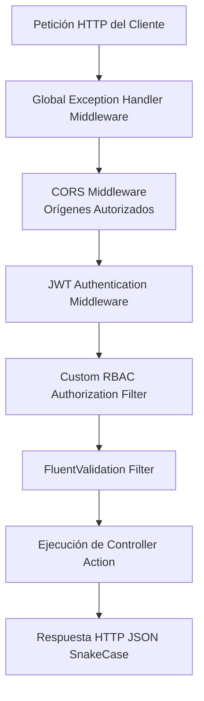

# Especificación de API REST y Enlace de Datos (API-Frontend Binding)

## 1. Visión General de la API Backend

La capa de exposición web API (`dosier_api`) de DOSIER está construida sobre **ASP.NET Core 8.0**, proporcionando una interfaz RESTful para el consumo cliente por parte de la SPA React (`dosier_web`) y la aplicación móvil (`dosier_mobile`).

El backend está compuesto por **23 controladores especializados**, organizados en subsistemas de dominio que coordinan la ejecución de los casos de uso alojados en `dosier_application`.

---

## 2. Políticas Globales de Serialization y Model Binding

Para asegurar la interoperabilidad entre el cliente TypeScript y la API C#, el pipeline de ASP.NET Core impone convenciones de serialización y mapeo de parámetros.

### 2.1. Política Global de Casing: `lower_snake_case` (`[FromBody]`)
El backend tiene configurada la propiedad `JsonNamingPolicy.SnakeCaseLower` de forma global en `Program.cs`. Todas las solicitudes `POST`, `PUT` y `PATCH` enviadas en el cuerpo del mensaje deben utilizar nombres de clave en **`lower_snake_case`**.

```json
{
  "project_uuid": "550e8400-e29b-41d4-a716-446655440000",
  "id_tipo_producto": 4,
  "titulo_investigacion": "Desarrollo de Algoritmos Forenses",
  "observacion_revision": "Aprobado sin modificaciones"
}
```

La deserialización de .NET transforma automáticamente estas claves a sus correspondientes propiedades `PascalCase` en los DTOs de C# (`ProjectUuid`, `IdTipoProducto`, `TituloInvestigacion`, `ObservacionRevision`).

### 2.2. Parámetros de Consulta y Formularios (`[FromQuery]`, `[FromForm]`)
* **Query Parameters (`[FromQuery]`):** El enlazador de parámetros de consulta es insensible a mayúsculas/minúsculas y vincula directamente con las variables de los métodos del controlador. Por convención, se envían en **`camelCase`** (ej. `?projectId=123&includeTeam=true`).
* **Form Data (`multipart/form-data`):** La carga de archivos e imágenes se enlaza mediante `camelCase` o el nombre exacto de la variable de tipo `IFormFile`.

### 2.3. Excepción de Metadatos Universales (`PascalCase`)
Las llamadas dirigidas al endpoint de parches de instancias documentales (`/documents/instances/{uuid}/metadata`) procesan esquemas dinámicos renderizados por el motor de plantillas (Handlebars / Scriban). Para preservar la compatibilidad con el motor de compilación HTML, el payload de metadatos se envía y procesa en **`PascalCase`** (ej. `Titulo`, `PresupuestoTotal`, `Investigadores`).

---

## 3. Catálogo Técnico de los 23 Controladores del Backend

| Controlador | Ruta Base HTTP | Subsistema | Responsabilidad Principal |
| :--- | :--- | :--- | :--- |
| `AuthController` | `/api/auth` | Seguridad | Autenticación de usuarios, login JWT, renovación de tokens, Magic Links y SSO Microsoft 365. |
| `AdminController` | `/api/admin` | Administración | Gestión de usuarios, asignación de roles, permisos RBAC y configuraciones del sistema. |
| `ProjectsController` | `/api/projects` | Investigación | Administración del ciclo de vida del proyecto, miembros del equipo y estados. |
| `DocumentInstancesController` | `/api/document-instances` | Motor Documental | Instanciación de documentos, parches de metadatos, snapshots SHA-256 y renderizado PDF. |
| `DocumentTemplatesController` | `/api/document-templates` | Motor Documental | Gestión y versionado de plantillas HTML y esquemas JSON. |
| `DocumentsController` | `/api/documents` | Motor Documental | Almacenamiento, descarga de archivos PDF emitidos y recursos documentales. |
| `PeerReviewsController` | `/api/peer-reviews` | Evaluación | Asignación de evaluadores ciegos, rúbricas cuantitativas y emisión de dictámenes. |
| `CollaborationController` | `/api/collaboration` | CoWork | Orquestación de salas de edición colaborativa en vivo y control de locks. |
| `SignaturesController` | `/api/signatures` | Criptografía | Registro de firmas electrónicas, certificados PKCS#12 y sellos de tiempo. |
| `ConvocatoriasController` | `/api/convocatorias` | Investigación | Convocatorias públicas institucionales y fondos concursables. |
| `InformesAvanceController` | `/api/informes-avance` | Investigación | Seguimiento de entregables técnicos/financieros e informes de avance. |
| `ResearchProductsController` | `/api/research-products` | Investigación | Registro de productos científicos (artículos, patentes, software y prototipos). |
| `GroupsController` | `/api/groups` | Investigación | Grupos de investigación, líneas, sublíneas de adscripción y miembros. |
| `CatalogsController` | `/api/catalogs` | Catálogos | Catálogos de áreas UNESCO, carreras SIGAFI y tipos de proyectos. |
| `LopdpController` | `/api/lopdp` | Gobernanza | Gestión de derechos ARCO, consentimientos informados y anonimización. |
| `NotificationsController` | `/api/notifications` | Comunicación | Notificaciones in-app, marcas de lectura y suscripciones WebPush VAPID. |
| `EmailEngineController` | `/api/email-engine` | Comunicación | Envío de correos transaccionales con layout HTML institucional. |
| `CalendarioController` | `/api/calendario` | Planificación | Hitos institucionales, plazos de entregables y fechas de convocatorias. |
| `ReportsController` | `/api/reports` | Analítica | Reportes institucionales de producción científica e indicadores CACES. |
| `RecycleBinController` | `/api/recycle-bin` | Persistencia | Gestión de la papelera de reciclaje lógica y restauración de registros. |
| `StorageController` | `/api/storage` | Almacenamiento | Gestión de archivos temporales e imágenes institucionales. |
| `HealthController` | `/api/health` | Monitoreo | Endpoint de verificación de estado y disponibilidad del servicio. |

---

## 4. Estructura Estándar de Peticiones y Respuestas

Todas las respuestas de la API siguen un formato JSON homogéneo definido en la capa de aplicación:

```json
{
  "success": true,
  "message": "Operación ejecutada",
  "data": {
    "uuid": "7a8b9c0d-1234-5678-90ab-cdef12345678",
    "codigo_proyecto": "INV-2026-001",
    "estado": "APROBADO"
  },
  "errors": null,
  "timestamp": "2026-07-28T13:37:30Z"
}
```

En caso de error de validación o excepción en tiempo de ejecución, la API devuelve un código de estado HTTP adecuado (400 Bad Request, 401 Unauthorized, 403 Forbidden, 404 Not Found, 422 Unprocessable Entity, 500 Internal Server Error) acompañado de la estructura de fallos:

```json
{
  "success": false,
  "message": "Error de validación en la solicitud",
  "data": null,
  "errors": [
    {
      "field": "presupuesto_total",
      "message": "El presupuesto asignado no puede ser negativo."
    }
  ],
  "timestamp": "2026-07-28T13:37:30Z"
}
```

---

## 5. Pipeline de Middlewares y Documentación OpenAPI

El flujo de procesamiento de peticiones en `dosier_api` se organiza secuencialmente en `Program.cs`:



### Documentación Interactivas (Swagger OpenAPI)
La API expone la especificación OpenAPI en el ambiente de desarrollo y staging bajo la ruta `/swagger`. Incorpora esquemas de autorización mediante Security Definition JWT Bearer, permitiendo la prueba interactiva de endpoints autenticados.
