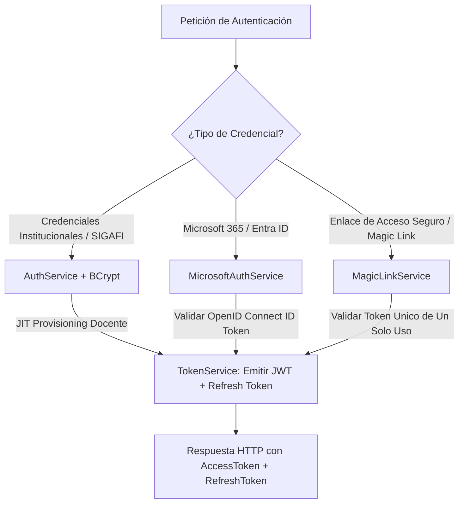
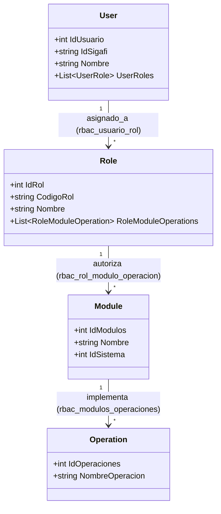

# Arquitectura de Autenticación, SSO y Control de Acceso (RBAC)

## 1. Visión General de Seguridad

El subsistema de seguridad e identidad de DOSIER (`Security`) proporciona un marco de autenticación híbrido y control de acceso basado en roles (RBAC) con políticas granulares. El sistema está diseñado para dar soporte a la gobernanza curricular docente del ISTPET:

1. **Docentes y Autoridades Institucionales:** Autenticación institucional mediante Single Sign-On (SSO) con Microsoft 365 / Entra ID o credenciales institucionales validadas contra la nómina docente de SIGAFI con hash BCrypt.
2. **Coordinadores y Vicerrectorado:** Aprovisionamiento automático basado en designaciones institucionales y asignaciones curriculares para la revisión colegiada y legalización de instrumentos pedagógicos.
3. **Público General y Auditores CACES:** Verificación criptográfica abierta de autenticidad documental mediante escaneo de código QR sin requerir inicio de sesión.

---

## 2. Métodos de Autenticación Soportados

### 2.1. Autenticación Nativa y JIT Provisioning
* **Just-In-Time (JIT) Provisioning:** Cuando un docente ingresa con su cédula o correo institucional por primera vez, `AuthService` valida las credenciales contra la tabla `profesores` de `sigafi_es`. Si son válidas, aprovisiona de forma transparente su registro en `usuarios` y le asigna el rol `DOSIER_DOCENTE` en el sistema RBAC.
* **Hashing de Contraseñas:** Administrado por `PasswordService` utilizando el algoritmo **BCrypt** (`BCrypt.Net-Next`) con verificación y re-hashing automático en caso de hashes desactualizados.
* **Emisión de Tokens JWT:** Administrado por `TokenService`. Los JSON Web Tokens son firmados criptográficamente mediante algoritmo HMAC-SHA256 (`SymmetricSecurityKey`).
* **Estructura de Claims del JWT:**
  * `sub` / `nameid`: Identificador numérico del usuario en la base de datos (`IdUsuario`).
  * `id_sigafi`: Cédula o identificador institucional en SIGAFI.
  * `email`: Correo electrónico institucional del docente.
  * `role`: Rol principal asignado (ej. `DOSIER_DOCENTE`, `DOSIER_COORD_CARRERA`, `DOSIER_ADMIN`).
  * `permissions`: Lista de permisos RBAC granulares inyectados dinámicamente con formato `MODULO:OPERACION`.
* **Mecanismo de Refresh Token:** Rotación segura de tokens de refresco almacenados en la base de datos con vigencia sincronizada.

### 2.2. Single Sign-On (SSO) Microsoft 365 / Entra ID
* **Servicio:** `MicrosoftAuthService`.
* **Mecanismo:** El cliente React autentica al usuario contra Microsoft Identity Platform (MSAL) y transmite el `id_token` al backend.
* **Validación Backend:** El servidor valida la firma del token OpenID Connect contra las claves públicas institucionales de Microsoft, verifica el *Audience* (ClientID) y mapea la cuenta del docente en DOSIER.

### 2.3. Acceso Seguro mediante Magic Links
* **Servicio:** `MagicLinkService`.
* **Propósito:** Permitir a directivos o docentes acceder a revisiones o firmas específicas sin requerir digitación manual de contraseñas.
* **Mecanismo:** Generación de un token criptográfico aleatorio de alta entropía asociado a un recurso con tiempo de vida limitado y consumo de un solo uso (*single-use token*), enviado por correo electrónico institucional.

---

## 3. Modelo de Control de Acceso Basado en Roles Curriculares (RBAC)

DOSIER implementa un modelo de autorización relacional registrado en las tablas `rbac_*` de `sigafi_es`, desacoplado de las tablas del SIGAFI antiguo y administrado por `RbacService`.

### 3.1. Roles Curriculares Oficiales del Sistema

| Código de Rol | Denominación Institucional | Módulos y Operaciones Habilitadas |
| :--- | :--- | :--- |
| **`DOSIER_ADMIN`** | Administrador DOSIER | Control total sobre los 4 módulos: `PEA`, `GOBERNANZA_CURRICULAR`, `AUDITORIA_CACES`, `CONFIGURACION` (16 permisos). |
| **`DOSIER_DOCENTE`** | Docente Elaborador DOSIER | Elaboración, co-redacción y subsanación de PEAs asignados (`PEA:VER`, `PEA:CREAR`, `PEA:EDITAR`, `PEA:COWORK`, `PEA:SUBSANAR`, `PEA:EXPORTAR_PDF`), consulta de normativas y configuración básica (8 permisos). |
| **`DOSIER_COORD_CARRERA`** | Coordinador de Carrera DOSIER | Revisión de coherencia curricular disciplinar (`PEA:VER`, `PEA:OBSERVAR`, `PEA:AVALAR_CARRERA`, `PEA:EXPORTAR_PDF`), gestión de perfiles de egreso de carrera y reportes de cobertura CACES (8 permisos). |
| **`DOSIER_COORD_ACAD`** | Coordinación Académica DOSIER | Revisión metodológica y cuadre horario (`PEA:VER`, `PEA:OBSERVAR`, `PEA:AVALAR_ACADEMICO`, `PEA:EXPORTAR_PDF`), gestión de normativas, auditoría y reportes CACES (9 permisos). |
| **`DOSIER_VICERRECTOR`** | Vicerrectorado Académico DOSIER | Máxima autoridad de legalización: aprobación final y sellado oficial (`PEA:VER`, `PEA:OBSERVAR`, `PEA:APROBAR`, `PEA:EXPORTAR_PDF`), gestión de normativas, modelos educativos, auditoría y configuración (10 permisos). |

### 3.2. Módulos y Operaciones del Sistema DOSIER

1. **Módulo `PEA`:**
   * `ver`: Consulta del instrumento curricular.
   * `crear`: Inicialización del PEA desde la asignación docente.
   * `editar`: Modificación de secciones en estado Borrador o Corregido.
   * `COWORK`: Co-redacción concurrente multi-docente en tiempo real.
   * `OBSERVAR`: Registro de observaciones formales por sección.
   * `SUBSANAR`: Respuesta formal y ajuste a observaciones recibidas.
   * `AVALAR_CARRERA`: Emisión del aval curricular por Coordinación de Carrera (`RevisadoCoord`).
   * `AVALAR_ACADEMICO`: Emisión del aval metodológico por Coordinación Académica (`RevisadoAcad`).
   * `APROBAR`: Aprobación definitiva y sellado forense por Vicerrectorado (`Aprobado`).
   * `EXPORTAR_PDF`: Generación y descarga del PDF oficial institucional.

2. **Módulo `GOBERNANZA_CURRICULAR`:**
   * `ver`: Consulta de normativas externas inalterables (CES, CACES), modelos educativos y perfiles de egreso.
   * `GESTIONAR`: Registro y actualización de antecedentes curriculares institucionales.

3. **Módulo `AUDITORIA_CACES`:**
   * `ver-auditoria`: Inspección de la bitácora inmutable de transiciones y firmas.
   * `REPORTES`: Generación de matrices de cobertura curricular por carrera para acreditación institucional.

4. **Módulo `CONFIGURACION`:**
   * `ver`: Visualización de parámetros de períodos académicos y mallas.
   * `editar`: Modificación de fechas límite de entrega y parámetros del sistema.

### 3.3. Sincronización Automática en la Capa de Infraestructura
La clase `RbacService` asegura que al arrancar el sistema o registrarse un nuevo usuario docente, la estructura del sistema `DOSIER` (ID 6) en `rbac_sistema`, sus módulos en `rbac_modulos`, sus operaciones en `rbac_modulos_operaciones` y la asignación por defecto a `rbac_rol_modulo_operacion` se mantengan íntegras de manera automática e idempotente.
