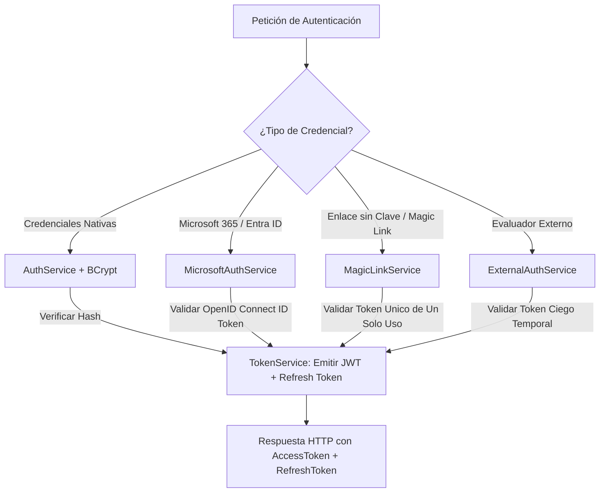
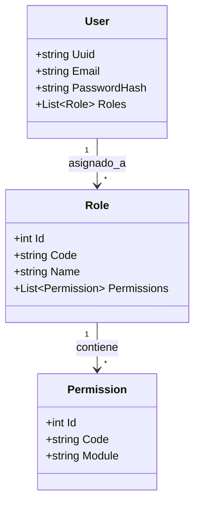

# Arquitectura de Autenticación, SSO y Control de Acceso (RBAC)

## 1. Visión General de Seguridad

El subsistema de seguridad e identidad de DOSIER (`Security`) proporciona un marco de autenticación híbrido y control de acceso basado en roles (RBAC) con políticas granulares. El sistema está diseñado para dar soporte a tres tipos de usuarios con necesidades distintas:

1. **Docentes y Directores Internos:** Autenticación institucional mediante Single Sign-On (SSO) con Microsoft 365 / Entra ID o credenciales nativas con hash BCrypt.
2. **Evaluadores Pares Ciegos Externos:** Autenticación temporal y sin contraseña mediante Magic Links seguros o tokens restringidos.
3. **Administradores y Auditores CACES:** Autenticación con segundo factor de verificación y permisos de superusuario con trazabilidad completa.

---

## 2. Métodos de Autenticación Soportados

### 2.1. Autenticación Nativa (JWT Bearer + BCrypt)
* **Hashing de Contraseñas:** Administrado por `PasswordService` utilizando el algoritmo **BCrypt** (`BCrypt.Net-Next`) con un factor de trabajo (*work factor*) configurable de 12 rondas para prevenir ataques de fuerza bruta y *rainbow tables*.
* **Emisión de Tokens JWT:** Administrado por `TokenService`. Los JSON Web Tokens son firmados criptográficamente mediante algoritmo HMAC-SHA256 (`SymmetricSecurityKey`).
* **Estructura de Claims del JWT:**
  * `sub` / `nameid`: Identificador único del usuario (`UserUuid`).
  * `email`: Correo electrónico institucional.
  * `role`: Rol principal asignado (ej. `DOCENTE_INVESTIGADOR`, `EVALUADOR_PAR`, `ADMINISTRADOR_INVESTIGACION`).
  * `permissions`: Lista de permisos RBAC granulares inyectados dinámicamente.
* **Mecanismo de Refresh Token:** Rotación segura de tokens de refresco almacenados en la base de datos con tiempo de expiración acotado.

### 2.2. Single Sign-On (SSO) Microsoft 365 / Entra ID
* **Servicio:** `MicrosoftAuthService`.
* **Mecanismo:** El cliente React autentica al usuario contra Microsoft Identity Platform (MSAL) y transmite el `id_token` al backend.
* **Validación Backend:** El servidor valida la firma del token OpenID Connect contra las claves públicas de Microsoft (`https://login.microsoftonline.com/common/v2.0/.well-known/openid-configuration`), verifica el *Audience* (ClientID) y aprovisiona o sincroniza automáticamente la cuenta del docente en DOSIER.

### 2.3. Autenticación sin Contraseña mediante Magic Links
* **Servicio:** `MagicLinkService`.
* **Propósito:** Permitir a evaluadores externos o docentes acceder a formularios específicos sin necesidad de crear una clave permanente.
* **Mecanismo:** Generación de un token criptográfico aleatorio de alta entropía (`Guid` / `byte[]` criptográfico), asociado a un recurso con tiempo de vida limitado (ej. 48 horas) y consumo de un solo uso (*single-use token*). El enlace se transmite mediante el servicio de correo institucional.

---

## 3. Modelo de Control de Acceso Basado en Roles (RBAC)

DOSIER implementa un modelo de autorización flexible que combina roles institucionales con permisos de grano fino.

### 3.1. Roles Predeterminados del Sistema

| Código de Rol | Nombre del Rol | Alcance de Permisos |
| :--- | :--- | :--- |
| `SUPER_ADMIN` | Administrador del Sistema | Acceso total a configuraciones, usuarios, tablas y logs de auditoría. |
| `DIRECTOR_INVESTIGACION` | Director de I+D+i | Gestión de convocatorias, asignación de evaluadores, aprobación final de proyectos y emisión de resoluciones. |
| `DOCENTE_INVESTIGADOR` | Docente Investigador | Creación de propuestas, edición colaborativa de borradores, envío de informes de avance y registro de entregables. |
| `EVALUADOR_PAR` | Evaluador Par Ciego | Acceso exclusivo al portal de evaluación ciega para asignaciones específicas, llenado de rúbricas y dictamen. |
| `AUDITOR_CACES` | Auditor Externo | Acceso de solo lectura a reportes institucionales, matrices de evidencia y nodos de verificación SHA-256. |

### 3.2. Autorización por Permisos Granulares (Custom Policy Requirements)
En lugar de restringir controladores únicamente por rol (`[Authorize(Roles = "ADMIN")]`), el backend utiliza la infraestructura de políticas dinámicas de ASP.NET Core:

* **Filtro Custom:** `PermissionHandler` procesa requerimientos de tipo `PermissionRequirement`.
* **Verificación Dinámica:** El filtro evalúa en tiempo de ejecución si el usuario autenticado posee el permiso específico (ej. `projects.create`, `projects.approve`, `signatures.stamp`) consultando la caché de permisos o los claims del JWT.
