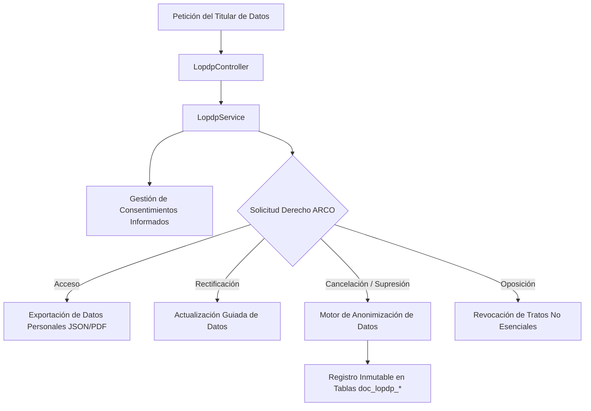

# Gobernanza de Datos, Protección LOPDP y Bitácora de Auditoría

## 1. Visión General y Marco Legal

DOSIER implementa una arquitectura de gobernanza de datos diseñada para cumplir rigurosamente con la **Ley Orgánica de Protección de Datos Personales (LOPDP)** de la República del Ecuador y responder a los requerimientos de auditabilidad, trazabilidad e inmutabilidad del **CACES**.

El subsistema abarca el tratamiento seguro de datos personales de docentes, la gestión de consentimientos informados para firmas electrónicas, el procesamiento de derechos ARCO y el registro inalterable de cada mutación curricular en el backend.

---

## 2. Cumplimiento de la Ley Orgánica de Protección de Datos Personales (LOPDP)

### 2.1. Gestión de Consentimientos Informados (`doc_lopdp_consentimientos`)
Cada docente o directivo que firma o interactúa con el sistema acepta explícitamente los términos de tratamiento de datos personales y uso de certificados digitales. La tabla `doc_lopdp_consentimientos` almacena:
* `idUsuario`: Identificador del usuario titular.
* `versionPolitica`: Versión exacta del aviso de privacidad y política institucional aceptada.
* `fechaConsentimiento`: Marca de tiempo UTC del consentimiento.
* `ipAcceso` y `userAgent`: Dirección IP y dispositivo de origen.
* `finalidadesAutorizadas`: Finalidades académicas y de acreditación CACES autorizadas.

### 2.2. Atención a Derechos ARCO (Acceso, Rectificación, Cancelación y Oposición)
* **Derecho de Acceso:** Generación de un reporte estructurado con la totalidad de los datos personales, nombramientos docentes y asignaciones curriculares del titular.
* **Derecho de Rectificación:** Canal de actualización con validación contra el registro institucional de SIGAFI.
* **Derecho de Cancelación (Anonimización):** En caso de desvinculación institucional, DOSIER no elimina físicamente expedientes de asignaturas ya aprobadas o legalizadas, puesto que constituyen evidencia obligatoria de acreditación ante el CACES. En su lugar, el servicio ejecuta una pseudonimización, disociando los identificadores personales y preservando la integridad técnica de la planificación.
* **Protección de Adaptaciones Curriculares:** Los datos sobre adaptaciones curriculares asociadas a necesidades educativas específicas se almacenan segregados, con acceso restringido exclusivamente a las autoridades autorizadas y fuera del documento público distribuido a estudiantes.

---

## 3. Bitácoras de Auditoría y Trazabilidad Forense

Las operaciones críticas del sistema se auditan en tablas especializadas:

### 3.1. Auditoría Documental (`doc_document_audit`)
Registra cada cambio en las instancias documentales:
* `idDocumentoInstancia`: Documento intervenido.
* `idUsuario`: Actor que realizó la operación.
* `accion`: Creación, actualización, envío a revisión, cambio de estado o firma.
* `detalles`: Metadatos serializados del cambio.
* `ip`: Dirección IP de la solicitud.
* `fecha`: Marca de tiempo UTC inalterable.

### 3.2. Trazabilidad del PEA (`doc_pea_trazabilidad`)
Soporte del ciclo de vida del Programa de Estudio de la Asignatura:
* `idPea`: Identificador de la asignatura y su planificación.
* `estadoAnterior` y `estadoNuevo`: Transición de estado (`Borrador` -> `EnRevision` -> `RevisadoCoord` -> `RevisadoAcad` -> `Aprobado`).
* `motivo`: Justificación técnica de la transición o aval emitido.
* `idUsuario`: Autoridad o docente que autorizó el cambio.
* `hashDocumento`: Hash criptográfico SHA-256 calculado sobre el contenido curricular completo al momento de la transición.

### 3.3. Auditoría LOPDP (`doc_lopdp_auditoria_datos`)
Registro inalterable de cada acceso, consulta o exportación de datos sensibles de usuarios para inspección del CACES y entes reguladores.

---

## 4. Política de Retención y Custodia Documental

1. **Inmutabilidad Post-Aprobación:** Los PEAs que alcanzan el estado `Aprobado` quedan permanentemente bloqueados para escritura (*State Locking*). Cualquier necesidad de ajuste en un período posterior genera una nueva versión formal vinculada sin sobreescribir el antecedente histórico.
2. **Custodia de Documentos Oficiales:** Los archivos PDF vectoriales legalizados y sus firmas criptográficas se conservan en almacenamiento estructurado local, protegidos contra eliminación accidental o automática no autorizada.
