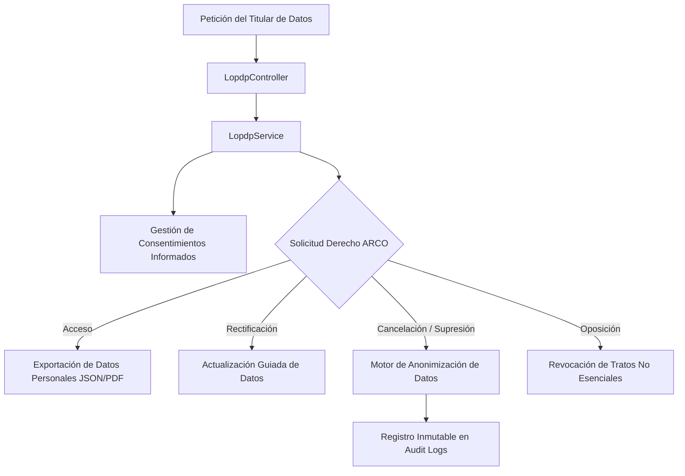
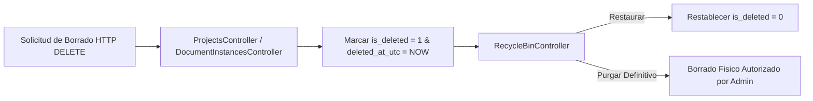

# Gobernanza de Datos, Protección LOPDP y Bitácora de Auditoría

## 1. Visión General y Marco Legal

DOSIER implementa una arquitectura de gobernanza de datos diseñada para cumplir rigurosamente con la **Ley Orgánica de Protección de Datos Personales (LOPDP)** del Ecuador y responder a los requerimientos de auditabilidad e inmutabilidad del **CACES**.

El subsistema abarca el tratamiento seguro de datos personales de docentes e investigadores, la gestión explícita de consentimientos informados, el procesamiento de derechos ARCO y el registro inalterable de cada mutación de datos en el backend.

---

## 2. Cumplimiento de la Ley Orgánica de Protección de Datos Personales (LOPDP)



### 2.1. Gestión de Consentimientos Informados
Cada docente o evaluador que interactúa con la plataforma debe aceptar explícitamente los términos de tratamiento de datos personales. El servicio `LopdpService` almacena el registro del consentimiento incluyendo:
* Identificador único del usuario.
* Versión exacta del aviso de privacidad aceptado.
* Marca de tiempo UTC y dirección IP de origen.
* Finalidades autorizadas (investigación académica, evaluación por pares, notificaciones institucionales).

### 2.2. Atencion a Derechos ARCO (Acceso, Rectificacion, Cancelacion y Oposicion)
* **Derecho de Acceso:** Generación de un reporte descargable en formato estructurado que recopila la totalidad de los datos personales y académicos almacenados.
* **Derecho de Rectificación:** Canal seguro para corregir inconsistencias en nombres, títulos académicos o adscripciones institucionales.
* **Derecho de Cancelación (Anonimización):** En caso de ejercer el derecho al olvido o baja institucional, DOSIER no elimina físicamente registros vinculados a proyectos aprobados para no romper la trazabilidad histórica de I+D+i. En su lugar, el `LopdpService` ejecuta una **pseudonimización irreversibles**, reemplazando datos identificativos por hashes irreversibles y manteniendo únicamente la estructura técnica necesaria para fines estadísticos y de acreditación.

---

## 3. Bitácora de Auditoría Inmutable (`audit_logs`)

Todas las operaciones de creación, modificación o eliminación ejecutadas en la solución backend son interceptadas y registradas de forma transparente por el servicio `AuditService`.

### 3.1. Estructura de la Tabla de Auditoría

```sql
CREATE TABLE audit_logs (
    id BIGINT AUTO_INCREMENT PRIMARY KEY,
    user_uuid VARCHAR(36) NULL,
    user_email VARCHAR(255) NULL,
    action_type VARCHAR(50) NOT NULL, -- INSERT, UPDATE, DELETE, EXECUTE, SIGN
    entity_name VARCHAR(100) NOT NULL,
    entity_uuid VARCHAR(36) NOT NULL,
    old_values_json LONGTEXT NULL,     -- Estado previo a la mutación
    new_values_json LONGTEXT NULL,     -- Estado posterior a la mutación
    ip_address VARCHAR(45) NOT NULL,
    user_agent VARCHAR(500) NULL,
    timestamp_utc DATETIME NOT NULL DEFAULT CURRENT_TIMESTAMP
);
```

### 3.2. Características de Seguridad del Audit Trail
* **Snapshots de Diferencia (JSON Diffs):** Ante un `UPDATE`, el backend captura exactamente el JSON previo (`old_values_json`) y el JSON resultante (`new_values_json`), permitiendo la reconstrucción histórica de cualquier entidad en un momento dado.
* **Imposibilidad de Modificación:** Los endpoints de la API no exponen operaciones de actualización o borrado sobre la tabla `audit_logs`. Esta tabla solo permite operaciones de inserción (`APPEND-ONLY`).

---

## 4. Papelera de Reciclaje Lógica y Soft Deletes

Para prevenir la pérdida accidental de información y asegurar la recuperabilidad de proyectos en formulación, DOSIER aplica la estrategia de **Soft Delete**.



* **Comportamiento por Defecto:** Al eliminar un registro, EF Core actualiza las columnas `is_deleted = true` y `deleted_at_utc = DateTime.UtcNow`.
* **Filtrado Automático:** Los `DbContextQueryFilters` de EF Core excluyen automáticamente los registros marcados como eliminados en todas las consultas habituales de la API.
* **Gestión Centralizada (`RecycleBinController`):** Proporciona a los administradores una interfaz para inspeccionar registros eliminados, evaluar el impacto de su eliminación y ejecutar acciones de restauración inmediata o purgado físico definitivo.
