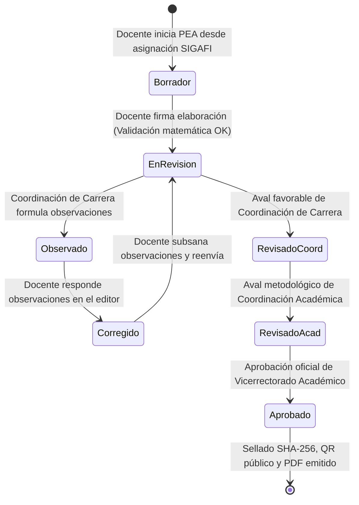

# Ciclo de Vida Curricular, Workflow y Portafolio Docente

## 1. Visión General del Módulo Curricular

El módulo de gestión curricular constituye el núcleo operativo de **DOSIER**. Administra la totalidad del ciclo de vida de la planificación microcurricular docente en el Instituto Superior Tecnológico Mayor Pedro Traversari (ISTPET), centrado en el **Programa de Estudio de la Asignatura (PEA)** en sus 11 secciones oficiales (a - k), su articulación con los proyectos de carrera, la co-redacción concurrente y su legalización forense.

---

## 2. Máquina de Estados y Circuito de Firmas del PEA

El avance de un PEA a través de sus fases está regulado por `PeaService` y las restricciones de seguridad RBAC:

### 2.1. Estados del Documento

| Estado | Significado Institucional | Actores Autorizados para Operar |
| :--- | :--- | :--- |
| `Borrador` | Redacción inicial del PEA por el docente titular y co-redactores mediante CoWork. | `DOSIER_DOCENTE` |
| `EnRevision` | Documento enviado formalmente para revisión colegiada. Se bloquea la edición directa. | `DOSIER_COORD_CARRERA`, `DOSIER_COORD_ACAD` |
| `Observado` | Se han emitido observaciones técnicas o metodológicas puntuales por sección. | `DOSIER_DOCENTE` |
| `Corregido` | El docente ha subsanado los requerimientos y prepara el reenvío a evaluación. | `DOSIER_DOCENTE` |
| `RevisadoCoord` | Aval favorable del Coordinador de Carrera sobre pertinencia disciplinar y perfil de egreso. | `DOSIER_COORD_ACAD` |
| `RevisadoAcad` | Aval favorable de la Coordinación Académica sobre estructura metodológica y horas. | `DOSIER_VICERRECTOR` |
| `Aprobado` | Aprobación legal definitiva de Vicerrectorado Académico. Documento inmutable y público. | Solo lectura |

---

## 3. Validaciones Matemáticas Bloqueantes

Antes de permitir la transición a `EnRevision`, el `CurricularValidationEngine` verifica de forma intransigente:
1. **Total de Horas:** La suma de horas de las unidades temáticas debe ser exactamente igual a las horas totales de la asignatura en `detallemallas` de SIGAFI.
2. **Componentes de Aprendizaje:**
   $$\text{Horas Docencia} + \text{Horas APE} + \text{Horas Autónomo} = \text{Horas Totales Asignatura}$$
   $$\text{Horas Autónomo} = \text{Horas Totales} - (\text{Horas Docencia} + \text{Horas APE})$$
3. **Carga Práctico-Experimental:** La suma de horas de las actividades prácticas planificadas no puede exceder las horas APE autorizadas para la materia.
4. **Articulación al Perfil de Egreso:** Cada resultado de aprendizaje de la asignatura (RDA) debe estar vinculado a al menos un resultado del Perfil de Egreso de la carrera.
5. **Bibliografía Mínima:** Presencia obligatoria de bibliografía básica con justificación académica.

---

## 4. Módulo de Observaciones y Subsanación Colegiada

Para evitar revisiones informales en hojas dispersas o correos electrónicos, DOSIER integra un flujo estructurado de observaciones:
* **Observación por Sección (`doc_pea_observaciones`):** El Coordinador de Carrera o Coordinador Académico registra comentarios directamente asociados a una sección específica del PEA (ej. `Sección f: Contenidos`, `Sección i: Evaluación`).
* **Subsanación Auditada:** El docente elaborador atiende cada observación registrando su respuesta formal y los ajustes realizados en el editor.
* **Trazabilidad Inalterable (`doc_pea_trazabilidad`):** Cada observación formulada y cada respuesta registrada queda almacenada cronológicamente con usuario, rol, fecha UTC y hash del documento, constituyendo evidencia documental ante auditorías del CACES.

---

## 5. Herencia Curricular y Clonación entre Períodos

Para reducir el esfuerzo administrativo repetitivo sin incurrir en duplicaciones ciegas:
* **Clonación Asistida (`ClonarPeaPeriodoAsync`):** Al iniciar un nuevo ciclo lectivo, el docente o coordinador puede clonar la estructura pedagógica de un PEA aprobado en un período anterior hacia el nuevo período académico.
* **Revalidación de Contexto Institucional:** La clonación no copia ciegamente identificadores anteriores; revalida las horas de la malla vigente (`mallas_periodos`), las autoridades en funciones y el nuevo distributivo docente de SIGAFI, iniciando el nuevo PEA en estado `Borrador` para su contextualización.
