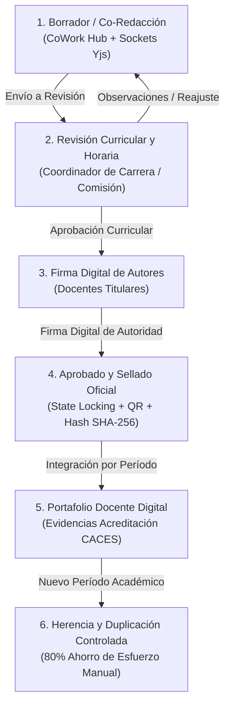
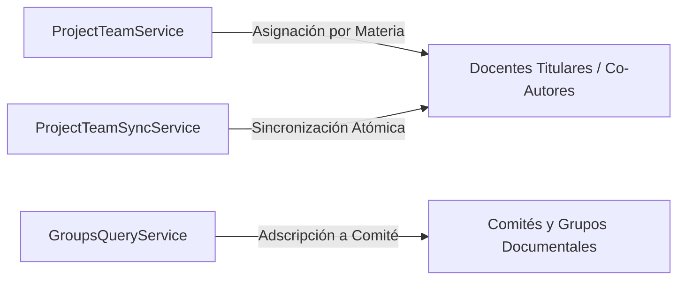

# Ciclo de Vida Curricular, Workflow y Portafolio Docente

## 1. Visión General del Módulo Curricular

El módulo de gestión curricular constituye el núcleo operativo de **DOSIER**. Administra la totalidad del ciclo de vida de la planificación docente institucional en el ISTPET:
1. **Programa de Estudio de la Asignatura (PEA)**
2. **Plan Analítico o Sílabo (19 Semanas)**
3. **Guías de Prácticas de Aprendizaje Práctico-Experimental (Guías APE)**
4. **Guía de Estudio Institucional**

---

## 2. Máquina de Estados y Workflow Curricular

El avance de un documento o expediente docente a través de sus fases está regulado por el `WorkflowEngineService` y orquestado por el `ProjectOrchestrator` / `IDocumentInstanceService`.

### 2.1. Validación Matemática de Horas y Créditos
Durante la formulación y revisión del Sílabo y PEA, el sistema valida en tiempo real:
* La correspondencia exacta de horas de **Docencia**, **Práctico-Experimental (APE)** y **Trabajo Autónomo** con la Malla Curricular vigente en SIGAFI.
* La distribución de las **19 semanas académicas** del ciclo formativo institucional.
* El cálculo automático y coherente de créditos académicos bajo el Reglamento de Régimen Académico (RRA).

### 2.2. Bloqueo de Estado (*State Locking*)
Una vez que el documento es enviado a revisión curricular o completado con las firmas de los docentes, el `WorkflowEngineService` activa el bloqueo de edición (*State Locking*). Cualquier intento de modificación es rechazado automáticamente para garantizar la inmutabilidad de la evidencia ante auditorías del CACES.

---

## 3. Gestión de Co-Redacción y Equipos Docentes

La conformación del equipo docente responsable de una asignatura o módulo está gestionada por servicios especializados:

### 3.1. Roles dentro del Equipo Curricular
* **Docente Titular / Responsable:** Docente a cargo de la asignatura o área de conocimiento.
* **Co-Autor / Docente Paralelo:** Docente que imparte la misma materia en otra sección/jornada y colabora concurrentemente en el Sílabo.
* **Coordinador de Carrera / Revisor:** Encargado de verificar la congruencia curricular y metodológica.
* **Estudiante Colaborador:** Participante de apoyo formativo en el diseño de guías prácticas.

---

## 4. Portafolio Docente y Acreditación Institucional

### 4.1. Conformación del Portafolio Digital
Al culminar el período académico, DOSIER compila automáticamente el expediente docente digital compuesto por:
* PEA aprobado y firmado digitalmente.
* Sílabo de 19 semanas con rúbricas y cronograma validado.
* Guías APE vinculadas a las horas prácticas declaradas.
* Guías de Estudio oficiales en formato institucional ISTPET.

### 4.2. Herencia y Transición entre Períodos Académicos
Para evitar la digitación redundante al inicio de cada nuevo ciclo, los docentes pueden duplicar un documento previamente validado del período anterior, heredando los contenidos transversales y permitiendo únicamente los ajustes contextuales pertinentes.
