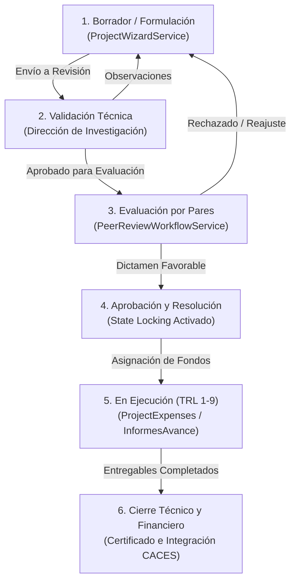
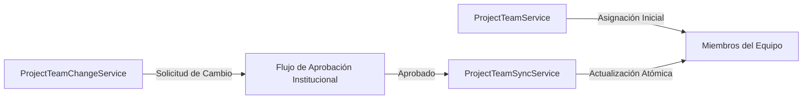

# Ciclo de Vida de Proyectos, Workflow y Seguimiento TRL

## 1. Visión General del Módulo de Investigación

El módulo de gestión de investigación constituye el núcleo operativo de DOSIER. Administra la totalidad del ciclo de vida de los proyectos de I+D+i, desde la publicación de la convocatoria pública hasta el seguimiento del Nivel de Madurez Tecnológica (TRL 1-9), el control presupuestario y la entrega de informes de avance.

---

## 2. Máquina de Estados y Workflow del Proyecto

El avance de un proyecto a través de sus fases está regulado por el `WorkflowEngineService` y orquestado por el `ProjectOrchestrator`.

### 2.1. Formulación Asistida (`ProjectWizardService`)
Guiado paso a paso para la redacción de la propuesta de investigación. Almacena borradores parciales y ejecuta validaciones en tiempo real sobre:
* Alineación con líneas y sublíneas de investigación institucionales.
* Mapeo obligatorio con las áreas del conocimiento UNESCO.
* Vinculación con los Objetivos del Plan Nacional de Desarrollo (PND) y ODS de la ONU.

### 2.2. Bloqueo de Estado (*State Locking*)
Una vez que la propuesta es enviada a validación o evaluación por pares, el `WorkflowEngineService` activa el bloqueo de edición. Cualquier intento de mutación sobre la propuesta principal es rechazado automáticamente hasta que se emita un dictamen formal.

---

## 3. Gestión de Equipos de Investigación y Solicitud de Cambios

La conformación del equipo de proyecto y sus modificaciones están gestionadas por tres servicios especializados:

### 3.1. Roles dentro del Equipo
* **Director / Investigador Principal (IP):** Responsable técnico y administrativo del proyecto.
* **Co-Investigador:** Docente colaborador en la ejecución de actividades.
* **Estudiante Técnico / Ayudante de Investigación:** Estudiante adscrito para soporte técnico.

### 3.2. Flujo de Cambio de Integrantes (`ProjectTeamChangeService`)
La incorporación, salida o sustitución de un miembro durante la ejecución requiere la creación de una solicitud formal de cambio. El servicio valida la justificación académica, procesa las firmas de conformidad y actualiza atómicamente la adscripción mediante `ProjectTeamSyncService`.

---

## 4. Seguimiento de Niveles de Madurez Tecnológica (TRL 1-9)

DOSIER integra la escala de TRL (Technology Readiness Level) para medir la evolución de los proyectos de desarrollo tecnológico e innovación.

| Nivel TRL | Fase de Desarrollo | Evidencia Requerida en DOSIER |
| :--- | :--- | :--- |
| **TRL 1 - 3** | Investigación Básica y Formulación del Concepto | Estado del arte, publicaciones y validación analítica de laboratorio. |
| **TRL 4 - 6** | Validación en Entorno de Laboratorio / Relevante | Prototipo alfa funcional, componentes probados y pruebas de concepto. |
| **TRL 7 - 9** | Demostración en Entorno Real y Despliegue | Prototipo beta/final operando en entorno operativo real y transferencia. |

El controlador `ResearchProductsController` registra los productos tecnológicos generados (patentes, registros de software, prototipos) asociándolos al nivel TRL correspondiente.

---

## 5. Control Presupuestario e Informes de Avance

### 5.1. Control de Gastos (`ProjectExpensesService`)
Administra la ejecución financiera del proyecto dividida por partidas presupuestarias (equipamiento, insumos, publicaciones, viáticos). El servicio impide la sobreejecución de rubros y valida los respaldos digitales de cada comprobante.

### 5.2. Informes de Avance (`InformesAvanceController` / `InformeAvanceService`)
Durante la fase de ejecución, los directores de proyecto deben presentar informes periódicos de avance técnico y financiero. El servicio coordina:
* Carga de entregables y evidencias fotográficas/documentales.
* Evaluación del cumplimiento del cronograma de actividades.
* Emisión del certificado de avance para la liberación de desembolsos.
