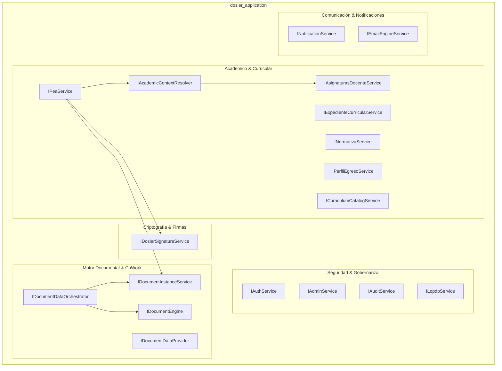

# Capa de Aplicación, Casos de Uso y Servicios de Orquestación (Application Layer)

## 1. Responsabilidad y Arquitectura de la Capa de Aplicación

La capa de aplicación (`dosier_application`) materializa los casos de uso del sistema **DOSIER**, orquestando el flujo de datos entre el modelo de dominio (`dosier_domain`), los contratos de persistencia de infraestructura (`dosier_infrastructure`) y la capa de exposición web (`dosier_api`).

Bajo los principios de Clean Architecture, `dosier_application` no contiene detalles tecnológicos de acceso a base de datos (SQL, EF Core) ni protocolos de transporte HTTP (ASP.NET Core Controllers). Su misión radica en:
* Definir las interfaces de servicios y repositorios.
* Modelar los Data Transfer Objects (DTOs) para entrada y salida.
* Implementar las reglas de orquestación, validación de negocio y flujos colegiados (elaboración del PEA, verificación de firmas, sincronización CoWork y control LOPDP).

---

## 2. Mapa de Subsistemas de Aplicación



---

## 3. Subsistema Académico y Curricular

### 3.1. Resolución de Contexto Académico SIGAFI (`Academico/`)

Garantiza la frontera inmutable de solo lectura con el sistema transaccional institucional `sigafi_es`. La plataforma DOSIER prohíbe la alteración de cargas horarias o asignaturas desde la interfaz docente; todo dato curricular se resuelve y valida contra SIGAFI.

#### `IAcademicContextResolver`
```csharp
public interface IAcademicContextResolver
{
    Task<AcademicContextDto?> ResolveByAssignmentAsync(
        int idAsignacion,
        string? expectedProfessorId = null,
        CancellationToken cancellationToken = default);
}
```
* **Responsabilidad:** Identifica la asignación docente (`idAsignacion`), verifica la correspondencia con la cédula del docente (`expectedProfessorId`), vincula la carrera institucional (`esInstituto = 1`), resuelve la cohorte de la malla (`mallas_periodos`) y consolida la distribución oficial de horas: docencia, prácticas (APE) y trabajo autónomo.

#### `IAsignaturasDocenteService`
* `GetPeriodoActivoAsync()`: Obtiene el período académico institucional actualmente vigente.
* `GetPeriodosDisponiblesAsync()`: Histórico de períodos habilitados para consulta y clonación curricular.
* `GetMisAsignaturasAsync(string idProfesor, string? idPeriodo)`: Carga horaria del profesor con banderas de estado del PEA (`NoIniciado`, `Borrador`, `EnRevision`, `Aprobado`).
* `GetCurriculoAsignaturaAsync(int idAsignatura, int idCarrera)`: Información oficial del pensum, prerrequisitos y créditos.

### 3.2. Gestión Integral del PEA (`Curriculum/Interfaces/ICurriculumInterfaces.cs`)

El servicio `IPeaService` coordina las 11 secciones pedagógicas oficiales del PEA institucional (Secciones a - k), el control de versiones, el flujo de firmas y las observaciones colegiadas.

#### Catálogo de Operaciones de `IPeaService`:

| Método | Propósito y Reglas de Negocio |
| :--- | :--- |
| `GetByIdAsync(int idPea)` | Recupera el PEA con sus unidades, RDAs, prácticas, bibliografía APA, prerrequisitos y evaluaciones. |
| `GetByUuidAsync(string uuid)` | Consulta segura y desacoplada de IDs secuenciales para el editor web. |
| `CrearDesdeAsignacionAsync(int idAsignacion, string idProfesor)` | Caso de uso de instanciación inicial: resuelve el contexto SIGAFI vía `IAcademicContextResolver`, precarga horas oficiales y crea el registro con versión 1 en estado `Borrador`. |
| `GuardarPeaAsync(PeaDto dto, string? idUsuarioModificador)` | Persistencia incremental de secciones. Valida que la suma de horas de las unidades coincida exactamente con las horas totales de la asignatura. |
| `CambiarEstadoAsync(...)` | Transición entre estados de la máquina curricular (`Borrador` -> `EnRevision` -> `RevisadoCoord` -> `RevisadoAcad` -> `Aprobado`), registrando trazabilidad SHA-256. |
| `ClonarPeaPeriodoAsync(...)` | Permite replicar un PEA aprobado de un período anterior hacia un nuevo período lectivo, conservando unidades y bibliografía pero reiniciando firmas y observaciones. |
| `FirmarPeaAsync(...)` | Validación de credenciales/certificados, sellado criptográfico y avance del circuito de firmas. |
| `AgregarObservacionAsync(...)` | Registro de hallazgo de revisión colegiada especificando sección afectada y texto de observación. |
| `SubsanarObservacionAsync(...)` | Respuesta formal del docente que marca la observación como `Subsanada`. |
| `ListarBandejaAsync(...)` | Bandeja unificada de supervisión para coordinadores y vicerrectorado, con cálculo de firmas completadas (`TotalFirmasCompletadas`) y conteo de observaciones pendientes. |

### 3.3. Servicios de Gobernanza Curricular y Antecedentes

* **`IExpedienteCurricularService`:** Gestiona el expediente curricular maestro por asignatura y período, asociando el proyecto de carrera aprobado por el CES, el perfil de egreso y el modelo educativo vigente.
* **`INormativaService`:** Provee el catálogo inalterable de resoluciones externas (CES, CACES, SENESCYT) y el checklist de artículos que los docentes deben certificar pedagógicamente en el PEA.
* **`IPerfilEgresoService`:** Administra los Resultados de Aprendizaje de Carrera (RDA) y la matriz de tributación de las asignaturas (`Introductorio`, `Medio`, `Avanzado`).

---

## 4. Motor Documental Empresarial y CoWork (`Common/`)

### 4.1. Orquestación del Motor Documental (`IDocumentEngine`)

Implementa la interfaz unificada del motor de generación de documentos oficiales en formato PDF:

```csharp
public interface IDocumentEngine
{
    Task<DocumentResult> GenerateAsync(DocumentRequest request, CancellationToken cancellationToken = default);
    Task<byte[]> MergeDocumentsAsync(IEnumerable<byte[]> pdfDocuments, CancellationToken cancellationToken = default);
    Task<IEnumerable<DocumentTemplate>> GetAvailableTemplatesAsync(CancellationToken cancellationToken = default);
    Task UpdateTemplateAsync(string templateCode, string newHtmlContent, string? customCss, string? collaborativeFieldsJson, string? themeConfigJson, string updatedBy, CancellationToken cancellationToken = default);
    Task ResetTemplateToDefaultAsync(string templateCode, string updatedBy, CancellationToken cancellationToken = default);
    Task UpdateSignatureConfigAsync(string templateCode, bool requiresSignature, string signatureType, string updatedBy, CancellationToken cancellationToken = default);
}
```

* **`DocumentRequest`:** Recibe el código de plantilla, la data del documento (cualquier DTO tipado), variables auxiliares, flags de borrador (`IsDraftMode`) o anonimización (`IsBlindMode`) y anexos binarios a concatenar (`AttachmentsToMerge`).
* **`DocumentResult`:** Devuelve los bytes del PDF, el nombre de archivo, el código de trazabilidad único (`TraceabilityCode`), el hash criptográfico SHA-256 (`FileHash`) y la versión de la plantilla utilizada.

### 4.2. Instancias Documentales y Auditoría (`IDocumentInstanceService`)

* **Gestión de Instancias:** Vincula plantillas con entidades de negocio (`entityUuid`), versionando snapshots de configuración visual y datos.
* **Diagnóstico y Purga Forense:**
  * `GetObsoleteDocumentDiagnosisAsync()`: Detecta PDFs generados con versiones obsoletas de plantillas.
  * `PurgeObsoleteFileByUuidAsync()` / `PurgeAllObsoleteDocumentFilesAsync()`: Elimina físicamente archivos huérfanos u obsoletos del sistema de archivos, preservando intactos los registros de auditoría y hashes SHA-256 bajo estado `Archived`.
  * `UpgradeTemplateAsync()`: Actualiza una instancia a la versión más reciente de la plantilla institucional.

---

## 5. Subsistema de Seguridad, Identidad y Gobernanza LOPDP (`Security/`)

### 5.1. Autenticación y Autorización (`IAuthService`)

Centraliza los mecanismos de ingreso y aprovisionamiento de usuarios:
1. **Login Tradicional:** Validación de credenciales de SIGAFI mediante hashing BCrypt. Implementa bloqueo progresivo por IP o cuenta ante intentos fallidos (`LoginBlockedResponse`).
2. **JIT Provisioning (Just-In-Time):** Si un docente registrado en SIGAFI ingresa por primera vez a DOSIER, el sistema aprovisiona automáticamente su usuario en el sistema ID 6 y le asigna el rol `DOSIER_DOCENTE`.
3. **SSO Microsoft 365 (`LoginWithMicrosoftAsync`):** Autenticación federada mediante tokens institucionales de Azure AD / Entra ID.
4. **Magic Links y Transición de Sesión (`ValidateAndConsumeHandoffPinAsync`):** Acceso seguro sin contraseña mediante enlaces temporales de un solo uso firmados criptográficamente y PIN de traspaso para sincronizar sesión entre navegadores o estaciones de trabajo.
5. **Recuperación Segura de Contraseña:** Generación de tokens efímeros (30 minutos) con respuesta anti-enumeración de usuarios (retorna siempre confirmación genérica independientemente de si la cédula existe o no).

### 5.2. Gobernanza de Datos Personales (`ILopdpService`)

Cumplimiento estricto de la Ley Orgánica de Protección de Datos Personales del Ecuador:
* **Registro de Consentimiento Informado:** Almacena la versión de la política de privacidad aceptada, canal, dirección IP y marca de tiempo UTC.
* **Derechos ARCO (Acceso, Rectificación, Cancelación, Oposición):** Flujo formal para registrar solicitudes ARCO de la comunidad académica (`SolicitudArcoRequest`), con plazo legal perentorio de resolución (`FechaLimiteResolucion`).

### 5.3. Auditoría Forense Administrativa (`IAuditService`)

Registra toda acción sensible efectuada por administradores o coordinadores:
* Identidad del operador (`AdminName`), usuario afectado (`TargetName`), acción, módulo, dirección IP, User-Agent y deltas exactos en JSON de los valores anteriores (`ValuesBefore`) y posteriores (`ValuesAfter`).

---

## 6. Subsistema de Criptografía y Firmas Digitales (`Signatures/`)

### 6.1. Contrato del Servicio de Firma (`IDosierSignatureService`)

Implementa el marco legal ecuatoriano (Ley de Comercio Electrónico, Firmas Electrónicas y Mensajes de Datos - Ley 67):

```csharp
public interface IDosierSignatureService
{
    Task<UserSignatureProfileDto?> GetProfileAsync(int idUsuario);
    Task<UserSignatureProfileDto> UpsertProfileAsync(int idUsuario, UpdateSignatureProfileDto dto);
    
    Task<SignatureResultDto> SignDocumentAsync(int idUsuario, string ipAddress, string userAgent, SignDocumentDto dto);
    Task<SignatureResultDto> SignDocumentWithP12Async(int idUsuario, string ipAddress, string userAgent, byte[] certificateBytes, string certificatePassword, string documentoUuid, string? rolFirmante);
    
    Task<IEnumerable<SignatureRecordDto>> GetByDocumentAsync(string documentoUuid);
    Task<SignatureVerificationDto> VerifyAsync(string firmaCode);
    Task<bool> RevokeAsync(int idUsuarioSolicitante, RevokeSignatureDto dto, bool esAdmin = false);
}
```

* **Firma Institucional DOSIER:** Requiere re-autenticación obligatoria con contraseña para garantizar no-repudio. Genera código de trazabilidad con formato `DFRM-{AÑO}-{UUID8}`, firma HMAC-SHA256, hash SHA-256 del binario y estampa visual en el PDF.
* **Firma con Certificado PKCS#12 (.p12 / FirmaEC):** Valida la vigencia de la cadena de confianza y la clave privada del certificado del docente o autoridad.
* **Verificación Pública (`VerifyAsync`):** Endpoint de libre acceso (sin sesión requerida) consumido desde el código QR impreso en el documento para certificar la validez de la firma.

---

## 7. Subsistema de Comunicación y Notificaciones (`Common/Notifications/`)

* **`INotificationService`:** Orquesta la distribución multicanal de alertas institucionales (cambio de estado del PEA, asignación de observaciones, recordatorios de firma). Soporta notificaciones dirigidas a usuarios (`NotifyUserAsync`), difusión por roles (`NotifyByRoleCodesAsync`) y marcas de lectura.
* **`INotificationDriver`:** Interfaz extensible para proveedores de envío (WebSockets SignalR en tiempo real, WebPush VAPID para navegadores).
* **`IEmailEngineService`:** Motor de correos electrónicos transaccionales con plantillas dinámicas HTML institucionales (`EmailTemplateDto`), cola de envíos y bitácora de auditoría de entrega (`EmailHistorialDto`).

---

## 8. Servicios de Orquestación Especializada y Purificación Total de Controladores

Para dar cumplimiento estricto al principio de inversión de dependencias y Clean Architecture pura, el 100% de los controladores de la capa `dosier_api` tienen prohibido inyectar `DosierContext` o ejecutar consultas LINQ directas. Todas las operaciones de persistencia y coordinación se desacoplan mediante contratos en `dosier_application`:

* **`ICatalogsService`:** Centraliza la consulta y mutación de catálogos institucionales, carreras activas (`esInstituto = 1`), períodos lectivos, configuraciones generales y estados del workflow.
* **`ICollaborationService`:** Gestiona el pulso de concurrencia en tiempo real (`GetPulseAsync`), comentarios de retroalimentación (`PostCommentAsync`, `UpdateCommentAsync`, `DeleteCommentAsync`) y retransmisión por WebSockets en `CollaborationHub`.
* **`IRecycleBinService`:** Aísla la gestión de elementos en papelera de reciclaje (`GetDeletedProjectsAsync`), aplicando de forma controlada `.IgnoreQueryFilters()` en la capa de infraestructura según los roles del solicitante.
* **`IReportsService`:** Consolida los indicadores agregados CACES (producción científica, semilleros), distribución de estados y generación compilada del PDF del reporte de analíticas institucionales.
* **`IBackupAdminService`:** Administra la bitácora de copias de seguridad (`DocBackupLogs`), cálculo en caliente de checksum SHA-256 para verificación de integridad física y purga forense en disco.
* **`IDocumentVerificationService`:** Orquesta la verificación pública de trazabilidad de documentos por código único o código de firma DFRM, resolviendo la cascada de firmas sin exponer el contexto de datos al controlador público.
* **`IDocumentTemplateAdminService`:** Administra el catálogo de plantillas oficiales, orden personalizado en JSON, tema visual institucional (`Theme.GlobalConfigJson`) y publicación en caliente hacia clientes conectados.

