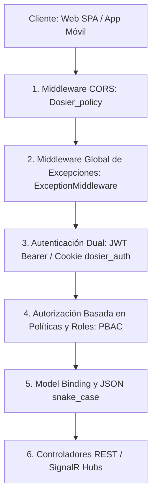

# Pipeline HTTP, Middlewares y Background Services (API Host Layer)

## 1. Arquitectura del Host ASP.NET Core 8.0

El punto de entrada del backend de DOSIER (`dosier_api/Program.cs`) implementa un modelo de host modular monolítico optimizado para alta concurrencia, tolerancia a fallos de red y cumplimiento de normativas de seguridad institucional.

El ciclo de procesamiento de solicitudes HTTP sigue una tubería estrictamente ordenada donde la seguridad perimetral, la negociación de políticas CORS, el manejo global de errores y la autenticación dual tienen prioridad absoluta.



---

## 2. Configuración y Orden de Middlewares

### 2.1. Política Dinámica de CORS (`Dosier_policy`)

Debido a que DOSIER opera en entornos de desarrollo local, túneles Cloudflare de previsualización, redes internas del campus y producción en AWS EC2, la política de CORS implementa un validador dinámico basado en expresiones de red:

```csharp
builder.Services.AddCors(options =>
{
    options.AddPolicy("Dosier_policy", policy =>
    {
        policy.SetIsOriginAllowed(origin =>
        {
            // 1. Orígenes locales (localhost, 127.0.0.1 en cualquier puerto)
            // 2. Origen configurado en FrontendUrl (appsettings.json)
            // 3. Dominios Cloudflare (*.trycloudflare.com) y producción (*.jorgedoicela.com, *.istpet.edu.ec)
            // 4. Subredes privadas de red de área local:
            //    - 192.168.0.0/16
            //    - 10.0.0.0/8
            //    - 172.16.0.0/12 (172.16.x.x - 172.31.x.x)
            // 5. Orígenes explícitos configurados en Cors:AllowedOrigins
        })
        .AllowAnyHeader()
        .AllowAnyMethod()
        .AllowCredentials(); // Vital para el handshake WebSocket de SignalR
    });
});
```

### 2.2. Manejo Centralizado de Excepciones (`ExceptionMiddleware`)

Intercepta cualquier excepción no controlada dentro del pipeline y la transforma en una respuesta HTTP semántica en formato JSON con política `lower_snake_case` y codificación directa UTF-8 (`JavaScriptEncoder.UnsafeRelaxedJsonEscaping`):

| Tipo de Excepción | Código HTTP | Estructura de Respuesta |
| :--- | :---: | :--- |
| `FluentValidation.ValidationException` | **400 Bad Request** | `{ "status_code": 400, "message": "Error de validación en la solicitud.", "errors": [ { "campo": "...", "error": "..." } ] }` |
| `KeyNotFoundException` | **404 Not Found** | `{ "status_code": 404, "message": "..." }` |
| `UnauthorizedAccessException` | **401 Unauthorized** | `{ "status_code": 401, "message": "..." }` |
| `InvalidOperationException` / `ArgumentException` | **400 Bad Request** | `{ "status_code": 400, "message": "..." }` |
| `DbUpdateConcurrencyException` | **409 Conflict** | `{ "status_code": 409, "message": "Conflicto de edición: El registro ha sido modificado por otro usuario..." }` |
| `Exception` general no controlada | **500 Internal Server Error** | `{ "status_code": 500, "message": "Error interno del servidor." }` *(traza detallada solo en ambiente de Desarrollo)* |

* **Logging Estructurado:** Registra el incidente con `_logger.LogError` o `_logger.LogWarning` incluyendo ruta HTTP, método y contexto de usuario.
* **Desacople en Controladores:** Elimina la necesidad de bloques `try-catch` repetitivos en los controladores, garantizando que la capa de aplicación defina reglas de negocio mediante excepciones tipadas y el host las traduzca limpiamente a códigos de estado REST.

### 2.3. Autenticación Dual: Header Bearer y Cookie HttpOnly

Para asegurar la convivencia fluida entre la SPA de desarrollo local, los túneles temporales y las aplicaciones móviles nativas, el handler de JWT inspecciona dos fuentes en orden de precedencia:

1. **Cookie Segura `dosier_auth`:** Emitida durante el login con flags `HttpOnly = true`, `SameSite = Strict` y expiración a 8 horas.
2. **Encabezado `Authorization: Bearer <token>`:** Empleado por clientes HTTP, herramientas de prueba (Swagger, Postman) e integraciones externas.

---

## 3. Política Global de Serialización y Model Binding

* **Casing Oficial:** `JsonNamingPolicy.SnakeCaseLower`. Todas las propiedades de las respuestas JSON emitidas por los controladores se serializan en `snake_case`.
* **Case-Insensitive Deserialization:** `PropertyNameCaseInsensitive = true`, permitiendo recibir payloads con tolerancias ante discrepancias menores de casing del cliente.
* **Production-Lock en Validación:** `SuppressModelStateInvalidFilter = false`. Ante cualquier payload de entrada que viole las anotaciones de datos o reglas de FluentValidation, el framework responde inmediatamente con `400 Bad Request` antes de alcanzar el método del controlador.

---

## 4. Servicios en Segundo Plano (Hosted Services / Background Jobs)

El host de ASP.NET Core ejecuta 6 tareas en segundo plano (`IHostedService` / `BackgroundService`) para garantizar el mantenimiento continuo del sistema sin intervención humana:

| Servicio Hosted | Ciclo / Activación | Responsabilidad Técnica |
| :--- | :--- | :--- |
| `BackupBackgroundService` | Diario a las 02:00 UTC | Genera un volcado SQL y copia de seguridad de la base de datos `sigafi_es`, registrando el log en `doc_backup_logs`. |
| `CalendarioAlertasJob` | Cada 15 minutos | Evalúa hitos académicos institucionales y normativas CACES próximas a vencer, despachando recordatorios preventivos a coordinadores y docentes. |
| `RecycleBinCleanupBackgroundService` | Diario a las 03:00 UTC | Purga definitivamente aquellos registros marcados como eliminados lógicamente que hayan superado el período de retención legal (30 días). |
| `DocumentGarbageCollectorBackgroundService` | Diario a las 04:00 UTC | Ejecuta la purga forense de archivos binarios PDF generados con plantillas obsoletas (`IsFilePurged = true`), preservando los hashes SHA-256 en la base de datos. |
| `EmailBackgroundProcessorService` | Continuo en cola en memoria | Despacha correos transaccionales pendientes en lotes controlados para no saturar el servidor SMTP institucional ni caer en listas de spam. |
| `EmailBounceListenerService` | Cada 30 minutos | Monitorea rebotes de correo electrónico (Hard/Soft Bounces) para marcar direcciones inválidas en `doc_email_historial`. |

---

## 5. Endpoints de Diagnóstico y Salud

* **`GET /api/ping`:** Endpoint mínimo ultraligero que retorna `{ "status": "healthy", "timestamp": "2026-09-23T19:00:00Z" }`. Utilizado por el Application Load Balancer de AWS o Cloudflare Health Checks para determinar el estado del contenedor.
* **`GET /api/health`:** Verificación operativa en `HealthController` para pruebas de conectividad de clientes.
