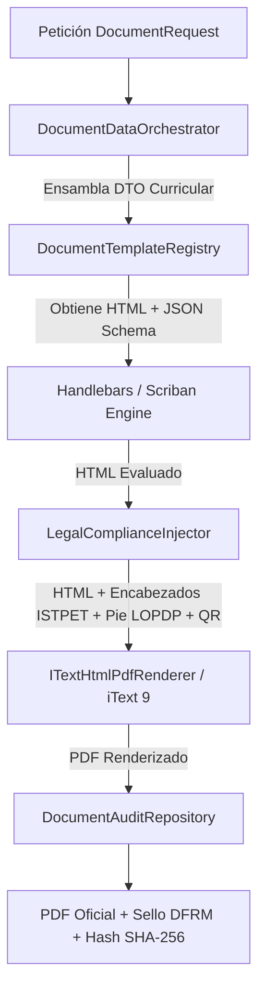
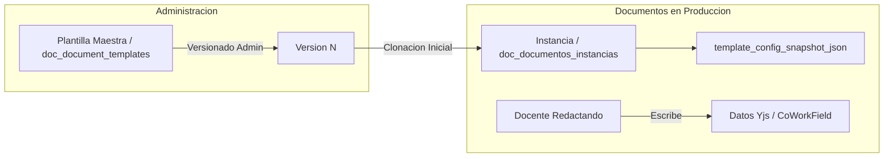

# Motor de Generación Documental PDF e Integridad Forense

## 1. Visión General del Motor

El motor documental de DOSIER (`DocumentEngine`) es el subsistema de infraestructura encargado de transformar estructuras de datos curriculares y plantillas HTML en documentos PDF de validez legal e institucional.

El motor estandariza la producción de los entregables oficiales del Instituto Superior Tecnológico Mayor Pedro Traversari (ISTPET):
1. **Programa de Estudio de la Asignatura (PEA):** Formato institucional reglamentario en sus 11 secciones (a - k), con desglose por unidades, temas, aporte al perfil de egreso, prácticas, evaluación y firmas.
2. **Plan Analítico o Sílabo (19 Semanas):** Matriz semanal articulada por unidades, estrategias y evaluaciones.
3. **Guía de Prácticas de Aprendizaje Práctico-Experimental (Guías APE):** Planificación micro-curricular de talleres y laboratorios.
4. **Guía de Estudio Institucional:** Compendio teórico estructurado para el autoaprendizaje.

---

## 2. Pipeline de Compilación Documental

La generación de un documento PDF sigue una secuencia de 5 etapas coordinadas por `DocumentEngine`:



### 2.1. Preparación de Datos (`DocumentDataOrchestrator`)
Recopila los metadatos requeridos para la plantilla mediante el patrón Strategy (`IDocumentDataProvider`). Obtiene los datos oficiales de la asignatura, carrera, horas y créditos desde SIGAFI en modo solo lectura (`AsNoTracking`) y los combina con las secciones co-redactadas en el módulo CoWork (`doc_cowork_documentos`).

### 2.2. Evaluación de Plantillas (`HandlebarsTemplateEngine` / `Scriban`)
Sustituye variables, procesa bucles de iteración (unidades temáticas, temas, actividades prácticas, bibliografía, matriz de evaluación) y evalúa expresiones condicionales en el marcado HTML de la plantilla seleccionada (`doc_document_templates`).

### 2.3. Inyección de Cumplimiento Institucional (`LegalComplianceInjector`)
Añade al HTML evaluado los elementos normativos requeridos por el ISTPET:
* Encabezado oficial con logotipos y membrete institucional reglamentario.
* Código de trazabilidad institucional único (ej. `DFRM-PEA-2026-0042`).
* Marcadores de posición para las firmas de responsabilidad docente, coordinación de carrera, coordinación académica y vicerrectorado (Sección k).
* Código QR dinámico vectorial generado por `QRCoder` con URL pública de verificación de autenticidad.
* Pie de página con cláusula de protección de datos personales LOPDP.

### 2.4. Renderizado Vectorial a PDF (`ITextHtmlPdfRenderer`)
Convierte el marcado HTML5 y estilos CSS con soporte tipográfico a un documento en formato PDF plano de alta fidelidad utilizando **iText 9** (`iText.Html2pdf` y `iText.Kernel`).

### 2.5. Ensamblado y Registro Forense
Calcula el Hash **SHA-256** sobre el archivo compilado y el contenido pedagógico, registrando la transacción en `doc_document_audit` y `doc_pea_trazabilidad`.

---

## 3. Estructura del Congelamiento Forense (`data_snapshot_json`)

En el momento en que un PEA o documento curricular es aprobado por Vicerrectorado Académico, `DocumentEngine` genera una captura inmutable del estado exacto de los datos (`data_snapshot_json`) que se almacena en la tabla `doc_documentos_instancias`:

```json
{
  "instance_uuid": "3a9f1b2c-4d5e-6f7a-8b9c-0d1e2f3a4b5c",
  "template_code": "FORMATO_OFICIAL_PEA_ISTPET",
  "traceability_code": "DFRM-PEA-2026-0142",
  "data_snapshot": {
    "asignatura": "PROGRAMACION ORIENTADA A OBJETOS",
    "codigo_asignatura": "SOF-401",
    "carrera": "TECNOLOGIA SUPERIOR EN DESARROLLO DE SOFTWARE",
    "periodo": "ABR2026 - AGO2026",
    "horas_totales": 160,
    "horas_docencia": 64,
    "horas_ape": 32,
    "horas_autonomo": 64,
    "creditos": 3.33,
    "firmantes": [
      { "rol": "Docente Elaborador", "nombre": "Ing. Carlos Mendoza", "fecha": "2026-09-02T10:15:00Z" },
      { "rol": "Coordinador de Carrera", "nombre": "Ing. Diana Paredes", "fecha": "2026-09-04T14:30:00Z" },
      { "rol": "Coordinador Academico", "nombre": "MSc. Franklin Calderon", "fecha": "2026-09-06T11:00:00Z" },
      { "rol": "Vicerrector Academico", "nombre": "MSc. Geovanny Naranjo", "fecha": "2026-09-08T16:45:00Z" }
    ],
    "sha256_hash": "e3b0c44298fc1c149afbf4c8996fb92427ae41e4649b934ca495991b7852b855",
    "issued_at_utc": "2026-09-08T16:45:00Z"
  }
}
```

Este snapshot asegura que variaciones posteriores en la base de datos (reestructuraciones de mallas, cambios de distributivo docente o actualizaciones de software) no alteren la información contenida en el documento oficial ya legalizado.

---

## 4. Verificación Pública mediante Código QR

Cada documento generado incluye un código QR que apunta a un endpoint público de validación:

$$\text{URL de Validación} = \texttt{https://dosier.istpet.edu.ec/public/verify/}\text{traceability\_code}$$

### Proceso de Verificación
1. El auditor del CACES o interesado escanea el código QR del documento impreso o digital.
2. El cliente web consulta el endpoint público de verificación en `DocumentInstancesController` o `DocumentsController`.
3. El servidor contrasta el código de trazabilidad con el hash criptográfico SHA-256 almacenado en el snapshot inmutable.
4. Se presenta en pantalla la ficha de autenticidad institucional con el estado del documento, fecha de aprobación y autoridades firmantes sin requerir inicio de sesión ni credenciales en el sistema.

---

## 5. Inmutabilidad y Ciclo de Vida: Patrón Molde vs Instancia

Para garantizar que las actualizaciones en las plantillas maestras (`doc_document_templates`) no alteren ni corrompan los documentos de los docentes en producción, el sistema implementa una separación estricta:



### Reglas de Negocio y Seguridad
1. **Molde Maestro (`doc_document_templates`):** Plantilla base versionada administrada por la institución.
2. **Snapshot Inmutable (`template_config_snapshot_json`):** Al iniciarse la planificación de una asignatura, `DocumentInstanceService` clona la versión de la plantilla y guarda el snapshot exacto de los bloques en ese momento.
3. **Protección Histórica (`Estado != Borrador`):** Los documentos revisados, aprobados o legalizados leen **exclusivamente su Snapshot**, conservando el formato visual con el que fueron oficializados.
4. **Desacoplamiento de Contenido:** Los textos de redacción colaborativa se indexan por clave de campo (`field_key`), desacoplados de la presentación visual.
