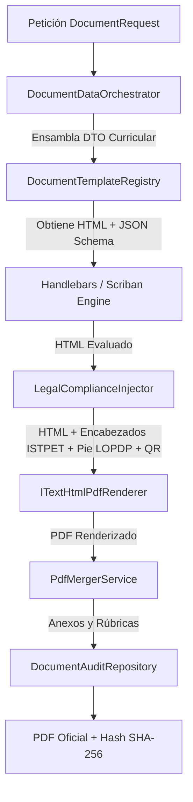
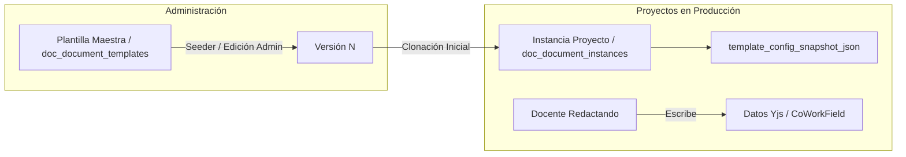

# Motor de Generación Documental PDF e Integridad Forense

## 1. Visión General del Motor

El motor documental de DOSIER (`DocumentEngine`) es el subsistema de infraestructura encargado de transformar estructuras de datos curriculares en formato JSON y plantillas HTML en documentos PDF de validez legal e institucional.

Genera automáticamente los cuatro formatos oficiales del ISTPET:
1. **Programa de Estudio de la Asignatura (PEA):** Caracterización de la asignatura, objetivos, resultados de aprendizaje, contenidos mínimos y perfil de egreso.
2. **Plan Analítico o Sílabo (19 Semanas):** Programación semanal detallada, distribución horaria de componentes (Docencia, APE, Autónomo), metodologías, recursos y rúbricas de evaluación.
3. **Guía de Prácticas de Aprendizaje Práctico-Experimental (Guías APE):** Planificación micro-curricular de actividades de laboratorio/taller, materiales, normas de seguridad y criterios de evaluación práctica.
4. **Guía de Estudio Institucional:** Material de autoaprendizaje y acompañamiento pedagógico.

---

## 2. Pipeline de Compilación Documental

La generación de un documento PDF sigue una secuencia de 5 etapas coordinadas por `DocumentEngine`:



### 2.1. Preparación de Datos (`DocumentDataOrchestrator`)
Resuelve la recopilación de información requerida para la plantilla mediante el patrón Strategy (`IDocumentDataProvider`). Obtiene los datos de la asignatura, carrera, docente y período desde SIGAFI y los combina con las secciones co-redactadas en el módulo CoWork (`doc_cowork_documentos`).

### 2.2. Evaluación de Plantillas (`HandlebarsTemplateEngine` / `Scriban`)
Sustituye variables, procesa bucles de iteración (ej. semanas de clase, bibliografía, actividades de evaluación, unidades temáticas) y evalúa expresiones condicionales en el marcado HTML de la plantilla seleccionada (`DocumentTemplate`).

### 2.3. Inyección de Cumplimiento Legal (`LegalComplianceInjector`)
Añade al HTML evaluado los elementos normativos requeridos por la institución:
* Encabezado institucional con logotipos oficiales del ISTPET.
* Pie de página con cláusula de protección de datos personales LOPDP.
* Marcadores de posición para firmas de responsabilidad docente y visto bueno de coordinación.
* Código QR dinámico generado por `QRCoder` con URL de verificación pública de autenticidad.

### 2.4. Renderizado PDF (`ITextHtmlPdfRenderer`)
Convierte el marcado HTML5 y los estilos CSS2.1/CSS3 a un documento en formato PDF plano utilizando **iText 7** (módulo `pdfHTML`).

### 2.5. Ensamblado de Anexos y Auditoría (`PdfMergerService` / `DocumentAuditRepository`)
Combina el PDF principal con documentos adjuntos (rúbricas, anexos curriculares) y registra la transacción en la bitácora `audit_logs` guardando la huella digital SHA-256.

---

## 3. Estructura del Congelamiento Forense (`data_snapshot_json`)

En el momento en que un documento curricular es aprobado o firmado, `DocumentEngine` genera una captura inmutable del estado exacto de los datos (`data_snapshot_json`) que se almacena en la tabla `document_instances`.

```json
{
  "instance_uuid": "3a9f1b2c-4d5e-6f7a-8b9c-0d1e2f3a4b5c",
  "template_code": "FORMATO_SILABO_19_SEMANAS",
  "traceability_code": "ISTPET-SIL-2026-0142",
  "data_snapshot": {
    "asignatura": "Desarrollo Web Avanzado",
    "carrera": "Tecnología Superior en Desarrollo de Software",
    "periodo": "2026-1",
    "horas_docencia": 48,
    "horas_ape": 32,
    "horas_autonomo": 80,
    "docentes": [
      {
        "nombres": "Ing. Carlos Mendoza",
        "cedula": "1712345678",
        "rol": "Docente Responsable"
    ],
    "sha256_hash": "e3b0c44298fc1c149afbf4c8996fb92427ae41e4649b934ca495991b7852b855",
    "issued_at_utc": "2026-07-28T13:40:00Z"
  }
}
```

Este snapshot asegura que variaciones posteriores en la base de datos no alteren la información contenida en el documento emitido en la fecha de corte.

---

## 4. Verificación Pública mediante Código QR

Cada documento generado incluye un código QR que apunta a un endpoint público de validación:

$$\text{URL de Validación} = \texttt{https://dosier.traversari.edu.ec/public/verify/}\text{traceability\_code}$$

### Proceso de Verificación
1. El auditor o tercero escanea el QR del documento impreso o digital.
2. El cliente público consulta el endpoint de verificación de `DocumentInstancesController`.
3. El servidor calcula el hash SHA-256 de la instancia guardada y lo contrasta con el código de trazabilidad.
4. Se presenta en pantalla el estado del documento, la fecha de emisión y los firmantes sin requerir inicio de sesión.

---

## 5. Inmutabilidad y Ciclo de Vida: Patrón Molde vs Instancia

Para garantizar que las actualizaciones visuales en el Administrador de Plantillas (`/admin/templates`) no alteren ni corrompan los documentos de los docentes en producción, el sistema implementa una separación estricta:



### Reglas de Negocio y Seguridad:
1. **Molde Maestro (`doc_document_templates`)**: Es el diseño vivo que el administrador edita. Sus cambios aplican como base para futuras formulaciones.
2. **Snapshot Inmutable (`template_config_snapshot_json`)**: Al crearse un proyecto o documento, `DocumentInstanceService` toma una fotografía exacta de los bloques y su versión.
3. **Protección Histórica (`State != Draft`)**: Los documentos en revisión CACES, aprobados o firmados leen **exclusivamente su Snapshot**, conservando el formato con el que fueron oficializados.
4. **Desacoplamiento de Datos**: Los textos de redacción colaborativa se indexan por clave de campo (`field_key`), permitiendo que mejoras visuales en borradores no borren el contenido redactado.
