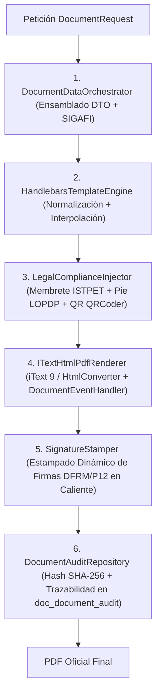
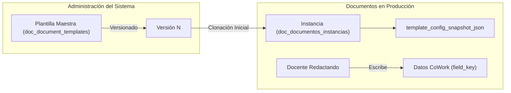

# Motor de Generación Documental PDF e Integridad Forense

## 1. Visión General del Motor (`DocumentEngine`)

El motor documental de DOSIER (`DocumentEngine`) es el subsistema de infraestructura encargado de transformar estructuras de datos microcurriculares y plantillas HTML enriquecidas en documentos PDF vectoriales de validez legal e institucional.

Implementa la interfaz `IDocumentEngine` (`backend/dosier_infrastructure/Common/Documents/DocumentEngine.cs`) y orquesta la producción de los instrumentos oficiales del Instituto Superior Tecnológico Mayor Pedro Traversari (ISTPET):

1. **Programa de Estudio de la Asignatura (PEA - `PEA_OFICIAL`):** Formato institucional reglamentario en sus 11 bloques normados (datos informativos, objetivos, prerrequisitos, RDA de carrera y asignatura, unidades temáticas, metodología, actividades prácticas APE, adaptaciones curriculares NEE, sistema de evaluación, bibliografía normalizada APA y firmas de responsabilidad).
2. **Formato Plan Analítico 2026 (`PLAN_ANALITICO`):** Formato institucional oficial del Plan Analítico de la Asignatura 2026 para carreras del ISTPET, estructurado en datos informativos, objetivo general, resultados de aprendizaje y matriz semanal de metodología, contenidos y horas.
3. **Formato Seguimiento de Tutorías Académicas 2026 (`SEGUIMIENTO_TUTORIAS`):** Formato institucional oficial para el registro, acompañamiento y seguimiento de tutorías académicas con orientación horizontal (*Landscape A4*).
4. **Informe de Acompañamiento Académico de Carrera (`INFORME_ACOMPANAMIENTO_CARRERA`):** Formato oficial para el informe de acompañamiento académico de carrera de la Unidad Académica (nómina de tutores, aportes docentes, gestión y conclusiones).
5. **Guía de Práctica de Laboratorio y Taller (Guías APE - `GUIA_PRACTICA_LAB`):** Formato microcurricular para diseño, ejecución experimental, instrumental y evaluación de actividades prácticas de aplicación y experimentación de los aprendizajes.
6. **Acta de Revisión y Validación Curricular (`ACTA_APROBACION_PEA`):** Acta oficial colegiada de verificación técnico-normativa, consistencia horaria y aprobación definitiva suscrita por Docente, Coordinación de Carrera y Vicerrectorado Académico.
7. **Rúbrica Institucional de Evaluación por Competencias (`RUBRICA_EVALUACION`):** Matriz estandarizada de criterios y niveles de desempeño para evaluación diagnóstica, formativa y sumativa articulada a los RDA.
8. **Plan de Acompañamiento y Tutoría Académica (`PLAN_TUTORIA_ACADEMICA`):** Instrumento pedagógico de refuerzo curricular, cronograma de tutorías y seguimiento de acuerdos con estudiantes.
9. **Informe Final de Cumplimiento Curricular de Asignatura (`INFORME_CUMPLIMIENTO_PEA`):** Informe de fin de ciclo académico sobre avance del sílabo, porcentaje de contenidos impartidos, prácticas ejecutadas y evidencias CACES.
10. **Plantillas Institucionales Dinámicas:** Capacidad de alta en caliente desde la consola de administración (`POST /api/admin/templates`) con auto-generación de bloques por defecto según la categoría de negocio.

---

## 2. Pipeline de Compilación Documental en 5 Etapas

La compilación y emisión de un documento PDF oficial sigue un flujo determinista coordinado por `DocumentEngine`:


```mermaid
flowchart TD
    Req["Petición DocumentRequest"] --> DataOrchestrator["1. DocumentDataOrchestrator (Ensamblado DTO + SIGAFI)"]
    DataOrchestrator --> TemplateEngine["2. HandlebarsTemplateEngine (Normalización + Interpolación)"]
    TemplateEngine --> LegalInjector["3. LegalComplianceInjector (Membrete ISTPET + Pie LOPDP + QR QRCoder)"]
    LegalInjector --> PDFRenderer["4. ITextHtmlPdfRenderer (iText 9 / HtmlConverter + DocumentEventHandler)"]
    PDFRenderer --> SignStamper["5. SignatureStamper (Estampado Dinámico de Firmas DFRM/P12 en Caliente)"]
    SignStamper --> AuditRepo["6. DocumentAuditRepository (Hash SHA-256 + Trazabilidad en doc_document_audit)"]
    AuditRepo --> OutputPDF["PDF Oficial Final"]
```

### 2.1. Preparación de Datos (`DocumentDataOrchestrator`)
Recopila los metadatos requeridos para la plantilla mediante el patrón Strategy (`IDocumentDataProvider`). Resuelve los datos oficiales de la asignatura, carrera, horas y créditos desde SIGAFI en modo solo lectura (`.AsNoTracking()`) y los combina con las secciones co-redactadas en el módulo CoWork (`doc_cowork_documentos` y `doc_documentos_instancias.data_snapshot_json`).

### 2.2. Evaluación de Plantillas y Normalización (`HandlebarsTemplateEngine`)
Sustituye variables e itera colecciones pedagógicas (unidades temáticas, temas, actividades prácticas, bibliografía, matriz de evaluación) sobre el HTML de la plantilla seleccionada (`doc_document_templates`). Incorpora un pipeline de normalización y sanitización editorial:
1. **Normalización Canónica de Colecciones (`NormalizePeaCollections`):** Proyecta dinámicamente cada entidad en PascalCase, camelCase y snake_case, garantizando que ninguna tabla o bloque evaluativo dependa de filas estáticas o claves asimétricas entre el frontend y el motor de reportes.
2. **Generación Editorial de Contenidos (`GenerateContenidosHtml`):** Transforma el texto plano o enriquecido de los contenidos en una tabla HTML optimizada para impresión (fuente de 8pt, padding de 3px), resaltando automáticamente las líneas que definen temas (`Tema X`, `Unidad X`) con fondo sutil `#f8fafc` y peso en negrita.
3. **Reconstrucción de Títulos Truncados (`CompleteTruncatedUnitTitle`):** Detecta títulos de unidades incompletos que terminan en preposiciones cortadas en tablas de origen (ej. *"FUNDAMENTOS DE"*, *"ARQUITECTURA DE"*, *"INTRODUCCIÓN A"*) y los completa de forma inteligente a partir del primer concepto identificado en la lista de temas.
4. **Sanitización de Encabezados Redundantes (`SanitizePeaFieldHeadings`):** Limpia mediante expresiones regulares encabezados repetidos al inicio de campos de texto enriquecido (ej. *"RECURSOS DIDÁCTICOS"*, *"ESTRATEGIAS METODOLÓGICAS"*, *"OBJETIVO DE LA ASIGNATURA"* o *"BIBLIOGRAFÍA"*), eliminando párrafos vacíos `<p></p>` para evitar duplicidad visual con las barras de título oficiales.

### 2.3. Inyección de Cumplimiento Institucional (`LegalComplianceInjector`)
Añade al HTML evaluado los elementos normativos requeridos por el ISTPET:
* Membrete institucional oficial con logotipos vectoriales de alta definición cargados mediante `ImageResourceLoader`.
* Código de trazabilidad institucional único (formato `DFRM-PEA-{AÑO}-{UUID8}`).
* Marcadores de posición para las firmas de responsabilidad: Docente Elaborador, Coordinación de Carrera, Coordinación Académica y Vicerrectorado Académico (Sección k).
* Código QR dinámico vectorial generado con `QRCoder` con la URL pública de verificación de autenticidad.
* Pie de página con cláusula de protección de datos personales conforme a la LOPDP.

### 2.4. Renderizado Vectorial a PDF (`ITextHtmlPdfRenderer`)
Convierte el marcado HTML5 y estilos CSS con soporte tipográfico a un documento en formato PDF plano de alta fidelidad utilizando **iText 9** (`iText.Html2pdf` e `iText.Kernel`).
* **Manejador de Eventos de Página (`DocumentEventHandler`):** Gestiona la numeración dinámica en formato `Página X de Y`, encabezados repetitivos en páginas interiores y márgenes de impresión A4 normados (superior 2.5cm, inferior 2.5cm, izquierdo 3cm, derecho 2.5cm).

### 2.5. Ensamblado, Estampado en Caliente y Registro Forense
1. **Estampado Acumulativo de Firmas en Caliente (`SignatureStamper`):** Al solicitar el renderizado del documento oficial (`isDraft == false`), el sistema consulta en `IDosierSignatureService` las firmas válidas emitidas (`SignatureState.Valid`). Si existen firmas registradas, invoca sucesivamente a `SignatureStamper.StampSignatureBlock` para incrustar los sellos vectoriales con sus códigos DFRM, nombres y URLs de verificación antes de devolver los bytes.
2. **Concatenación de Evidencias (`PdfMergerService`):** Ensambla anexos binarios y paquetes de acreditación CACES al final del PDF generado cuando la solicitud lo requiere.
3. **Registro Forense y Sellado:** Calcula el Hash **SHA-256** sobre los bytes del PDF final compilado, registrando la emisión en `doc_document_audit` (`DocumentAuditEntry`) y en la bitácora `doc_pea_trazabilidad`.

---

## 3. Estructura del Congelamiento Forense (`data_snapshot_json`)

En el momento en que un PEA o instrumento microcurricular es legalizado y aprobado por el Vicerrectorado Académico, `DocumentEngine` y `PeaService` generan una captura inmutable del estado exacto de los datos (`data_snapshot_json`) que se almacena en `doc_documentos_instancias`:

```json
{
  "instance_uuid": "3a9f1b2c-4d5e-6f7a-8b9c-0d1e2f3a4b5c",
  "template_code": "PEA_OFICIAL",
  "traceability_code": "DFRM-PEA-2026-0142",
  "data_snapshot": {
    "asignatura": "PROGRAMACION ORIENTADA A OBJETOS",
    "codigo_asignatura": "SOF-401",
    "carrera": "TECNOLOGIA SUPERIOR EN DESARROLLO DE SOFTWARE",
    "periodo": "ABR2026 - AGO2026",
    "horas_totales": 160,
    "horas_docencia": 64,
    "horas_ape": 32,
    "horas_autonomo": 64,
    "creditos": 3.33,
    "firmantes": [
      { "rol": "Docente Elaborador", "nombre": "Ing. Carlos Mendoza", "fecha": "2026-09-02T10:15:00Z" },
      { "rol": "Coordinador de Carrera", "nombre": "Ing. Diana Paredes", "fecha": "2026-09-04T14:30:00Z" },
      { "rol": "Coordinador Academico", "nombre": "MSc. Franklin Calderon", "fecha": "2026-09-06T11:00:00Z" },
      { "rol": "Vicerrector Academico", "nombre": "MSc. Geovanny Naranjo", "fecha": "2026-09-08T16:45:00Z" }
    ],
    "sha256_hash": "e3b0c44298fc1c149afbf4c8996fb92427ae41e4649b934ca495991b7852b855",
    "issued_at_utc": "2026-09-08T16:45:00Z"
  }
}
```

Este snapshot asegura que mutaciones futuras en el distributivo de SIGAFI (modificaciones de mallas o rotación de docentes) no alteren jamás la evidencia académica de planificaciones ya aprobadas ante auditorías del CACES.

---

## 4. Verificación Pública mediante Código QR

Cada documento generado incluye un código QR que apunta a un endpoint público de validación:

$$\text{URL de Validación} = \texttt{https://dosier.istpet.edu.ec/documentos/verificar/}\text{traceability\_code}$$

### Protocolo de Verificación sin Login:
1. El auditor o estudiante escanea el código QR del documento impreso o digital.
2. El cliente web consulta el endpoint público de verificación expuesto por `IDocumentVerificationService` en `DocumentVerificationController`.
3. El servidor contrasta el código de trazabilidad con el hash criptográfico SHA-256 almacenado en el snapshot inmutable.
4. Se presenta en pantalla la ficha de autenticidad institucional con el estado del documento, fecha de aprobación y autoridades firmantes sin requerir inicio de sesión ni credenciales en el sistema.

---

## 5. Inmutabilidad y Ciclo de Vida: Patrón Molde vs. Instancia

Para garantizar que las actualizaciones en las plantillas maestras (`doc_document_templates`) no alteren ni corrompan los documentos en curso, el sistema implementa una separación estricta:


```mermaid
flowchart LR
    subgraph Administracion["Administración del Sistema"]
        T["Plantilla Maestra (doc_document_templates)"] -->|Versionado| TVersion["Versión N"]
    end
    subgraph ProduccionCurricular["Documentos en Producción"]
        TVersion -->|Clonación Inicial| Instance["Instancia (doc_documentos_instancias)"]
        Instance --> Snapshot["template_config_snapshot_json"]
        Docente["Docente Redactando"] -->|Escribe| CoWorkData["Datos CoWork (field_key)"]
    end
```

### Reglas de Negocio y Seguridad:
1. **Molde Maestro (`doc_document_templates`):** Plantilla base versionada administrada institucionalmente.
2. **Snapshot Inmutable (`template_config_snapshot_json`):** Al iniciarse la planificación de una asignatura, `DocumentInstanceService` clona la versión de la plantilla y guarda el snapshot exacto de los bloques en ese momento.
3. **Protección Histórica (`Estado != Borrador`):** Los documentos revisados, aprobados o legalizados leen **exclusivamente su Snapshot**, conservando el formato visual con el que fueron oficializados.
4. **Desacoplamiento de Contenido:** Los textos de redacción colaborativa se indexan por clave de campo (`field_key`), desacoplados de la presentación visual.

---

## 6. Previsualización en Caliente y Renderizado Oficial de Plantillas

Para permitir la inspección en tiempo real sin alterar la base de datos ni los documentos en curso, el subsistema expone dos endpoints especializados en `DocumentTemplatesController`:

### 6.1. Endpoint de Renderizado Oficial
* **Ruta:** `GET /api/admin/templates/{code}/render-pdf`
* **Parámetros de Consulta:**
  * `isDraft` (booleano): Indica si se inyecta marca de agua de borrador institucional.
  * `download` (booleano): Devuelve el archivo con cabecera `Content-Disposition: attachment` para descarga directa, o `inline` para renderizado en el visor embebido.
* **Propósito:** Genera el PDF con los datos institucionales oficiales de muestra del ISTPET (asignatura de software, 160h, docentes y autoridades firmantes).

### 6.2. Endpoint de Previsualización en Caliente
* **Ruta:** `POST /api/admin/templates/{code}/render-pdf`
* **Cuerpo de la Solicitud (`RenderTemplatePreviewRequest`):**
  * `htmlContent`: Marcado HTML con los bloques del lienzo actualmente en edición.
  * `customCss`: Estilos CSS personalizados de la plantilla.
  * `themeConfigJson`: Configuración visual del tema fusionado (colores institucionales, márgenes A4, tipografía).
* **Propósito:** Renderiza un PDF en vivo a partir de las modificaciones no publicadas del diseñador visual, permitiendo validar la maqueta antes de comprometer una nueva versión de fábrica.

---

## 7. Paginación Inteligente y Prevención de Huérfanos (*Anti-Orphan Pagination*)

Para evitar que encabezados o subtítulos de sección se impriman aislados al final de una página (separados de su contenido en la página siguiente), el motor documental inyecta directivas de paginación CSS a nivel de renderizado:

1. **Directivas Globales en `DocumentEngine`:**
   * `.header-primary, .header-sub, .pea-subhead, th`: Configurados con `page-break-after: avoid !important; break-after: avoid !important;`. El motor prohíbe cortes de página inmediatos tras cualquier encabezado o barra de título.
   * `.sub-block, .keep-together`: Configurados con `page-break-inside: avoid !important; break-inside: avoid !important;`. Todo sub-bloque (ej. Estrategias Metodológicas o Recursos Didácticos) se traslada íntegramente a la página siguiente si no cabe completo en la actual.
   * Tablas institucionales: `thead` configurado con `display: table-header-group` y filas `tr` con `page-break-inside: avoid !important;`.
2. **Sanitización de Títulos Redundantes:**
   * En `HandlebarsTemplateEngine`, el sistema analiza mediante expresiones regulares los campos de texto enriquecido (`recursos_didacticos`, `metodologia_ensenanza`, `objetivo_asignatura`, `bibliografia_basica`). Si el contenido inicia con el nombre de la sección repetido (ej. *"RECURSOS DIDÁCTICOS / INFORMATIZACIÓN DEL APRENDIZAJE"*), este se remueve automáticamente antes de la compilación de la plantilla, evitando duplicaciones visuales con la barra de cabecera.

---

## 8. Nomenclatura Institucional de Descarga y Streaming PDF

Para garantizar que los archivos PDF exportados por docentes y revisores mantengan la convención institucional y no identidades UUID internas:

1. **Resolución de Nombres en Caliente (`DocumentEngine.ResolveFilename`):**
   * Resuelve dinámicamente el patrón configurado en la columna `filename_pattern` de la plantilla (ej. `{code}_{carrera}_{asignatura}_{periodo}.pdf`).
   * Deserializa los datos de `DataSnapshotJson` extrayendo tokens directos o anidados (`carrera`, `asignatura`, `periodo`, `docente`).
2. **Endpoints en `DocumentInstancesController`:**
   * `GET /api/documents/instances/{uuid}/pdf/{filename?}`: Devuelve el archivo en modo `inline` con cabecera `Content-Disposition` codificada en UTF-8 y ruta enriquecida para visores Chromium.
   * `GET /api/documents/instances/{uuid}/download`: Devuelve el archivo como adjunto binario forzado (`Content-Disposition: attachment`).
3. **CORS:** Política institucional configurada con `WithExposedHeaders("Content-Disposition")` para permitir lectura programática del nombre de archivo desde el cliente web.

---

## 9. Gobernanza de Fechas en la Sección de Firmas (Sección k)

Para cumplir con la normativa de auditoría curricular y la Ley 67 de Firmas Electrónicas, la matriz de firmas de responsabilidad institucional opera bajo un esquema de sincronización dinámica:

1. **Resolución y Valor por Defecto:**
   * La fecha de elaboración (`DocenteFecha`) se inicializa automáticamente con la fecha actual del sistema en formato institucional `DD/MM/AAAA` (o la fecha de creación registrada en `doc_pea.fechaElaborado`), garantizando que la tabla oficial y los documentos exportados nunca presenten celdas de fecha vacías.
2. **Desbloqueo Controlado con Confirmación:**
   * El usuario puede modificar la fecha haciendo clic sobre el campo, lo que despliega un diálogo modal de confirmación informando que la modificación aplica de forma aislada a este instrumento curricular sin alterar los registros globales.
3. **Sincronización Bidireccional (CoWork Yjs y Motor de Plantillas):**
   * El valor modificado se propaga en tiempo real a través del proveedor Yjs (`Firmas_DocenteFecha`, `Firmas_CoordinadorFecha`, etc.) y se normaliza en el motor de plantillas (`HandlebarsTemplateEngine`) hacia las variables `FechaElaborado` y `fecha_elaborado`, permitiendo que el visor web, el diseñador de plantillas y la exportación oficial a PDF reflejen exactamente la misma fecha sin requerir nuevas tablas en la base de datos.

---

## 10. Soporte para Orientación Horizontal (*Landscape A4*) en Formatos Extensos

Para instrumentos de gestión curricular que demandan alta densidad tabular por columnas (como el formato oficial `SEGUIMIENTO_TUTORIAS` con 12 columnas normadas o la matriz semanal de 19 semanas del Plan Analítico), el motor documental implementa soporte nativo de orientación apaisada:

1. **Directiva de Impresión PDF (`@page`):**
   * El compilador inyecta `@page { size: A4 landscape; margin: 1cm 1.5cm; }`, reorientando el viewport a 297mm x 210mm (1123px x 794px a 96 DPI).
2. **Adaptación Reactiva en el Lienzo (`BlockCanvas.tsx`):**
   * El lienzo detecta automáticamente la presencia de bloques apaisados (`tutorias_*`) o metadatos de plantilla, redimensionando la hoja A4 visual a `max-w-[1123px]` con altura mínima de `794px`.
3. **Control de Desbordamiento:**
   * Las tablas horizontales se configuran con `width: 100%`, `table-layout: fixed` o porcentajes de celda estrictamente acotados (sumatoria exacta al 100%), garantizando que ninguna columna sufra corte ni pérdida visual al compilar con iText 9 o exportar a PDF.
