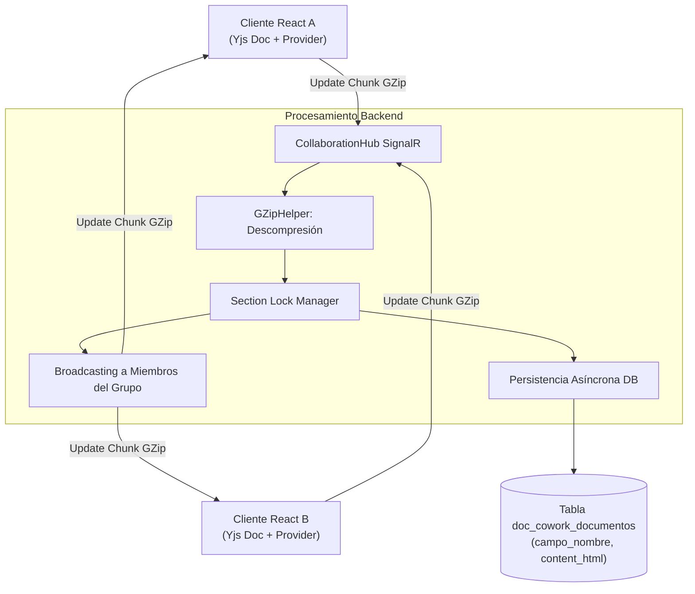

# Motor Colaborativo en Tiempo Real (CoWork)

## 1. Visión General del Subsistema CoWork

El motor colaborativo CoWork proporciona la infraestructura de sincronización en tiempo real que permite a múltiples investigadores redactar simultáneamente las secciones de una propuesta de proyecto o informe.

El subsistema combina **SignalR WebSockets**, compresión de carga útil vía **GZip**, tipos de datos replicados sin conflictos (**Yjs CRDT**) y un mecanismo de bloqueo granular de secciones (`SectionBlockGuard`).

---

## 2. Arquitectura de Sincronización



---

## 3. Componentes del Engine Colaborativo

### 3.1. Gateway de Comunicación (`CollaborationHub`)
Clase derivada de `Hub` en SignalR que gestiona las conexiones en tiempo real:
* **Grupos de Sala (*Rooms*):** Los clientes se unen a grupos identificados por la instancia del documento (`EntidadUuid`).
* **Presencia de Usuarios:** Controla la lista de usuarios activos conectados a la sala y el estado de su cursor en el documento.

### 3.2. Compresión de Carga Útil (`GZipHelper`)
Los deltas de actualización del documento Yjs generados en el cliente se comprimen en formato binario GZip antes de ser transmitidos por el WebSocket. `GZipHelper` descomprime los bytes en el backend para su validación y los retransmite comprimidos a los demás clientes conectados, reduciendo el tráfico de red.

### 3.3. Bloqueo Granular de Secciones (`SectionBlockGuard`)
Previene colisiones directas de edición sobre un mismo bloque de texto:
* Cuando un usuario enfoca una sección específica del formulario, emite una señal de bloqueo (`LockSection`).
* El servidor registra el bloqueo y notifica a los demás clientes, deshabilitando la edición del bloque correspondiente en la interfaz gráfica.
* Al perder el foco o desconectarse, el servidor libera el bloqueo (`UnlockSection`).

---

## 4. Persistencia e Integración con el Motor Documental

El estado del documento colaborativo se almacena periódicamente en la tabla `doc_cowork_documentos`.

```sql
CREATE TABLE doc_cowork_documentos (
    id BIGINT AUTO_INCREMENT PRIMARY KEY,
    entidad_uuid VARCHAR(36) NOT NULL,    -- Identificador de la DocumentInstance
    campo_nombre VARCHAR(100) NOT NULL,   -- Nombre de la sección (ej. 'justificacion')
    content_html LONGTEXT NULL,           -- Marcado HTML resultante de la edición
    updated_at_utc DATETIME NOT NULL,
    updated_by VARCHAR(255) NOT NULL
);
```

Cuando se solicita la emisión o compilación en PDF, `DocumentDataOrchestrator` lee las secciones almacenadas en `doc_cowork_documentos` y las inyecta en el payload de datos maestro que consume `DocumentEngine`.
