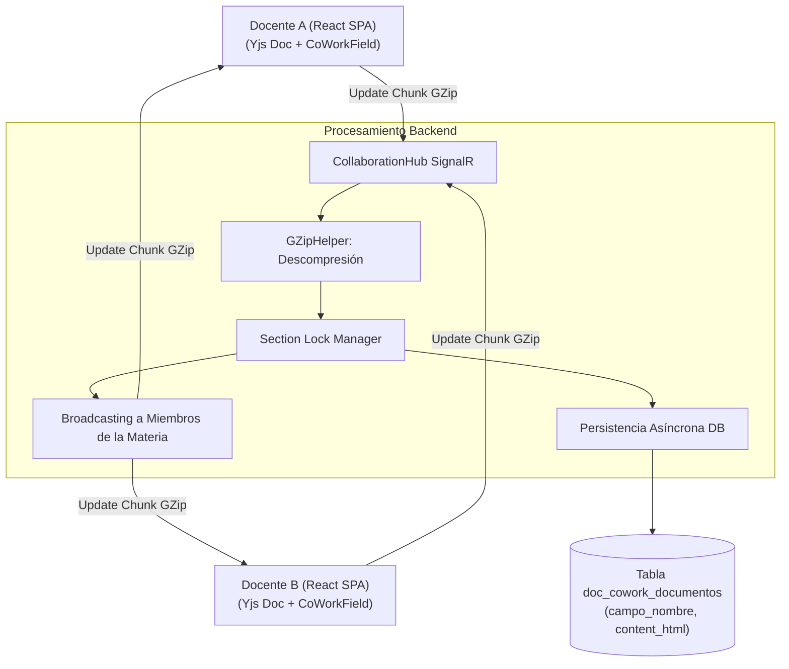

# Motor Colaborativo en Tiempo Real (CoWork)

## 1. Visión General del Subsistema CoWork

El motor colaborativo CoWork proporciona la infraestructura de sincronización en tiempo real que permite a múltiples docentes de una misma materia, área académica o comisión curricular redactar simultáneamente las secciones de un **PEA (Programa de Estudio de la Asignatura)**, **Plan Analítico / Sílabo (19 semanas)** o **Guía APE**.

El subsistema combina **SignalR WebSockets**, compresión de carga útil vía **GZip**, tipos de datos replicados sin conflictos (**Yjs CRDT**) y un mecanismo de bloqueo granular de secciones (`SectionBlockGuard`).

---

## 2. Arquitectura de Sincronización



---

## 3. Componentes del Engine Colaborativo

### 3.1. Gateway de Comunicación (`CollaborationHub`)
Clase derivada de `Hub` en SignalR que gestiona las conexiones en tiempo real:
* **Grupos de Materia / Asignatura (*Rooms*):** Los clientes se unen a grupos identificados por la instancia del documento curricular (`EntidadUuid`).
* **Presencia de Docentes:** Controla la lista de docentes activos conectados a la redacción del sílabo/PEA y el estado de su cursor en los campos colaborativos.

### 3.2. Compresión de Carga Útil (`GZipHelper`)
Los deltas de actualización del documento Yjs generados en el componente `<CoWorkField>` del frontend se comprimen en formato binario GZip antes de ser transmitidos por el WebSocket. `GZipHelper` descomprime los bytes en el backend para su validación y los retransmite comprimidos a los demás docentes conectados, optimizando el ancho de banda.

### 3.3. Bloqueo Granular de Secciones (`SectionBlockGuard`)
Previene colisiones directas de edición sobre un mismo bloque del sílabo o PEA:
* Cuando un docente enfoca una sección específica (ej. *Resultados de Aprendizaje*, *Cronograma Semanal* o *Metodología*), emite una señal de bloqueo (`LockSection`).
* El servidor registra el bloqueo y notifica a los demás docentes, mostrando visualmente el avatar/nombre del docente activo y deshabilitando temporalmente la edición concurrente de ese bloque.
* Al perder el foco o desconectarse, el servidor libera el bloqueo (`UnlockSection`).

---

## 4. Persistencia e Integración con el Motor Documental

El estado del documento colaborativo se almacena periódicamente en la tabla `doc_cowork_documentos`.

```sql
CREATE TABLE doc_cowork_documentos (
    id BIGINT AUTO_INCREMENT PRIMARY KEY,
    entidad_uuid VARCHAR(36) NOT NULL,    -- Identificador de la DocumentInstance (PEA, Sílabo)
    campo_nombre VARCHAR(100) NOT NULL,   -- Nombre de la sección (ej. 'resultados_aprendizaje', 'cronograma')
    content_html LONGTEXT NULL,           -- Marcado HTML resultante de la co-redacción
    updated_at_utc DATETIME NOT NULL,
    updated_by VARCHAR(255) NOT NULL
);
```

Cuando se solicita la emisión o compilación oficial en PDF, `DocumentDataOrchestrator` lee las secciones almacenadas en `doc_cowork_documentos` y las inyecta en el payload de datos maestro que consume `DocumentEngine`.
