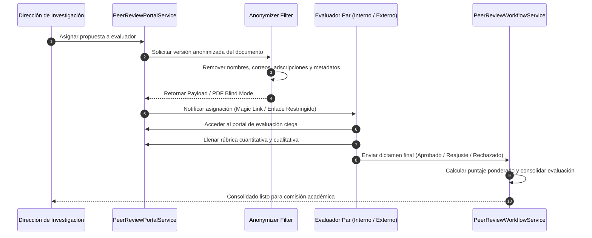

# Motor de Evaluación por Pares Ciegos

## 1. Visión General del Subsistema

El motor de evaluación por pares ciegos (`PeerReview`) gestiona el proceso confidencial de dictamen técnico sobre las propuestas de investigación presentadas en las convocatorias del ISTT.

El subsistema aplica el principio de **doble ciego** (*Double-Blind Peer Review*): los evaluadores no conocen la identidad de los autores del proyecto, y los autores no conocen la identidad de los evaluadores asignados.

---

## 2. Flujo de Evaluación por Pares Ciegos

---

## 3. Componentes del Sub-sistema

### 3.1. `PeerReviewAdminService`
Servicio de administración que permite a la Dirección de Investigación:
* Gestionar el catálogo de evaluadores pares (internos y externos).
* Registrar las áreas de especialidad del evaluador conforme al árbol UNESCO.
* Monitorear el estado de las revisiones asignadas y los plazos de entrega.

### 3.2. `PeerReviewPortalService`
Servicio encargado de renderizar la vista de evaluación para los pares ciegos:
* Filtra la información del proyecto eliminando cualquier identificador personal o institucional.
* Proporciona la interfaz para la calificación de la propuesta en base a rubros predefinidos.

### 3.3. `PeerReviewWorkflowService`
Controlador del estado del dictamen:
* Consolida las calificaciones de múltiples evaluadores sobre una misma propuesta.
* Aplica la fórmula de ponderación cuantitativa para determinar si el proyecto supera la nota mínima de aprobación.
* Gestiona los estados de revisión (`ASIGNADO`, `EN_PROCESO`, `DICTAMINADO`, `RECHAZADO`).

---

## 4. Estructura de Rúbrica de Evaluación

Las evaluaciones se procesan mediante rúbricas cuantitativas compuestas por criterios ponderados:

| Criterio de Evaluación | Ponderación (%) | Descripción |
| :--- | :--- | :--- |
| **Rigor Metodológico y Coherencia** | 30% | Claridad del problema, objetivos, hipótesis y diseño de la investigación. |
| **Impacto y Pertinencia Institucional** | 25% | Vinculación con las líneas de investigación, PND y beneficio para el ISTT. |
| **Viabilidad Técnica y Presupuestaria** | 25% | Relación costo-beneficio, cronograma de actividades y entregables. |
| **Nivel de Innovación y TRL** | 20% | Grado de novedad tecnológica y potencial de transferencia. |
