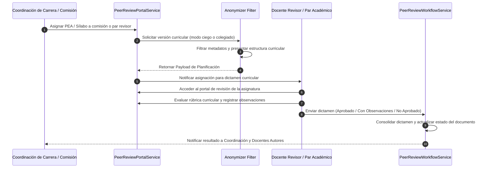

# Motor de Revisión y Validación Curricular por Pares / Comisiones

## 1. Visión General del Subsistema

El motor de revisión y validación curricular (`PeerReview`) gestiona el proceso técnico y confidencial de dictamen sobre la calidad de los **Programas de Estudio de la Asignatura (PEA)**, **Sílabos (19 semanas)** y **Guías APE** previo a su aprobación oficial en el ISTPET.

El subsistema permite revisiones ciegas o colegiadas por parte de comisiones académicas de área/carrera, garantizando que la planificación cumpla con el modelo pedagógico del ISTPET y las normativas del CES y CACES.

---

## 2. Flujo de Revisión Curricular

---

## 3. Componentes del Sub-sistema

### 3.1. `PeerReviewAdminService`
Servicio de administración que permite a la Coordinación de Carrera y Vicerrectorado:
* Gestionar el cuerpo docente evaluador y comisiones de revisión por área de conocimiento.
* Monitorear los plazos de entrega y revisión de sílabos antes del inicio del período académico.

### 3.2. `PeerReviewPortalService`
Servicio encargado de renderizar la vista de revisión curricular:
* Presenta la matriz de alineación: Objetivos de Carrera $\to$ Resultados de Aprendizaje $\to$ Contenidos $\to$ Prácticas APE $\to$ Mecanismos de Evaluación.
* Proporciona la interfaz para emitir observaciones puntuales por sección y registrar la calificación de la rúbrica.

### 3.3. `PeerReviewWorkflowService`
Controlador del ciclo de vida del dictamen:
* Consolida las revisiones de los miembros de la comisión curricular.
* Actualiza el estado del documento (`EN_REVISION`, `OBSERVADO`, `APROBADO_COMISION`, `VALIDADO_CARRERA`).
* Dispara notificaciones a los docentes autores cuando se requieren ajustes en el contenido o la distribución de horas.

---

## 4. Estructura de Rúbrica de Validación Curricular

Las revisiones curriculares se evalúan mediante criterios pedagógicos y normativos:

| Criterio Curricular | Ponderación (%) | Descripción |
| :--- | :--- | :--- |
| **Alineación de Resultados de Aprendizaje** | 30% | Coherencia entre los objetivos del PEA, resultados de la asignatura y perfil de egreso. |
| **Consistencia Horaria y Planificación (19 Sem.)** | 30% | Distribución exacta de horas (CD, APE, Autónomo) y dosificación de contenidos semanales. |
| **Calidad de Guías Prácticas (APE)** | 20% | Pertinencia de las prácticas planificadas, recursos requeridos y rúbricas de evaluación. |
| **Actualización Bibliográfica** | 20% | Vigencia de la bibliografía básica y complementaria, libros físicos y recursos virtuales. |
