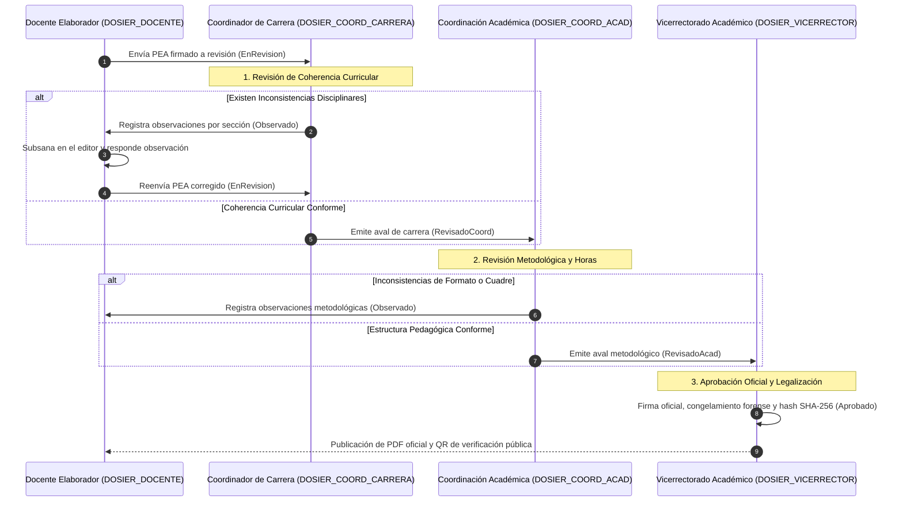

# Motor de Revisión y Validación Colegiada Curricular

## 1. Visión General del Subsistema

El motor de revisión colegiada curricular administra el proceso institucional de auditoría pedagógica, control de observaciones y emisión de avales formales sobre el **Programa de Estudio de la Asignatura (PEA)** y el portafolio curricular en el Instituto Superior Tecnológico Mayor Pedro Traversari (ISTPET).

A diferencia de modelos de arbitraje ciego genéricos, en el ISTPET la revisión responde a la cadena de responsabilidades establecida en el **Reglamento del Sistema de Seguimiento, Control y Evaluación del Proceso Docente (Resolución ISTPET-OCS-SE-2022-019)** y en el formato oficial del PEA (Sección k).

---

## 2. Flujo de Revisión y Avales Institucionales

---

## 3. Responsabilidades Diferenciadas por Rol Revisor

### 3.1. Coordinación de Carrera (`DOSIER_COORD_CARRERA`)
* **Alineación con el Perfil de Egreso:** Verifica que cada Resultado de Aprendizaje (RDA) formulado en la materia tribute efectivamente a las competencias profesionales de la carrera.
* **Prerrequisitos y Contenidos Mínimos:** Comprueba que los temas no se solapen con materias correlacionadas ni omitan los contenidos mínimos del proyecto curricular aprobado por el CES.
* **Emisión de Aval:** Su firma digital certifica la coherencia técnica del PEA y habilita la transición a `RevisadoCoord`.

### 3.2. Coordinación Académica (`DOSIER_COORD_ACAD`)
* **Integridad Metodológica:** Verifica que las estrategias pedagógicas coincidan con el Modelo Educativo Institucional.
* **Cuadre Horario y Créditos:** Valida que la sumatoria de horas de docencia, práctico-experimental (APE) y trabajo autónomo cumpla la equivalencia estricta de 48 horas por crédito académico.
* **Sistema de Evaluación Continua:** Comprueba que la ponderación de las notas parciales (frecuentes y sumativas) y el examen final sumen 10.0 puntos según el reglamento institucional.
* **Emisión de Aval:** Su firma digital certifica el cumplimiento normativo y habilita la transición a `RevisadoAcad`.

### 3.3. Vicerrectorado Académico (`DOSIER_VICERRECTOR`)
* **Legalización Institucional:** Ejerce la máxima potestad de aprobación curricular del Instituto.
* **Firma Oficial y Publicación:** Su firma digital sella la versión inmutable, genera el código DFRM-XXXX, calcula la firma criptográfica SHA-256 y activa la consulta pública vía código QR para auditorías del CACES.

---

## 4. Gestión de Observaciones y Subsanaciones (`doc_pea_observaciones`)

Para garantizar la máxima transparencia en el proceso de revisión:
* **Observación Atómica por Sección:** El revisor selecciona la sección observada (`Objetivos`, `Unidades y Temas`, `Actividades Prácticas`, `Evaluación`, etc.) e introduce el requerimiento de ajuste en texto claro.
* **Bloqueo de Aprobación:** El sistema impide que un PEA sea avalado o aprobado si mantiene observaciones pendientes de atención (`estado = 'Pendiente'`).
* **Respuesta del Docente:** El docente registra su justificación o detalle de corrección para marcar la observación como `Subsanada`.
* **Auditoría Forense:** Cada observación y subsanación queda registrada permanentemente con usuario, cargo, fecha UTC y texto original en `doc_pea_observaciones`.

---

## 5. Paneles de Control y Herramientas Operativas por Rol

Para asegurar que cada rol cuente con todas las herramientas necesarias para cumplir a cabalidad su función dentro del circuito, el sistema dispone de paneles de control especializados y un simulador interactivo accesible desde el Dashboard principal:

### 5.1. Coordinación Académica (`CoordAcadDashboard.tsx`)
* **Apertura de Convocatoria Institucional (`AperturaConvocatoriaModal.tsx`):** Disparador para fijar plazos y notificar a los 28 docentes asignados en SIGAFI.
* **Recordatorio Masivo a Rezagados (`RecordatorioDocentesModal.tsx`):** Detección automática de docentes con PEAs en Borrador y envío de alertas por correo electrónico institucional y notificaciones push.
* **Concesión de Prórroga (`ProrrogaPlazoModal.tsx`):** Extensión de plazos por carrera o institucionalmente con registro del justificativo académico.
* **Auditoría Normativa CACES (`AuditoriaCacesModal.tsx`):** Verificación automática del Artículo 21 del CES (64h docencia + 32h prácticas + 64h autónomo = 160h), matriz de 30 puntos y bibliografía APA.
* **Emisión de Aval Académico:** Aprobación formal que eleva el PEA al despacho de Vicerrectorado.

### 5.2. Coordinación de Carrera (`CoordCarreraDashboard.tsx`)
* **Filtro Disciplinar:** Supervisión focalizada en las asignaturas de su carrera.
* **Notificación a Docentes de Carrera:** Alerta específica a los docentes de la especialidad.
* **Solicitud de Correcciones (`ObservacionesDisciplinarModal.tsx`):** Registro de observaciones puntuales por sección con fijación de plazo de subsanación de 48 horas.
* **Emisión de Aval de Carrera:** Firma técnica que certifica la pertinencia curricular y los contenidos mínimos.

### 5.3. Docente Elaborador (`DocentePeaDashboard.tsx`)
* **Clonado de PEA de Período Anterior (`ClonarPeaModal.tsx`):** Importación ágil de unidades, metodologías y bibliografía aprobadas del período anterior.
* **Validador de Horas CES Art. 21:** Semáforo en vivo del cuadre horario normativo.
* **Acceso a Co-Redacción Concurrente (Yjs):** Editor en tiempo real de las 11 secciones institucionales.
* **Envío a Revisión Técnica:** Disparo de notificación hacia el Coordinador de Carrera.

### 5.4. Vicerrectorado Académico (`VicerrectorDashboard.tsx`)
* **Firma y Legalización Digital Masiva (`LegalizacionFirmaModal.tsx`):** Aprobación y firma en bloque de todos los PEAs avalados de una carrera.
* **Legalización Unitaria con Sello SHA-256:** Estampado de firma digital, inmutabilidad y generación de código QR.
* **Generación de Dossier Curricular:** Compendio foliado en formato PDF oficial para auditorías del CACES.

