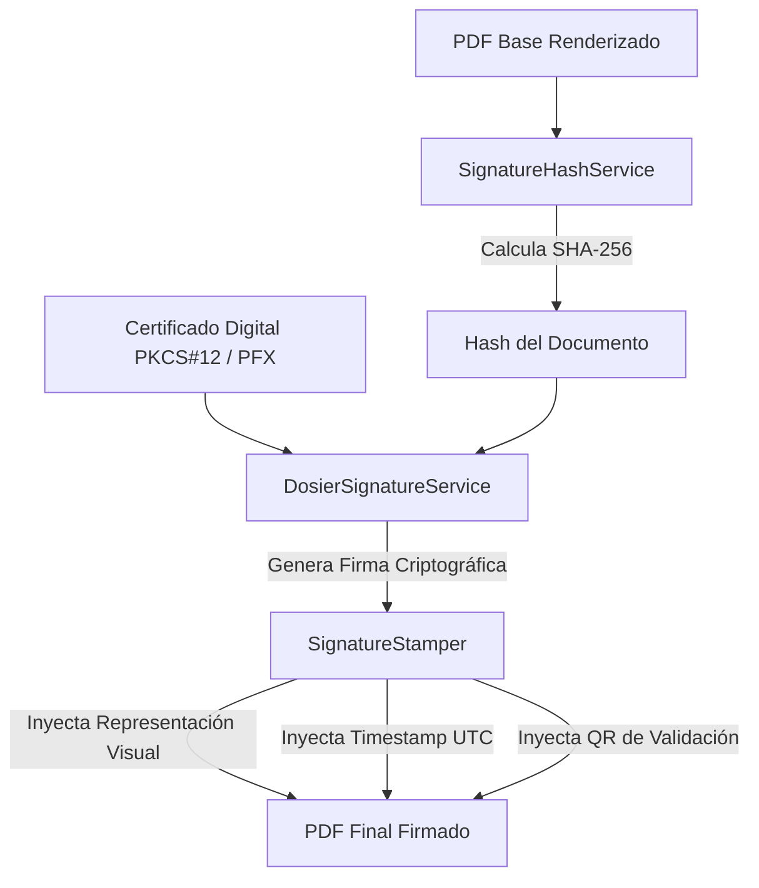

# Motor de Firma Digital, Criptografía y Sellos

## 1. Visión General del Subsistema de Firma

El motor de firma y sellado de DOSIER (`Signatures`) proporciona la infraestructura para validar la responsabilidad autoral e institucional sobre los documentos emitidos.

El subsistema integra la gestión de certificados digitales (PKCS#12 / PFX), el cálculo de hashes de integridad SHA-256, el sellado visual en páginas de PDF (`SignatureStamper`) y la estampación de sellos de tiempo UTC.

---

## 2. Arquitectura del Proceso de Firma



---

## 3. Componentes del Engine Criptográfico

### 3.1. `SignatureHashService`
Encargado del cálculo de huellas digitales en los documentos:
* Genera el resumen hash encriptado usando el algoritmo **SHA-256**.
* Permite comparar el hash de un documento en disco con el hash guardado en el snapshot inmutable de `DocumentInstances` para verificar si ha sufrido alteraciones.

### 3.2. `DosierSignatureService`
Gestiona las operaciones de cifrado asimétrico:
* Procesa certificados digitales en formato PKCS#12 / PFX.
* Utiliza las librerías criptográficas `BouncyCastle` y `BCrypt` para la verificación de cadenas de confianza y validez de los certificados.

### 3.3. `SignatureStamper`
Servicio de marcado e impresión gráfica sobre el archivo PDF:
* Utiliza **iText 7** para abrir el documento PDF existente y añadir capas visuales en páginas específicas.
* **Incrustación de Sello Visual:** Dibuja el cuadro de firma conteniendo el nombre del firmante, cargo institucional, fecha/hora UTC del firmado y motivo de la firma.
* **Incrustación de Código QR:** Posiciona el código QR dinámico en el margen del documento para su lectura e inspección física.

---

## 4. Estructura del Registro de Firma

Cada operación de firma se registra en la base de datos conservando los metadatos criptográficos:

```sql
CREATE TABLE document_signatures (
    id BIGINT AUTO_INCREMENT PRIMARY KEY,
    document_instance_uuid VARCHAR(36) NOT NULL,
    signer_uuid VARCHAR(36) NOT NULL,
    signer_name VARCHAR(255) NOT NULL,
    signer_role VARCHAR(100) NOT NULL,
    sha256_signature_hash VARCHAR(64) NOT NULL,
    timestamp_utc DATETIME NOT NULL,
    is_valid BOOLEAN NOT NULL DEFAULT TRUE,
    FOREIGN KEY (document_instance_uuid) REFERENCES document_instances(uuid)
);
```
