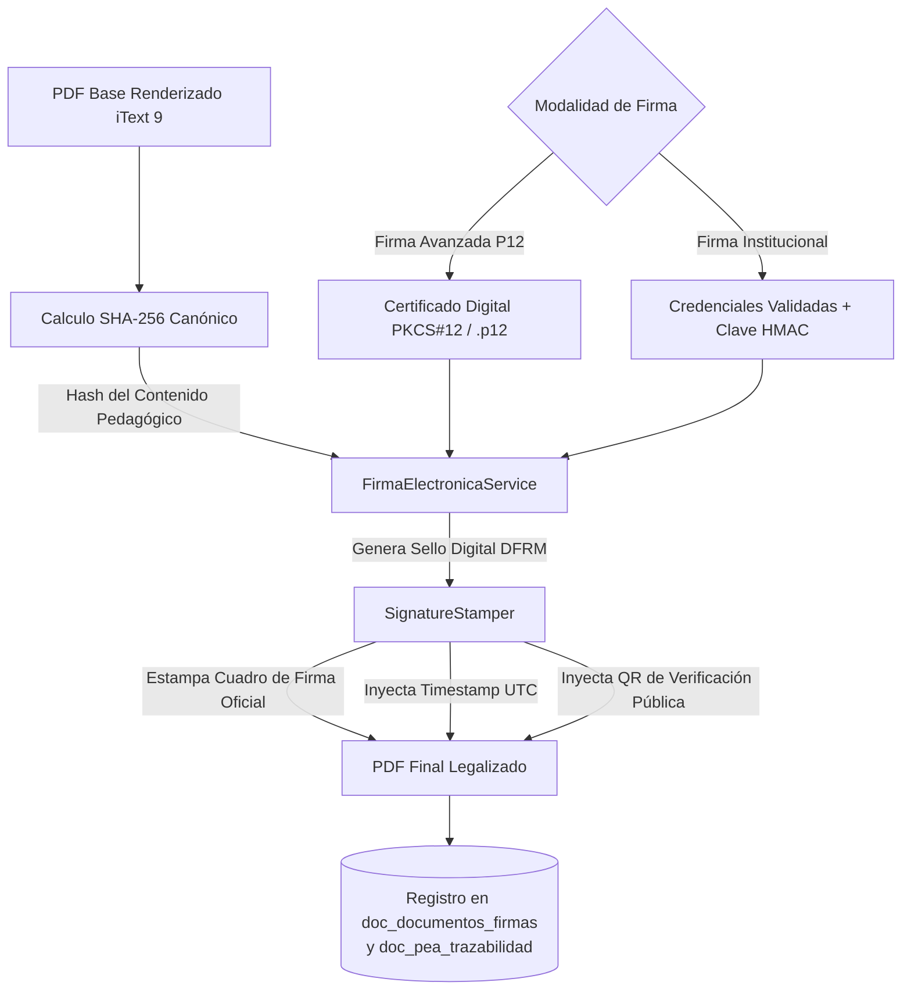

# Motor de Firma Digital, Criptografía y Sellos

## 1. Visión General del Subsistema de Firma

El motor de firma y sellado de DOSIER (`Signatures`) proporciona la infraestructura para validar la autoría, integridad y no repudio legal sobre los instrumentos curriculares emitidos por el Instituto Superior Tecnológico Mayor Pedro Traversari (ISTPET), en estricta conformidad con la **Ley de Comercio Electrónico, Firmas Electrónicas y Mensajes de Datos (Ley 67 de la República del Ecuador)**.

El subsistema integra la validación de certificados digitales en formato PKCS#12 (.p12) / FirmaEC, el sellado criptográfico HMAC-SHA256 institucional, el cálculo de huellas digitales de integridad SHA-256 y el estampado visual de sellos DFRM y códigos QR en documentos PDF.

---

## 2. Arquitectura del Proceso de Firma



---

## 3. Modalidades de Firma Soportadas

### 3.1. Firma Electrónica Avanzada (PKCS#12 / .p12 / FirmaEC)
* **Mecanismo:** El docente o directivo carga su archivo de certificado digital emitido por una entidad de certificación autorizada (BCE, Security Data, ANF, UANATACA) en formato Base64 o binario, junto con su contraseña privada.
* **Procesamiento:** `FirmaElectronicaService` utiliza **BouncyCastle** para abrir el almacén PKCS#12, validar la cadena de confianza X.509, verificar la vigencia temporal y comprobar la correspondencia del titular con el firmante en sesión.

### 3.2. Firma Digital Institucional (Sello HMAC-SHA256)
* **Mecanismo:** Para el flujo interno cotidiano de validación y avales en borrador, el docente autentica su identidad mediante verificación estricta de contraseña (BCrypt) contra su cuenta docente en SIGAFI.
* **Procesamiento:** El servidor genera un token de sellado firmado con la clave criptográfica del sistema (`DosierFirma:SigningSecret`), garantizando que la firma solo pudo ser generada por el servidor tras la verificación del docente.

---

## 4. Estampado Visual y Código DFRM (`SignatureStamper`)

El servicio de estampado gráfico sobre el archivo PDF utiliza **iText 9** para posicionar el sello institucional en la Sección k (Firmas de responsabilidad):

* **Código Oficial DFRM:** Generación de un identificador institucional único de trazabilidad (ej. `DFRM-DOC-2026-0089`, `DFRM-VIC-2026-0042`).
* **Datos del Sello Visual:**
  * Nombre completo del firmante (obtenido de su registro oficial en SIGAFI).
  * Cargo institucional formal (`Docente Elaborador`, `Coordinador de Carrera`, `Coordinación Académica`, `Vicerrectorado Académico`).
  * Fecha y hora exacta de firmado en estándar UTC e ISO 8601.
  * Código hash abreviado y algoritmo criptográfico utilizado.
* **Código QR Dinámico:** Posicionado en el pie de cada página con el enlace directo al validador público descentralizado.

---

## 5. Estructura de Persistencia de Firmas (`doc_documentos_firmas`)

Cada firma electrónica ejecutada se persiste de forma inmutable en la base de datos:

```sql
CREATE TABLE doc_documentos_firmas (
    id_firma INT AUTO_INCREMENT PRIMARY KEY,
    id_documento_instancia INT NOT NULL,
    id_usuario INT NOT NULL,
    rol_firmante VARCHAR(50) NOT NULL,        -- DOSIER_DOCENTE, DOSIER_COORD_CARRERA, etc.
    tipo_firma VARCHAR(30) NOT NULL,          -- P12_PADES_ECUADOR, HMAC_SHA256_INSTITUCIONAL
    hash_documento VARCHAR(64) NOT NULL,      -- Hash SHA-256 del contenido firmado
    codigo_dfrm VARCHAR(50) NOT NULL,         -- Código de trazabilidad impreso
    fecha_firma DATETIME NOT NULL,            -- Timestamp UTC
    ip_origen VARCHAR(45) NOT NULL,
    user_agent VARCHAR(255) NULL,
    FOREIGN KEY (id_documento_instancia) REFERENCES doc_documentos_instancias(id_documento_instancia)
);
```
