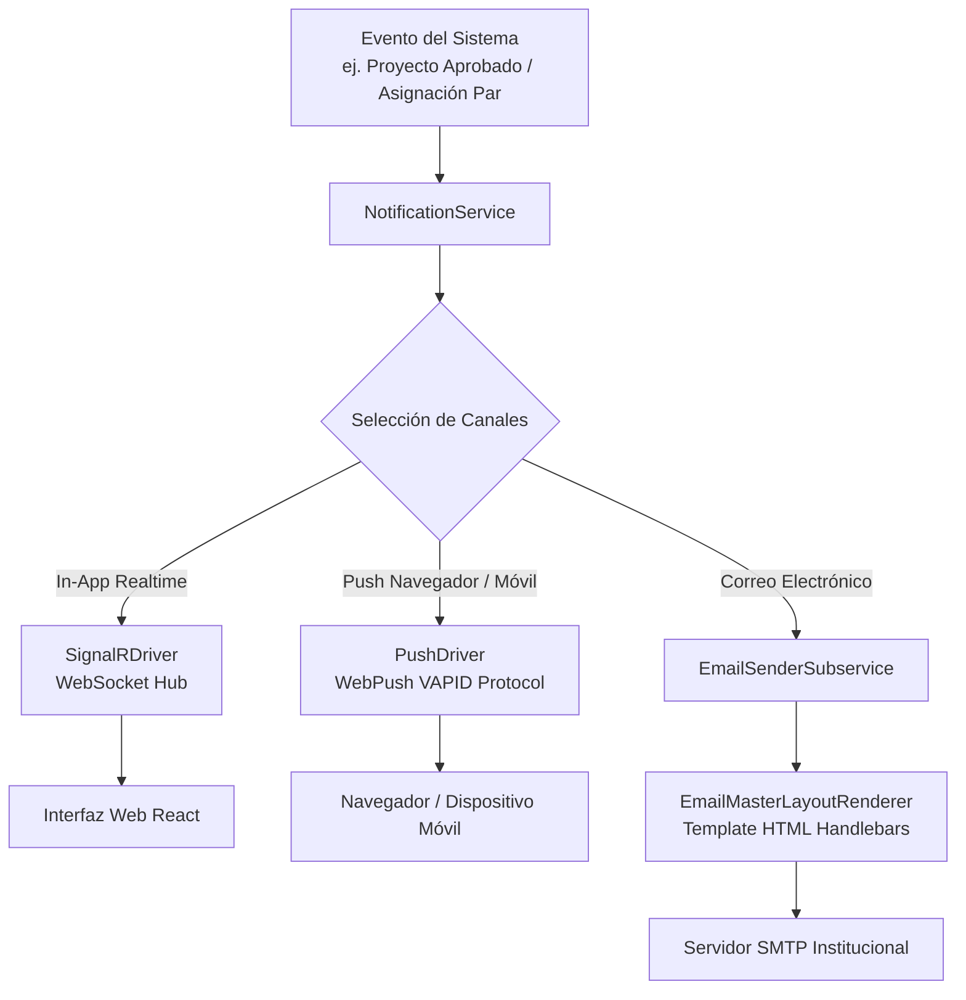

# Motor de Notificaciones Multicanal

## 1. Visión General del Subsistema de Notificaciones

El subsistema de notificaciones (`Notifications` / `EmailEngine`) administra el envío de alertas transaccionales y eventos del sistema a través de tres canales de comunicación independientes:

1. **Notificaciones en Tiempo Real (In-App):** Transmitidas mediante WebSockets a la interfaz web mediante `SignalRDriver`.
2. **Notificaciones Push Navegador/Móvil:** Enviadas mediante el protocolo WebPush (VAPID) a través de `PushDriver`.
3. **Notificaciones por Correo Electrónico:** Generadas y transmitidas en HTML con formato institucional por `EmailSenderSubservice`.

---

## 2. Arquitectura de Notificación Multicanal



---

## 3. Canales de Comunicación

### 3.1. Canal WebSocket In-App (`SignalRDriver`)
* **Hub:** Dispara eventos hacia clientes conectados identificados por su `UserUuid`.
* **Uso:** Alertas inmediatas en la barra superior del sistema (ej. observaciones del evaluador, solicitudes de cambio de equipo, bloqueos de sección).

### 3.2. Canal WebPush (`PushDriver`)
* **Protocolo:** Implementa el estándar **VAPID** (`WebPush` 1.0.13).
* **Uso:** Notificaciones dirigidas al navegador del docente o dispositivo móvil, aun cuando la pestaña de DOSIER se encuentre cerrada.

### 3.3. Canal de Correo Transaccional (`EmailSenderSubservice`)
* **Layout Maestro (`EmailMasterLayoutRenderer`):** Renderiza el correo encapsulándolo en la plantilla HTML institucional (cabecera con isotipo del ISTT, cuerpo del mensaje, botón de acción con Magic Link y pie LOPDP).
* **Plantillas (`EmailTemplateService`):** Administra las plantillas para eventos clave (bienvenida, recuperación de contraseña, notificación de Magic Link, asignación de par ciego, resoluciones).

---

## 4. Estructura de Registro de Notificaciones

Las notificaciones emitidas se registran en la base de datos para consulta del usuario:

```sql
CREATE TABLE user_notifications (
    id BIGINT AUTO_INCREMENT PRIMARY KEY,
    user_uuid VARCHAR(36) NOT NULL,
    title VARCHAR(255) NOT NULL,
    message TEXT NOT NULL,
    notification_type VARCHAR(50) NOT NULL, -- INFO, SUCCESS, WARNING, URGENT
    action_url VARCHAR(500) NULL,
    is_read BOOLEAN NOT NULL DEFAULT FALSE,
    created_at_utc DATETIME NOT NULL DEFAULT CURRENT_TIMESTAMP
);
```
