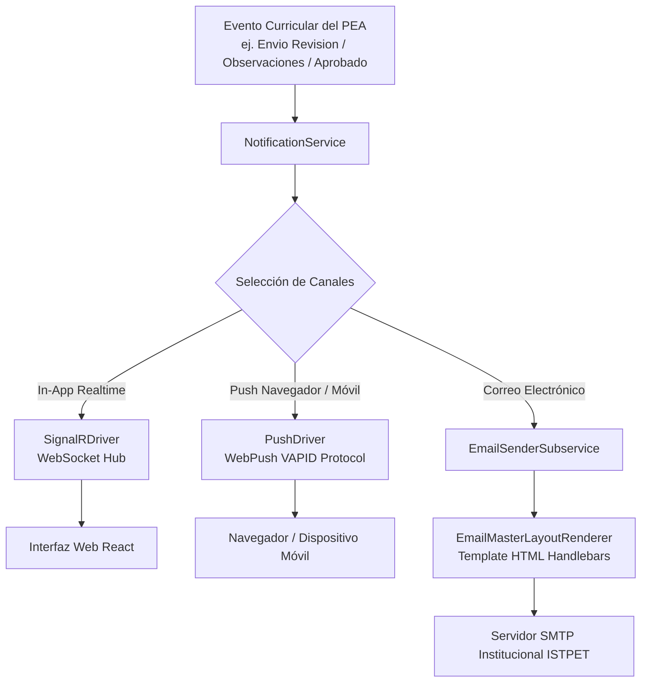

# Motor de Notificaciones Multicanal

## 1. Visión General del Subsistema de Notificaciones

El subsistema de notificaciones (`Notifications` / `EmailEngine`) administra el envío de alertas transaccionales, convocatorias a revisión y eventos del ciclo de vida del PEA a través de tres canales de comunicación independientes:

1. **Notificaciones en Tiempo Real (In-App):** Transmitidas mediante WebSockets a la interfaz web mediante `SignalRDriver`.
2. **Notificaciones Push Navegador/Móvil:** Enviadas mediante el protocolo WebPush (VAPID) a través de `PushDriver`.
3. **Notificaciones por Correo Electrónico:** Generadas y transmitidas en HTML con formato institucional por `EmailSenderSubservice`.

---

## 2. Arquitectura de Notificación Multicanal



---

## 3. Canales de Comunicación y Eventos Curriculares

### 3.1. Canal WebSocket In-App (`SignalRDriver`)
* **Hub:** Dispara eventos hacia clientes conectados identificados por su identificador de usuario (`idUsuario`).
* **Uso:** Alertas inmediatas en el encabezado del sistema cuando un revisor formula una observación, un docente subsana un requerimiento o un PEA es legalizado por Vicerrectorado.

### 3.2. Canal WebPush (`PushDriver`)
* **Protocolo:** Implementa el estándar **VAPID** (`WebPush` 1.0.13) con llaves públicas y privadas institucionales.
* **Uso:** Notificaciones dirigidas al navegador del docente o dispositivo móvil, aun cuando la pestaña de DOSIER se encuentre cerrada.

### 3.3. Canal de Correo Transaccional (`EmailSenderSubservice`)
* **Layout Maestro (`EmailMasterLayoutRenderer`):** Renderiza el correo encapsulándolo en la plantilla HTML institucional (cabecera con logotipo del ISTPET, cuerpo del mensaje, enlace directo al PEA y pie legal LOPDP).
* **Plantillas Institucionales (`EmailTemplateService`):** Administra las plantillas para eventos clave del calendario académico:
  * `PEA_ENVIADO_REVISION`: Notificación al Coordinador de Carrera.
  * `PEA_OBSERVADO`: Notificación al Docente Elaborador con el detalle de secciones a subsanar.
  * `PEA_AVAL_CARRERA`: Notificación a Coordinación Académica para revisión metodológica.
  * `PEA_APROBADO`: Notificación general al docente y carrera con el PDF oficial y QR adjunto.
  * `ALERTA_PLAZO_ENTREGA`: Recordatorio automatizado antes del inicio del período académico.

---

## 4. Estructura de Registro de Notificaciones (`doc_notificaciones`)

Las notificaciones emitidas se registran en la base de datos para consulta y marcado de lectura del usuario:

```sql
CREATE TABLE doc_notificaciones (
    id_notificacion INT AUTO_INCREMENT PRIMARY KEY,
    id_usuario INT NOT NULL,
    titulo VARCHAR(255) NOT NULL,
    mensaje TEXT NOT NULL,
    tipo VARCHAR(50) NOT NULL,              -- INFO, SUCCESS, WARNING, URGENT
    url_redireccion VARCHAR(500) NULL,      -- Enlace directo al PEA u observación
    leida TINYINT(1) NOT NULL DEFAULT 0,
    fecha_creacion DATETIME NOT NULL,
    FOREIGN KEY (id_usuario) REFERENCES usuarios(idUsuario)
);
```
