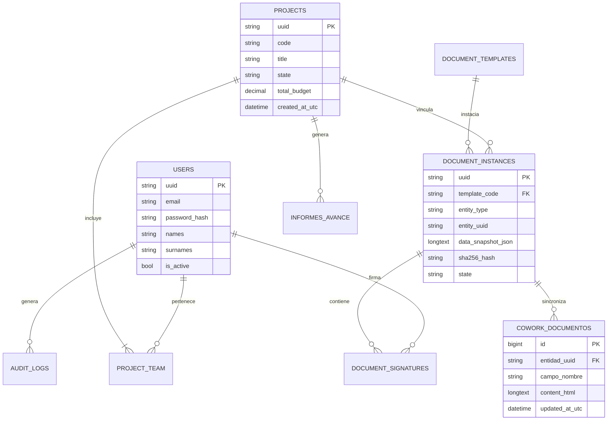

# Esquema Relacional de Base de Datos y Persistencia

## 1. Visión General del Modelo de Datos

La capa de persistencia de DOSIER utiliza el motor de base de datos **MariaDB 10.5+ / MySQL 8.0+** sobre el esquema de base de datos **`sigafi_es`** (expuesto en el puerto por defecto `3306`).

El mapeo objeto-relacional (ORM) es administrado por **Entity Framework Core 9.0** a través del conector `Pomelo.EntityFrameworkCore.MySql`. La base de datos almacena las entidades del dominio de investigación, la estructura de usuarios y permisos, el motor documental, la bitácora de auditoría inmutable y las tablas de sincronización colaborativa.

---

## 2. Diagrama Entidad-Relación (DER Principal)

---

## 3. Tablas Clave del Sistema

### 3.1. Dominio de Investigación y Proyectos

* **`doc_proyectos` (`Projects`):** Almacena la entidad principal de las propuestas de investigación (código, título, resumen, línea de investigación, presupuesto total y estado del workflow).
* **`doc_proyecto_miembros` (`ProjectTeam`):** Relación N:M entre usuarios y proyectos, especificando el rol dentro del equipo (Director, Co-Investigador, Ayudante), porcentaje de dedicación horaria y estado de adscripción.
* **`doc_proyecto_cambios_equipo` (`ProjectTeamChange`):** Registro de solicitudes formales de adscripción o salida de miembros durante la ejecución del proyecto.
* **`doc_informes_avance` (`InformesAvance`):** Registro de informes periódicos de cumplimiento técnico/financiero y entregables.

### 3.2. Dominio Documental y Forense

* **`document_templates` (`DocumentTemplate`):** Registro de plantillas de documentos (código de plantilla, versión, marcado HTML base, esquema de metadatos JSON y estado de activación).
* **`document_instances` (`DocumentInstance`):** Registro de cada documento instanciado (UUID, tipo de entidad vinculada, snapshot `data_snapshot_json`, hash SHA-256, código de trazabilidad QR y estado).
* **`doc_cowork_documentos` (`DocCoworkDocumento`):** Tabla de edición colaborativa que guarda el marcado HTML resultante de las secciones editadas en tiempo real mediante Yjs.
* **`document_signatures` (`DocumentSignature`):** Bitácora de firmas electrónicas aplicadas a una instancia documental (firmante, rol, hash SHA-256 y timestamp UTC).

### 3.3. Dominio de Seguridad y Gobernanza

* **`users` (`User`):** Catálogo de usuarios institucionales (UUID, cédula, nombres, apellidos, correo institucional, password_hash BCrypt).
* **`roles` / `permissions` / `role_permissions`:** Estructura RBAC para asignación de roles y permisos de grano fino.
* **`audit_logs` (`AuditLog`):** Tabla inmutable que registra cada operación `INSERT`, `UPDATE` o `DELETE` con snapshots en JSON del estado anterior y posterior de los datos.
* **`lopdp_consents` / `lopdp_arco_requests`:** Registro de consentimientos informados y atención a solicitudes de derechos ARCO.

---

## 4. Convenciones de Columna y Estrategia de Indexación

1. **Identificadores Únicos (UUID v4):** Las entidades principales de negocio utilizan identificadores `VARCHAR(36)` generados en la capa de aplicación (`Guid.NewGuid()`), evitando el uso de claves secuenciales expuestas en la API.
2. **Columnas de Auditoría Estándar:**
   * `created_at_utc DATETIME NOT NULL`: Fecha de creación en formato UTC.
   * `updated_at_utc DATETIME NULL`: Fecha de última modificación.
   * `is_deleted BOOLEAN NOT NULL DEFAULT FALSE`: Indicador de borrado lógico (Soft Delete).
   * `deleted_at_utc DATETIME NULL`: Fecha de eliminación lógica.
3. **Estrategia de Índices:**
   * Índices B-Tree únicos sobre `uuid`, `code` y `email`.
   * Índices compuestos en `document_instances(entity_uuid, entity_type)` para optimizar las consultas del orquestador documental.
   * Índices en `audit_logs(entity_uuid, timestamp_utc)` para la generación de trazas de auditoría.
