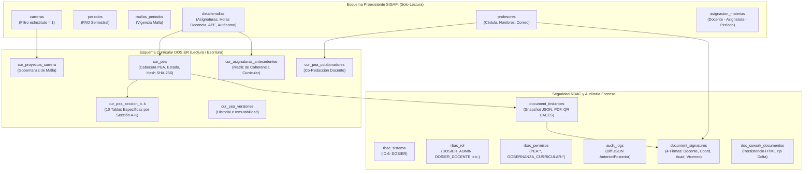

# Esquema Relacional de Base de Datos y Persistencia

## 1. Visión General del Modelo de Persistencia

La persistencia de DOSIER opera sobre el motor relacional **MariaDB 10.5+ / MySQL 8.0+** en el esquema de base de datos **`sigafi_es`** (puerto por defecto `3306`).

El sistema implementa una arquitectura híbrida de base de datos:
1. **Esquema Académico Institucional Preexistente (SIGAFI - Solo Lectura):** Contiene los catálogos maestros de carreras técnicas y tecnológicas, períodos académicos semestrales, mallas curriculares aprobadas, asignaturas con distribución horaria y la nómina docente institucional.
2. **Esquema de Gobernanza Curricular y Acreditación DOSIER (Lectura / Escritura):** Conjunto de tablas estructuradas mediante scripts DDL versionados que gestionan la formulación colaborativa del Programa de Estudio de la Asignatura (PEA), antecedentes curriculares, marcos normativos, firmas electrónicas, bitácora forense de auditoría y sincronización colaborativa en tiempo real.

El mapeo objeto-relacional (ORM) es administrado por **Entity Framework Core 9.0** mediante el conector oficial `Pomelo.EntityFrameworkCore.MySql`.

---

## 2. Diagrama de Arquitectura de Datos Híbrida



---

## 3. Catálogo de Tablas del Sistema por Módulos

### 3.1. Tablas del Esquema SIGAFI (Solo Lectura)

* **`carreras`:** Registro institucional de carreras y programas formativos. DOSIER filtra estrictamente las carreras con `esInstituto = 1` para limitar el alcance al Instituto Superior Tecnológico Pedro Traversari.
* **`periodos`:** Períodos Académicos Ordinarios (PAO) con sus fechas de inicio, finalización y estado administrativo.
* **`mallas_periodos`:** Vinculación entre el período lectivo y la versión curricular aprobada por los organismos colegiados.
* **`detallemallas`:** Registro granular de asignaturas por nivel formativo. Define las horas oficiales de docencia (CD), aprendizaje práctico-experimental (APE) y trabajo autónomo (TA), sirviendo como regla de validación matemática inviolable para la planificación curricular.
* **`profesores`:** Catálogo del personal docente, identificadores únicos institucionales, títulos profesionales y correos electrónicos.
* **`asignacion_materias`:** Cruce entre el docente titular, el período lectivo y la asignatura asignada para la carga académica.

### 3.2. Tablas del Núcleo Base Documental y Forense (`01_sistema_base.sql`)

* **`document_templates` (`DocumentTemplate`):** Catálogo de plantillas oficiales emitidas por la institución (PEA oficial, Sílabos, Guías APE). Almacena el marcado HTML base y el esquema JSON de metadatos.
* **`document_instances` (`DocumentInstance`):** Instancia oficial de un documento curricular emitido. Almacena el snapshot congelado (`data_snapshot_json`), hash criptográfico SHA-256, ruta del archivo PDF firmado y código de verificación QR para acreditación CACES.
* **`document_signatures` (`DocumentSignature`):** Registro de las firmas electrónicas aplicadas a cada documento curricular. Almacena el identificador del firmante, rol curricular, certificado PKCS#12, marca de tiempo y estado de validación.
* **`audit_logs` (`AuditLog`):** Bitácora de auditoría forense inmutable. Cada transacción curricular genera un registro con el usuario, dirección IP, tipo de acción, entidad afectada y snapshots JSON del estado previo y posterior.
* **`doc_cowork_documentos` (`DocCoworkDocumento`):** Tabla de persistencia para la co-redacción concurrente en tiempo real mediante Yjs y CRDT. Guarda los estados intermedios en HTML de cada sección editada simultáneamente por los docentes.
* **`lopdp_consents` & `lopdp_arco_requests`:** Tablas de cumplimiento con la Ley Orgánica de Protección de Datos Personales del Ecuador para consentimientos informados y ejercicio de derechos ARCO.

### 3.3. Tablas de Gobernanza Curricular y Normativa (`02_gobernanza_y_antecedentes_curriculares.sql`)

* **`cur_normativas_externas`:** Repositorio de normativas de nivel superior (Ley Orgánica de Educación Superior - LOES, Reglamento de Régimen Académico del CES, Criterios de Evaluación CACES y lineamientos SENESCYT).
* **`cur_normativa_articulos`:** Artículos específicos y considerandos normativos vinculables a las decisiones curriculares.
* **`cur_modelos_educativos`:** Registro de las versiones del Modelo Educativo y Pedagógico Institucional del ISTPET.
* **`cur_proyectos_carrera`:** Proyectos de creación y rediseño de carreras aprobados por el Consejo de Educación Superior (CES), vinculando la carrera de SIGAFI con su fundamentación curricular.
* **`cur_proyectos_carrera_normativas`:** Tabla de articulación N:M entre los proyectos de carrera y las normativas externas vigentes.
* **`cur_asignaturas_antecedentes`:** Matriz curricular que detalla para cada asignatura de `detallemallas` su justificación epistemológica, problema pedagógico que resuelve, relación con el perfil de egreso y articulación metodológica.
* **`doc_autoridades_curriculares`:** Registro formal de designaciones institucionales y coordinaciones de carrera (`VICERRECTOR`, `COORD_ACADEMICO`, `COORD_CARRERA` con FK opcional a `carreras`). Garantiza la autonomía de DOSIER frente a vacíos de SIGAFI y alimenta el aprovisionamiento de roles RBAC en tiempo de ejecución.

### 3.4. Tablas del Programa de Estudio de la Asignatura Oficial (`03_curriculum_pea_oficial.sql`)

* **`cur_pea`:** Cabecera de la planificación del PEA. Almacena la relación con `detallemallas`, período académico, estado del workflow (`Borrador`, `EnRevision`, `RevisadoCoord`, `RevisadoAcad`, `Aprobado`), versión curricular, hash SHA-256 de inmutabilidad y marca de tiempo de bloqueo.
* **`cur_pea_seccion_b_datos`:** Datos generales de la asignatura, campo de formación, créditos, prerrequisitos y correquisitos sincronizados desde SIGAFI.
* **`cur_pea_seccion_c_objetivos`:** Objetivos de aprendizaje general y específicos de la asignatura articulados con la malla.
* **`cur_pea_seccion_d_competencias`:** Competencias genéricas y específicas que tributan al perfil de egreso del tecnólogo.
* **`cur_pea_seccion_e_resultados`:** Matriz de resultados de aprendizaje con niveles de logro (Inicial, Medio, Alto).
* **`cur_pea_seccion_f_contenidos`:** Estructura modular de unidades temáticas, subtemas, horas teóricas, horas prácticas y trabajo autónomo.
* **`cur_pea_seccion_g_metodologia`:** Estrategias metodológicas y técnicas didácticas de enseñanza-aprendizaje aplicadas.
* **`cur_pea_seccion_h_recursos`:** Recursos didácticos, software especializado, laboratorios, talleres y equipamiento requerido.
* **`cur_pea_seccion_i_evaluacion`:** Mecanismos de evaluación diagnóstica, formativa y sumativa con sus respectivas ponderaciones porcentuales reglamentarias.
* **`cur_pea_seccion_j_bibliografia`:** Referencias bibliográficas básicas y complementarias normalizadas bajo normas APA 7ma edición con validación de fondos físicos y virtuales.
* **`cur_pea_seccion_k_firmas`:** Circuito formal de 4 firmas: Elaborado (Docente/s), Revisado (Coordinador de Carrera), Verificado (Coordinador Académico) y Aprobado (Vicerrectorado).
* **`cur_pea_colaboradores`:** Nómina de docentes autores y co-autores asignados con permisos de co-redacción concurrente.
* **`cur_pea_versiones`:** Historial de versiones del PEA con almacenamiento de snapshot y trazabilidad de cambios por período lectivo.

### 3.5. Tablas de Seguridad RBAC Curricular (`04_seguridad_rbac_roles_curriculares.sql`)

* **`rbac_sistema`:** Registro de sistemas de la institución. DOSIER está formalizado con identificador primario `6` y detalle `"Gestión Curricular y Acreditación ISTPET"`.
* **`rbac_modulos`:** Módulos funcionales: `PEA`, `GOBERNANZA_CURRICULAR`, `AUDITORIA_CACES`, `CONFIGURACION`.
* **`rbac_rol`:** Catálogo de roles curriculares institucionales:
  1. `DOSIER_ADMIN` (ID: 32) - Administrador General del Sistema Curricular.
  2. `DOSIER_DOCENTE` (ID: 33) - Docente Autor y Co-Redactor de Planificación Curricular.
  3. `DOSIER_COORD_CARRERA` (ID: 34) - Coordinador de Carrera (Revisión Técnica y Aprobación Primaria).
  4. `DOSIER_COORD_ACAD` (ID: 35) - Coordinador Académico (Verificación Institucional).
  5. `DOSIER_VICERRECTOR` (ID: 36) - Vicerrectorado (Aprobación Definitiva e Inmutabilidad).
* **`rbac_permisos`:** Permisos granulares de acción sobre los módulos curriculares (`PEA:READ`, `PEA:WRITE`, `PEA:REVIEW`, `PEA:APPROVE`, `PEA:SIGN`, etc.).
* **`rbac_rol_permisos`:** Matriz de asociación N:M entre roles y permisos.
* **`rbac_usuario_rol`:** Asignación de docentes y directivos a los roles curriculares del sistema.

---

## 4. Convenciones de Columnas y Reglas de Integridad

1. **Claves Primarias:**
   * Tablas maestras de negocio DOSIER: `VARCHAR(36)` con identificadores únicos universales (UUID v4) generados a nivel de aplicación mediante `Guid.NewGuid()`.
   * Tablas de auditoría y relaciones transaccionales: `BIGINT AUTO_INCREMENT` o claves compuestas explícitas.
2. **Campos de Auditoría Estándar:**
   * `created_at_utc DATETIME NOT NULL`: Marca temporal de creación en tiempo universal coordinado.
   * `updated_at_utc DATETIME NULL`: Marca temporal de última modificación.
   * `is_deleted BOOLEAN NOT NULL DEFAULT FALSE`: Marcado para borrado lógico (Soft Delete).
   * `deleted_at_utc DATETIME NULL`: Fecha de eliminación lógica.
3. **Manejo de Cotejamiento y Collation:**
   * Las tablas preexistentes del esquema `sigafi_es` utilizan cotejamiento `latin1_swedish_ci`.
   * Las tablas curriculares de DOSIER utilizan `utf8mb4_unicode_ci` para soporte de caracteres extendidos, caracteres científicos y tildes en contenidos pedagógicos.
   * Para evitar errores 1267 de incompatibilidad en consultas que unen tablas de ambos esquemas, los controladores y servicios ejecutan conversiones explícitas (`CONVERT(col USING utf8mb4)`).
4. **Reglas de Integridad Referencial:**
   * No se aplican claves foráneas restrictivas directas hacia las tablas de SIGAFI (`carreras`, `detallemallas`, `profesores`) para evitar bloqueos transaccionales o fallos en cascada sobre el sistema académico principal. La consistencia se garantiza a través de la capa de dominio en EF Core y validaciones en los servicios de aplicación.

---

## 5. Secuencia Oficial de Provisión de Base de Datos para Docker y Despliegues

Para inicializaciones autónomas (Docker Compose, CI/CD y entornos de prueba/defensa de tesis), la base de datos se estructura en 5 scripts ordenados en `scripts/base_datos/`, ejecutados automáticamente por el contenedor MySQL en `/docker-entrypoint-initdb.d/`:

1. **`00_sigafi_esquema_y_datos_demo.sql`:** Provisión autónoma y completa del esquema preexistente de SIGAFI: actores (`profesores`), carga académica (`carreras`, `periodos`, `mallas`, `mallas_periodos`, `detallemallas`, `prerequisitos`, `materias`, `tipos_asignatura`, `modalidades`, `modalidades_carreras`, `secciones`, `asignacion_materias`), infraestructura y horarios (`horas_clases`, `semanas_horarios`), catálogos institucionales (`paises`, `provincias`, `cantones`, `parroquias`, `nacionalidades`, `grados_academicos`, `niveles_academicos`, `instituciones_instituto`, `parametros`), tabla maestra `usuarios` y el esquema base RBAC (`rbac_sistema`, `rbac_operaciones`, `rbac_rol`, `rbac_modulos`, `rbac_modulos_operaciones`, `rbac_rol_modulo_operacion`). Cumple con LOPDP mediante anonimización estricta sobre catálogo académico real.
2. **`01_sistema_base.sql`:** Tablas base del motor DOSIER (`doc_proyectos`, `doc_document_templates`, `doc_documentos_instancias`, `doc_user_signature_profiles`, `doc_documentos_firmas`, `doc_email_historial`, `doc_calendario_eventos_normativos`, etc.).
3. **`02_gobernanza_y_antecedentes_curriculares.sql`:** Marco normativo institucional (CES, CACES), modelo educativo, matrices de tributación curricular y autoridades académicas designadas (`doc_autoridades_curriculares`).
4. **`03_curriculum_pea_oficial.sql`:** Estructura completa de las 11 secciones oficiales del Programa de Estudio de la Asignatura (PEA).
5. **`04_seguridad_rbac_roles_curriculares.sql`:** Configuración de roles curriculares (`DOSIER_ADMIN`, `DOSIER_DOCENTE`, `DOSIER_COORD_CARRERA`, `DOSIER_COORD_ACAD`, `DOSIER_VICERRECTOR`), permisos atómicos por módulo y sincronización de autoridades curriculares.

---

## 6. Pipeline de Sanitización y Anonimización Continua (LOPDP)

Para mantener la base de datos de desarrollo y Docker permanentemente actualizada con las mallas y periodos reales del ISTPET sin vulnerar la privacidad legal:

* **Script de Automatización:** `scripts/utilidades/sanitizar_sigafi_dump.py`
* **Ejecución:**
  ```powershell
  py scripts/utilidades/sanitizar_sigafi_dump.py [ruta_al_dump_nuevo.sql]
  ```
* **Comportamiento del Pipeline:**
  1. *Extracción DDL Dinámica:* Lee las 300 tablas de `sigafi_es` desde el volcado MySQL más reciente (`Dump*.sql`).
  2. *Retención Curricular Íntegra:* Conserva de forma transparente todas las carreras, mallas aprobadas, asignaturas, códigos y horas de docencia/APE/autónomo.
  3. *Anonimización LOPDP:* Reemplaza cédulas de docentes por identificadores sintéticos válidos módulo 10, nombres genéricos y correos institucionales de prueba.
  4. *Poda de Tablas Masivas:* Omite registros de facturación, pensiones o historiales estudiantiles antiguos, reduciendo el volcado de 263 MB a 0.76 MB para un arranque en 1 segundo.

