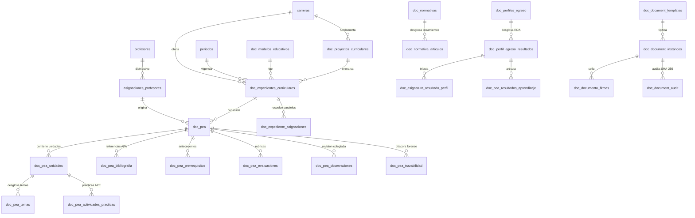

# Esquema Relacional de Base de Datos e Integración SIGAFI

## 1. Visión General del Modelo de Persistencia

La persistencia de **DOSIER** opera sobre el motor relacional **MariaDB 10.5+ / MySQL 8.0+** en la base de datos institucional **`sigafi_es`** (puerto `3306`), utilizando cotejamiento `utf8mb4_general_ci`.

El sistema implementa una arquitectura híbrida de persistencia dividida en dos fronteras claras:
1. **Frontera SIGAFI (Solo Lectura):** Esquema transaccional preexistente del instituto. Provee catálogos de carreras con `esInstituto = 1`, períodos académicos, mallas por cohorte (`mallas_periodos`), distributivos y cargas docentes (`asignaciones_profesores`). DOSIER tiene prohibido alterar o duplicar estos registros.
2. **Esquema Curricular y Documental DOSIER (Lectura / Escritura con prefijo `doc_`):** Tablas creadas y gobernadas exclusivamente por los 4 scripts oficiales en `scripts/base_datos/`, administrando el PEA institucional en sus 11 secciones, gobernanza curricular, firmas electrónicas, snapshots forenses SHA-256 y colaboración concurrente.

---

## 2. Mapa Relacional de la Base de Datos



---

## 3. Catálogo de Tablas del Esquema SIGAFI (Solo Lectura)

| Tabla SIGAFI | Columnas Principales | Regla de Integración / Filtro DOSIER |
| :--- | :--- | :--- |
| `carreras` | `idCarrera`, `carrera`, `codigo`, `esInstituto` | Filtro estricto `WHERE esInstituto = 1` para aislar carreras técnicas del ISTPET y excluir escuelas de conducción. |
| `periodos` | `idPeriodo`, `detalle`, `fechainicial`, `fechafinal`, `activo` | Delimita los períodos académicos activos y vigentes para formulación de PEAs. |
| `profesores` | `idProfesor` (cédula), `nombres`, `apellidos`, `correo` | Registro oficial de la planta docente. Se utiliza para el JIT Provisioning en el sistema ID 6. |
| `mallas` | `idMalla`, `idCarrera`, `descripcion`, `codigoResolucion` | Mallas curriculares aprobadas. |
| `mallas_periodos` | `idMallaPeriodo`, `idMalla`, `idPeriodo` | Tabla pivote de resolución de cohorte curricular por período lectivo. |
| `detallemallas` | `idDetalleMalla`, `idMalla`, `idAsignatura`, `horasDocencia`, `horasApe`, `horasAutonomo`, `creditos` | Regla matemática inalterable de distribución horaria oficial. |
| `asignaturas` | `idAsignatura`, `asignatura`, `codigo` | Catálogo de materias del plan de estudios. |
| `asignaciones_profesores` | `idAsignacion`, `idProfesor`, `idPeriodo`, `idAsignatura`, `idCarrera`, `paralelo` | Carga horaria docente asignada. Es el punto de partida para instanciar el PEA. |

---

## 4. Estructura de Tablas Curriculares y de Gobernanza DOSIER

### 4.1. Núcleo Base y Motor Documental (`scripts/base_datos/01_sistema_base.sql`)

* **`doc_document_templates`:**
  * Almacena las plantillas maestras en HTML con directivas Scriban.
  * Campos: `idTemplate`, `code`, `name`, `htmlContent`, `version`, `category`, `requiresLopdpClause`, `requiresTraceabilityCode`, `requiresElectronicSignature`, `signatureType`, `customCss`, `collaborativeFieldsJson`, `themeConfigJson`.
* **`doc_document_instances`:**
  * Documentos materializados para una entidad (`entityUuid`).
  * Campos: `idInstance`, `uuid`, `templateCode`, `templateVersion`, `entityUuid`, `entityType`, `state` (Draft, Review, Signed, Archived), `finalPdfPath`, `fileHash` (SHA-256), `traceabilityCode`, `dataSnapshotJson`, `isFilePurged`, `purgedAt`, `purgedBy`.
* **`doc_document_audit`:**
  * Bitácora inmutable exigida por el Art. 20 de la LOPDP y auditorías CACES.
  * Campos: `idAudit`, `traceabilityCode`, `templateCode`, `templateVersion`, `category`, `generatedBy`, `generatedAt`, `fileHash`, `dataSnapshotJson`.
* **`doc_documento_firmas`:**
  * Registro de firmas aplicadas a documentos.
  * Campos: `idFirma`, `uuid`, `documentoUuid`, `idUsuario`, `rolFirmante`, `firmaCode` (DFRM-XXXX), `hmacHash`, `docHash`, `metodoFirma`, `estado`, `fechaFirma`.
* **`doc_user_signature_profiles`:**
  * Perfil de firma del usuario (trazo vectorial canvas, iniciales, cargo institucional y departamento).
* **`doc_cowork_documentos` & `doc_cowork_updates`:**
  * Persistencia de sesiones colaborativas y deltas binarios Yjs para co-redacción en tiempo real.
* **`doc_lopdp_consentimientos` & `doc_lopdp_auditoria_datos`:**
  * Registro de consentimientos informados de privacidad y solicitudes ARCO.
* **`doc_notificaciones`, `doc_email_templates`, `doc_email_historial`:**
  * Mensajería interna, WebPush y plantillas HTML para alertas colegiadas.

### 4.2. Gobernanza Curricular y Antecedentes (`scripts/base_datos/02_gobernanza_y_antecedentes_curriculares.sql`)

* **`doc_normativas`:**
  * Repositorio inalterable de regulaciones nacionales (CES, CACES, SENESCYT).
  * Campos: `idNormativa`, `uuid`, `organismoEmisor`, `tipoNormativa`, `codigoResolucion`, `titulo`, `descripcion`, `fechaEmision`, `fechaVigencia`, `archivoUrl`.
* **`doc_normativa_articulos`:**
  * Desglose de artículos y lineamientos pedagógicos que alimentan el checklist de validación del PEA.
* **`doc_modelos_educativos`:**
  * Modelos educativos institucionales del ISTPET versionados formalmente (`codigo`, `version`, `resolucionAprobacion`, vigencia).
* **`doc_proyectos_curriculares`:**
  * Proyectos de carrera y rediseños aprobados por resolución del CES (`codigoResolucionCes`, `version`).
* **`doc_perfiles_egreso` y `doc_perfil_egreso_resultados`:**
  * Resultados de Aprendizaje de Carrera (RDA) que se articulan obligatoriamente con el PEA.
* **`doc_asignatura_resultado_perfil`:**
  * Matriz institucional de articulación curricular (tributación de la asignatura: `Introductorio`, `Medio`, `Avanzado`).
* **`doc_expedientes_curriculares`:**
  * Contenedor maestro que unifica la carrera, período, asignatura, proyecto CES, perfil de egreso y modelo educativo con el PEA.
* **`doc_expediente_asignaciones`:**
  * Resuelve asignaturas compartidas y cátedras paralelas en relación N:M (`idExpediente`, `idAsignacion`, `esDocenteLider`).
* **`doc_autoridades_curriculares`:**
  * Designación formal de autoridades (`VICERRECTOR`, `COORD_ACADEMICO`, `COORD_CARRERA`) para legalizar su potestad de firma en el PEA.

### 4.3. Programa de Estudio de la Asignatura Oficial (`scripts/base_datos/03_curriculum_pea_oficial.sql`)

* **`doc_pea`:**
  * Cabecera oficial del PEA institucional.
  * Campos: `idPea`, `uuid`, `idExpediente`, `idCarrera`, `idAsignatura`, `idPeriodo`, `idAsignacion`, `idDocenteElaborador`, `modalidad`, `totalHorasAsignatura`, `creditos`, `horasContactoDocente`, `horasPracticoExperimental`, `horasAutonomo`, `objetivoAsignatura`, `metodologiaEnsenanza`, `recursosDidacticos`, `evaluacionAprendizaje`, `estado` (`Borrador`, `EnRevision`, `RevisadoCoord`, `RevisadoAcad`, `Aprobado`), `version`, firmas y fechas de los 4 firmantes reglamentarios.
* **`doc_pea_unidades`:**
  * Unidades temáticas estructuradas con balance interno de horas (`horasDocencia`, `horasPracticoExp`, `horasAutonomo`).
* **`doc_pea_temas`:**
  * Temas y subtemas de cada unidad didáctica (`numeroTema`, `tituloTema`, `descripcionSubtemas`).
* **`doc_pea_resultados_aprendizaje`:**
  * RDAs específicos de la asignatura articulados con `doc_perfil_egreso_resultados`.
* **`doc_pea_actividades_practicas`:**
  * Prácticas de laboratorio o experimentales (APE) asociadas a unidades.
* **`doc_pea_bibliografia`:**
  * Referencias bibliográficas categorizadas (`Basica`, `Consulta`, `Virtual`) con formato normalizado APA 7ma edición.
* **`doc_pea_prerrequisitos`:**
  * Prerrequisitos académicos validados contra la malla curricular.
* **`doc_pea_evaluaciones`:**
  * Criterios y rúbricas de evaluación continua (escala sobre 10.0 puntos).
* **`doc_pea_observaciones`:**
  * Bitácora formal de observaciones emitidas en la revisión colegiada por sección pedagógica, con control de subsanación y respuesta docente.
* **`doc_pea_trazabilidad`:**
  * Historial inmutable de cambios de estado del PEA con marca de tiempo UTC, usuario y hash criptográfico SHA-256.

### 4.4. Seguridad RBAC Curricular (`scripts/base_datos/04_seguridad_rbac_roles_curriculares.sql`)

Configuración del subsistema de identidad bajo el **Sistema ID 6 (`DOSIER`)** en las tablas institucionales:

* **`rbac_sistema`:** Registro del sistema con `idSistema = 6`, `codigo = 'DOSIER'`, `detalle = 'Gestión Curricular y Acreditación ISTPET'`.
* **`rbac_rol`:** Los 5 roles curriculares institucionales:
  1. `DOSIER_ADMIN`: Administrador de calidad y plataforma.
  2. `DOSIER_DOCENTE`: Docente elaborador y co-redactor.
  3. `DOSIER_COORD_CARRERA`: Coordinador(a) de carrera - revisión disciplinar y pertinencia.
  4. `DOSIER_COORD_ACAD`: Coordinación académica - revisión metodológica y carga horaria.
  5. `DOSIER_VICERRECTOR`: Vicerrectorado académico - aprobación en firme y sellado institucional.
* **`rbac_modulos` y `rbac_operaciones`:** Módulos de elaboración del PEA, gobernanza curricular, auditoría CACES y configuración, vinculados mediante `rbac_modulos_operaciones` y asignados a los roles a través de `rbac_rol_modulo_operacion`.

---

## 5. Protocolo de Ejecución y Despliegue de Base de Datos

Para inicializar la base de datos en un entorno nuevo o migrar un servidor, los scripts deben ejecutarse estrictamente en el siguiente orden secuencial:

```bash
# 1. Base del sistema, motor documental y CoWork
mysql -u root -p sigafi_es < scripts/base_datos/01_sistema_base.sql

# 2. Gobernanza institucional, antecedentes y normativas
mysql -u root -p sigafi_es < scripts/base_datos/02_gobernanza_y_antecedentes_curriculares.sql

# 3. Estructura oficial del PEA institucional
mysql -u root -p sigafi_es < scripts/base_datos/03_curriculum_pea_oficial.sql

# 4. Seguridad RBAC y roles curriculares
mysql -u root -p sigafi_es < scripts/base_datos/04_seguridad_rbac_roles_curriculares.sql
```
