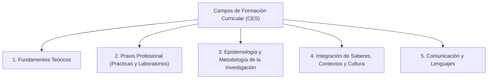
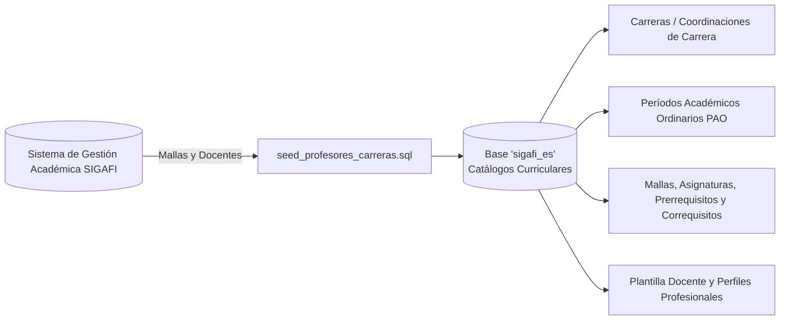

# Catálogos Institucionales y Normativa Curricular Ecuador (CES / CACES / SENESCYT)

## 1. Visión General de Catálogos

El subsistema de catálogos (`CatalogsController`) provee las estructuras de clasificación normalizadas necesarias para garantizar que la planificación curricular y la documentación docente del ISTPET cumplan con los marcos normativos del CACES, el CES (Reglamento de Régimen Académico) y las mallas aprobadas en SIGAFI.

---

## 2. Campos de Formación Curricular (CES / RRA)

DOSIER estructura las asignaturas conforme a los campos de formación vigentes en la Educación Superior del Ecuador:

### Propósito en el Sistema
* **Formulación de PEA y Sílabos:** Cada asignatura está tipificada según su campo de formación, lo cual determina la carga de horas de Docencia (CD), Aprendizaje Práctico-Experimental (APE) y Trabajo Autónomo (TA).
* **Validación de Créditos:** El sistema valida que la sumatoria de horas cumpla con la equivalencia de créditos académicos (1 crédito = 48 horas de trabajo total del estudiante).

---

## 3. Catálogos Académicos e Integración con Mallas SIGAFI

### 3.1. Carreras y Mallas Curriculares (SIGAFI)
* **Tablas:** `cat_carreras`, `cat_mallas_curriculares`, `cat_asignaturas`.
* **Sincronización:** Mantiene la relación de carreras técnicas y tecnológicas del ISTPET, los niveles formativos, las asignaturas, sus prerrequisitos y correquisitos.

### 3.2. Períodos Académicos y Materias
* **Tablas:** `cat_periodos_academicos`, `cat_asignacion_docente`.
* **Estructura:** Permite instanciar y duplicar los Sílabos y PEAs entre períodos académicos, heredando la estructura base aprobada y asignando a los docentes responsables de cada materia.
