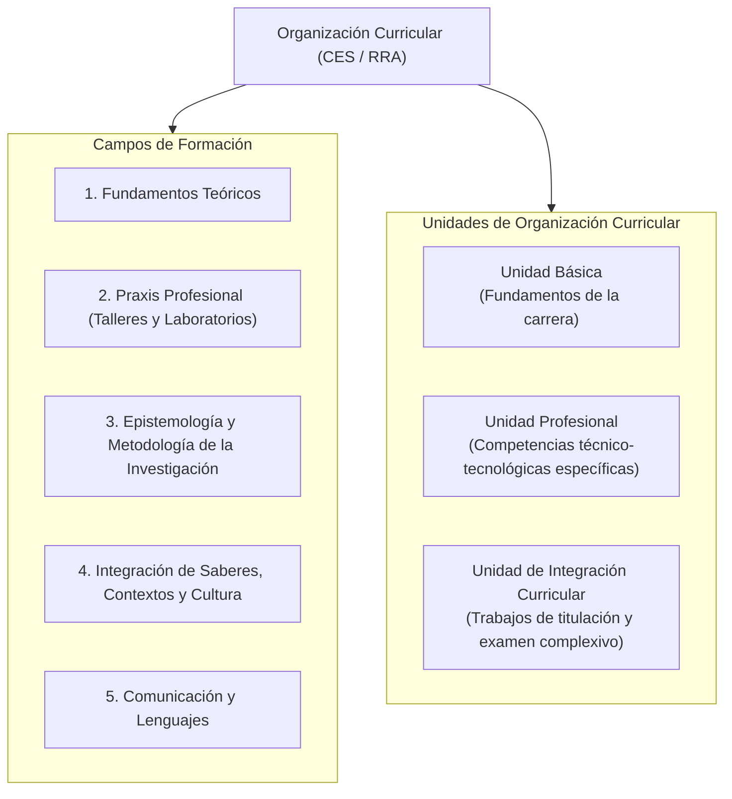
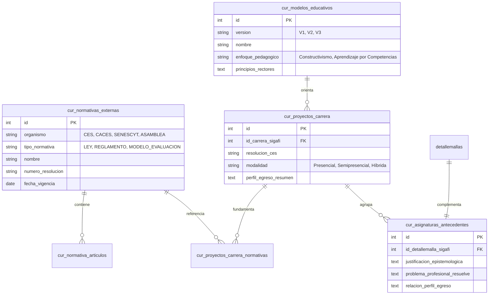

# Catálogos Institucionales y Normativa Curricular del Ecuador (CES / CACES / SENESCYT)

## 1. Marco Jurídico y Normativo de la Educación Superior Ecuatoriana

La plataforma DOSIER sustenta su motor de gobernanza curricular en el ordenamiento legal vigente para Institutos Superiores Técnicos y Tecnológicos en la República del Ecuador:

1. **Ley Orgánica de Educación Superior (LOES):** Mandato de pertinencia académica, libertad de cátedra responsable y aseguramiento continuo de la calidad de los programas formativos.
2. **Reglamento de Régimen Académico (RRA - Consejo de Educación Superior CES):** Regula la estructura y organización del currículo, la distribución horaria de los componentes de aprendizaje, la definición de créditos académicos y las modalidades de estudio.
3. **Modelo de Evaluación y Acreditación de Institutos Superiores Técnicos y Tecnológicos (CACES):** Define los criterios e indicadores obligatorios para la dimensión de docencia, coherencia curricular, portafolios de asignatura y rigor pedagógico.
4. **Lineamientos SENESCYT:** Normas operativas para la titulación técnica y tecnológica, registro de mallas y perfiles de egreso.

---

## 2. Campos de Formación y Unidades de Organización Curricular

El sistema categoriza cada asignatura de la malla institucional según las directrices establecidas por el Consejo de Educación Superior:

### Impacto de los Campos de Formación en la Planificación

* **Tipificación Pedagógica:** El campo de formación determina la proporción pedagógica recomendada entre horas de docencia teórica, horas de laboratorio y trabajo autónomo.
* **Coherencia con el Perfil de Egreso:** En la formulación del PEA (Sección D y E), cada resultado de aprendizaje debe responder a las competencias declaradas en el proyecto de carrera aprobado por el CES.

---

## 3. Componentes de Aprendizaje y Validación Matemática de Créditos

Conforme al Reglamento de Régimen Académico del CES, el sistema implementa la regla matemática estricta para la equivalencia de créditos:

$$\text{Total Horas Asignatura} = \text{Horas Docencia (CD)} + \text{Horas APE} + \text{Horas Trabajo Autónomo (TA)}$$

$$\text{Créditos Académicos} = \frac{\text{Total Horas Asignatura}}{48}$$

### 3.1. Desglose de Componentes

| Componente | Siglas | Definición Normativa | Validación en DOSIER |
| :--- | :--- | :--- | :--- |
| **Aprendizaje en Contacto con el Docente** | CD | Actividades sincrónicas o presenciales, conferencias, seminarios y talleres guiados. | Valida que la suma semanal en el PEA coincida exactamente con las horas registradas en `detallemallas.horasdocencia`. |
| **Aprendizaje Práctico-Experimental** | APE | Actividades prácticas en talleres, laboratorios, simulaciones y centros de práctica tecnológica. | Valida que las prácticas declaradas cubran las horas de `detallemallas.horasape`. |
| **Aprendizaje Autónomo** | TA | Horas dedicadas por el estudiante a la lectura, investigación, resolución de ejercicios y proyectos. | Valida que las actividades extra-aula coincidan con `detallemallas.horasautonomas`. |

---

## 4. Estructura de Tablas de Gobernanza Curricular

El script `02_gobernanza_y_antecedentes_curriculares.sql` despliega el repositorio de articulación entre la normativa externa y los proyectos institucionales:

### 4.1. `cur_normativas_externas` y `cur_normativa_articulos`
Permiten a las comisiones curriculares referenciar legalmente cada sección del PEA y de las mallas. Cuando un evaluador externo del CACES audita una asignatura, el sistema vincula la resolución del CES que habilitó la titulación.

### 4.2. `cur_modelos_educativos`
Registra la evolución de la filosofía pedagógica del Instituto Superior Tecnológico Pedro Traversari. Permite asegurar que las estrategias metodológicas seleccionadas en la Sección G del PEA concuerden con el modelo pedagógico oficial vigente en el período lectivo.

### 4.3. `cur_asignaturas_antecedentes`
Actúa como la base teórica de cada materia. Al abrir la formulación de un PEA, el docente hereda de forma precargada la justificación epistemológica, el problema profesional que resuelve y la vinculación con el perfil de egreso aprobada institucionalmente, garantizando coherencia formativa transversal y previniendo desvíos conceptuales.
