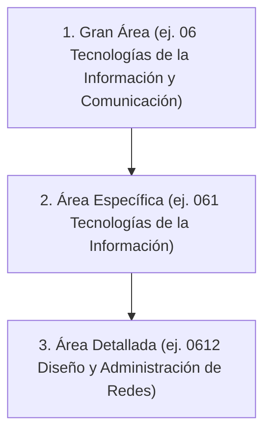
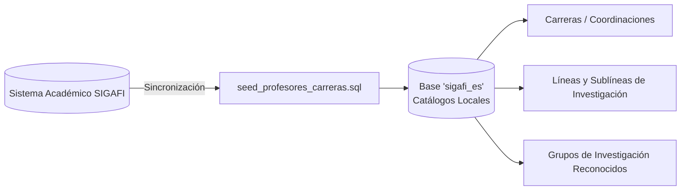

# Catálogos Institucionales y Normativa Ecuador

## 1. Visión General de Catálogos

El subsistema de catálogos (`CatalogsController` / `PndController`) provee las estructuras de clasificación normalizadas necesarias para garantizar que las propuestas de investigación del ISTT cumplan con los marcos normativos del CACES, la SENESCYT y las clasificaciones internacionales de I+D+i.

---

## 2. Clasificación Áreas del Conocimiento UNESCO

DOSIER implementa el árbol estandarizado de áreas del conocimiento de la UNESCO, estructurado en tres niveles jerárquicos:

### Propósito en el Sistema
* **Formulación de Proyectos:** Cada propuesta debe vincularse obligatoriamente a una subárea detallada UNESCO.
* **Asignación de Evaluadores Pares:** El `PeerReviewAdminService` utiliza este catálogo para cruzar las áreas de especialidad del evaluador con el área del proyecto, garantizando idoneidad técnica en el dictamen.

---

---

## 3. Catálogos Internos e Integración SIGAFI

### 3.1. Carreras y Docentes (SIGAFI)
* **Tablas:** `cat_carreras`, `cat_docentes_perfiles`.
* **Sincronización:** Mantiene la relación de carreras acreditadas en el ISTT y la plantilla docente activa con sus títulos académicos registrados en SENESCYT.

### 3.2. Líneas y Sublíneas de Investigación ISTT
* **Tabla:** `cat_lineas_investigacion`.
* **Estructura:** Áreas prioritarias aprobadas por el Órgano Colegiado Superior (OCS) del instituto para la asignación de presupuestos institucionales.
