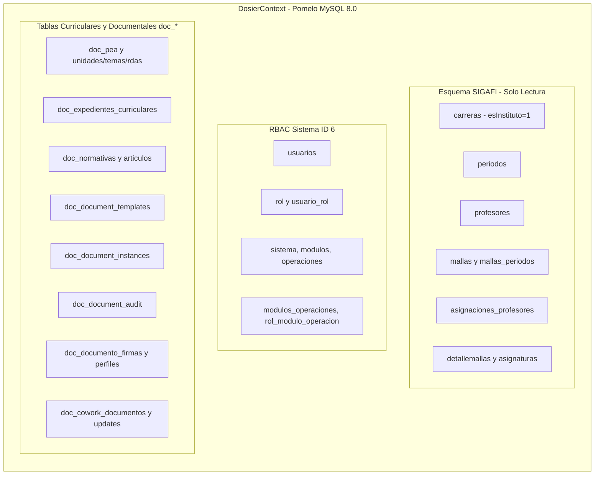
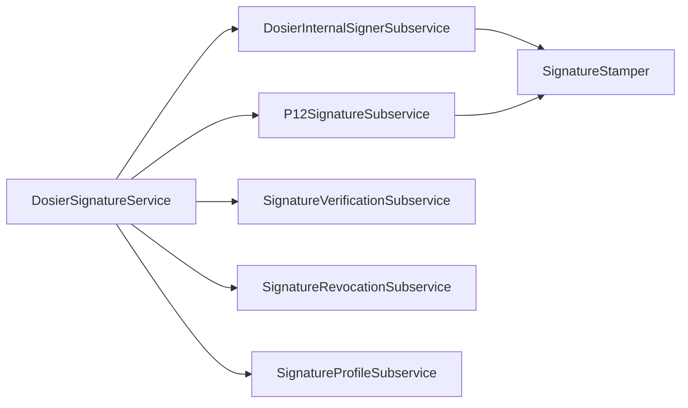

# Infraestructura de Persistencia, EF Core y Repositorios (Infrastructure Layer)

## 1. Visión General de la Capa de Infraestructura

La capa de infraestructura (`dosier_infrastructure`) implementa los contratos definidos en `dosier_application` y gestiona la interacción con los recursos tecnológicos externos del sistema **DOSIER**:
* Motor de persistencia relacional **Entity Framework Core 9** con el proveedor optimizado **Pomelo.EntityFrameworkCore.MySql** sobre la base de datos `sigafi_es` (MySQL 8.0, puerto 3306).
* Hub de comunicación bidireccional en tiempo real **SignalR** (`CollaborationHub`) para la co-redacción concurrente de asignaturas mediante CRDTs (Yjs) con compresión `GZip`.
* Motor de generación documental y compilación PDF basado en **Scriban** (motor de plantillas) e **iText 9** (manipulación de bajo nivel de flujos PDF y estampados forenses).
* Motor criptográfico de firmas digitales institucionales (HMAC-SHA256) y certificados electrónicos **PKCS#12 (.p12 / FirmaEC)**.
* Servicios de comunicación multicanal: WebSockets in-app (`SignalRDriver`), notificaciones push móviles/web (`PushDriver` vía VAPID) y despachador de correo institucional (`EmailEngineService`).

---

## 2. Arquitectura del Contexto de Datos: `DosierContext`

El acceso a datos se centraliza en `DosierContext` (ubicado en `dosier_infrastructure/data/models/Dosier/DosierContext.cs`), el cual estructura de forma limpia la convivencia entre la base de datos preexistente del instituto y el nuevo ecosistema curricular:

### 2.1. Modularización de Fluent API (`OnModelCreating`)

Para mantener un diseño mantenible y evitar un archivo monolítico inmanejable, `DosierContext` utiliza clases parciales (`partial class`) que segregan las reglas de mapeo:

1. **`OnModelCreatingSigafi(ModelBuilder)`:**
   * Mapea tablas institucionales de sólo lectura.
   * Aplica filtros globales de consulta (Query Filters) para aislar las carreras técnicas del ISTPET (`carreras.esInstituto = 1`), excluyendo los registros pertenecientes a la escuela de conducción u otros subsistemas.
   * Mapea la resolución de mallas por cohorte (`mallas_periodos`) y asignaciones docentes (`asignaciones_profesores`).
2. **`OnModelCreatingIdentity(ModelBuilder)`:**
   * Mapea el sistema de control de acceso RBAC unificado en las tablas institucionales `usuarios`, `rol`, `usuario_rol`, `sistema`, `modulos`, `operaciones` y sus tablas intermedias.
   * Maneja columnas de tipo `DateOnly` para compatibilidad nativa con las columnas `DATE` de MySQL.
3. **`OnModelCreatingDosier(ModelBuilder)`:**
   * Configura las tablas propietarias `doc_*` del sistema DOSIER (creadas por los scripts oficiales `01` a `04` en `scripts/base_datos/`).
   * Establece llaves primarias autoincrementales, índices únicos sobre columnas `uuid`, restricciones de integridad referencial (`ON DELETE RESTRICT` / `CASCADE` según criticidad pedagógica) y relaciones 1:N entre `DocPea`, `DocPeaUnidad`, `DocPeaTema`, `DocPeaActividadPractica`, `DocPeaBibliografia`, `DocPeaObservacion` y `DocPeaTrazabilidad`.

---

## 3. Implementación de Servicios Curriculares y Académicos

### 3.1. Motor Curricular del PEA (`Curriculum/PeaService.cs`)

Con más de 75 KB de lógica transaccional, `PeaService` es el servicio de persistencia más crítico del backend:

* **Instanciación desde Asignación SIGAFI (`CrearDesdeAsignacionAsync`):**
  1. Invoca `IAcademicContextResolver` para consultar la asignación docente en SIGAFI.
  2. Extrae las horas de docencia, prácticas (APE) y autónomo oficiales, calculando automáticamente los créditos correspondientes.
  3. Crea el registro en `doc_pea` con `Version = 1` y estado `Borrador`.
  4. Crea o vincula el `DocExpedienteCurricular` correspondiente a la materia y período.
* **Persistencia Integral de Secciones (`GuardarPeaAsync`):**
  1. Ejecuta transacciones atómicas (`using var transaction = await _context.Database.BeginTransactionAsync()`).
  2. Realiza validación matemática de balance: la suma de horas de las unidades didácticas debe cuadrar exactamente con el total de horas de la asignatura registrado en la malla.
  3. Sincroniza en cascada colecciones de unidades, temas, RDAs, prácticas de laboratorio, bibliografía formateada en APA y criterios de evaluación.
  4. Actualiza `FechaModificacion` y notifica al bus de eventos.
* **Máquina de Estados Curricular y Trazabilidad Forense (`CambiarEstadoAsync`):**
  1. Valida que la transición solicitada sea legal dentro del circuito:
     * `Borrador` -> `EnRevision`
     * `EnRevision` -> `RevisadoCoord` (o retorno a `Borrador` con observaciones)
     * `RevisadoCoord` -> `RevisadoAcad` (o retorno a `EnRevision` con observaciones)
     * `RevisadoAcad` -> `Aprobado`
  2. Genera un snapshot serializado en JSON del estado actual del PEA.
  3. Calcula el hash criptográfico SHA-256 del contenido.
  4. Inserta un registro inmutable en `DocPeaTrazabilidad` con el estado anterior, nuevo, usuario y hash de integridad.

### 3.2. Resolución de Contexto de Solo Lectura (`Academico/AcademicContextResolver.cs`)

Resuelve de manera no intrusiva el pensum y los datos del profesor:
* Ejecuta consultas optimizadas con `.AsNoTracking()` sobre `asignaciones_profesores`, uniendo con `carreras`, `periodos`, `mallas_periodos`, `detallemallas` y `asignaturas`.
* Aplica la regla cardinal de negocio: **los datos curriculares base provienen de SIGAFI y no pueden ser alterados desde DOSIER**. Cualquier discrepancia detectada entre la carga del profesor y la malla se reporta en la lista `Advertencias` del DTO de contexto.

---

## 4. Motor de Co-Redacción Concurrente (`Collaboration/CollaborationHub.cs`)

El servicio de colaboración implementa la infraestructura de co-redacción multi-docente en tiempo real para asignaturas compartidas:

* **Protocolo de Mensajería:** WebSocket persistente gestionado mediante SignalR Core bajo la ruta `/hubs/collaboration`.
* **Sincronización CRDT (Yjs):**
  * Los clientes envían deltas binarios de actualización Yjs codificados en Base64 o binario plano.
  * `CollaborationHub` recibe la actualización, valida la membresía del docente en el documento y la retransmite a todos los pares conectados en el canal de la asignatura mediante `Clients.OthersInGroup(docGroup).SendAsync("ReceiveUpdate", update)`.
* **Compresión GZip (`GZipHelper.cs`):** Para reducir la latencia de red y el consumo de ancho de banda en sesiones con documentos extensos, las actualizaciones de estado se comprimen y descomprimen automáticamente en memoria antes de la persistencia o retransmisión.
* **Control de Presencia y Bloqueos Suaves:**
  * Mantiene el registro en memoria de usuarios activos por documento (`doc_id`).
  * Emite eventos `UserJoined`, `UserLeft` y `AwarenessUpdate` para reflejar qué sección del PEA está editando cada docente, evitando colisiones en campos sensibles.
* **Persistencia Periódica:** Los deltas se consolidan periódicamente en la tabla `doc_cowork_updates` y se genera el snapshot consolidado en `doc_cowork_documentos`.

---

## 5. Subsistema Criptográfico y Motor de Firma Digital (`Signatures/`)

Implementado bajo una arquitectura desacoplada en subsistemas especializados en `dosier_infrastructure/Signatures/Subservices/`:

### 5.1. Firma Institucional DOSIER (`DosierInternalSignerSubservice.cs`)
* Valida la re-autenticación del usuario con BCrypt contra la tabla `usuarios`.
* Emite un código único de firma con nomenclatura formal: `DFRM-{AÑO}-{UUID8}` (ej. `DFRM-2026-A1B2C3D4`).
* Calcula la prueba criptográfica HMAC-SHA256 combinando: identificador del usuario, UUID del documento, timestamp UTC exacto y la clave secreta institucional.
* Invoca a `SignatureStamper` para imprimir visualmente el recuadro oficial de firma en el documento PDF y calcula el hash SHA-256 del binario resultante.
* Persiste el registro en `doc_documento_firmas` con estado `Valid` y registra el evento `DocumentSigned`.

### 5.2. Firma con Certificados PKCS#12 (`P12SignatureSubservice.cs`)
* Procesa certificados de firma electrónica emitidos por entidades certificadoras autorizadas en el Ecuador (Security Data, Banco Central, Consejo de la Judicatura, ANFAC).
* Decodifica el contenedor `.p12` mediante `X509Certificate2` utilizando la contraseña suministrada por el docente.
* Verifica la validez temporal del certificado (no expirado, vigente a la fecha UTC actual).
* Aplica el sellado y genera el hash de no-repudio.

### 5.3. Estampado Visual en PDF (`SignatureStamper.cs`)
* Utiliza **iText 9** (`PdfDocument`, `PdfCanvas`, `Paragraph`, `Table`).
* Posiciona de forma matemática el bloque institucional en la última página o en la sección designada de firmas del PEA:
  * Inserta el isotipo vectorial institucional.
  * Imprime nombre del docente, cargo académico, fecha y hora UTC exacta.
  * Renderiza el código DFRM-XXXX y el enlace/QR público de verificación.

---

## 6. Motor Documental y Purga Forense (`Common/Documents/`)

### 6.1. Pipeline de Renderizado (`DocumentEngine.cs`)
* **Compilación Scriban:** Transforma el marcado HTML de `DocumentTemplate` inyectando los datos del DTO curricular.
* **Ensamblado PDF con iText 9:**
  * Inyecta hojas de estilo base (`Resources/BaseDocumentStyles.css`) y overrides personalizados (`CustomCss`).
  * Inyecta encabezados institucionales, número de página dinámico ("Página X de Y") y pie de página legal obligatorio (Cláusula de protección de datos personales LOPDP).
  * Genera el código QR vectorial apuntando al endpoint de validación pública `/api/documents/verify/{traceabilityCode}`.
* **Registro Inmutable:** Inserta automáticamente la entrada en `DocumentAuditEntry` con el snapshot JSON de datos y el hash SHA-256 del archivo.

### 6.2. Diagnóstico y Purga de Archivos Obsoletos (`DocumentInstanceService.cs`)
* **`GetObsoleteDocumentDiagnosisAsync`:** Detecta documentos generados cuya versión de plantilla en `doc_document_instances` sea inferior a la versión activa en `doc_document_templates`.
* **`PurgeObsoleteFileByUuidAsync` / `PurgeAllObsoleteDocumentFilesAsync`:**
  * Elimina los archivos PDF obsoletos del disco en el servidor para liberar almacenamiento.
  * **Principio de Custodia Forense:** El registro en base de datos no se elimina; la columna `IsFilePurged` se establece en `true`, se registra la fecha (`PurgedAt`) y el usuario operador (`PurgedBy`), conservando intactos el hash SHA-256 original y la bitácora de auditoría para fines de acreditación CACES.

---

## 7. Notificaciones y Comunicación Multicanal (`Common/Notifications/`)

* **`NotificationService.cs`:** Distribuidor unificado de mensajes. Registra las alertas en `doc_notificaciones` y las envía concurrentemente a los drivers registrados.
* **`SignalRDriver.cs`:** Notificación instantánea al socket del usuario conectado en la web o app móvil.
* **`PushDriver.cs`:** Construye payloads WebPush VAPID cifrados para dispositivos registrados en `doc_dispositivos_tokens`.
* **`EmailEngineService.cs` y `EmailSenderSubservice.cs`:**
  * Renderiza correos institucionales mediante `EmailMasterLayoutRenderer.cs`.
  * Despacha correos vía SMTP institucional con reintentos y registra el resultado en `doc_email_historial`.
