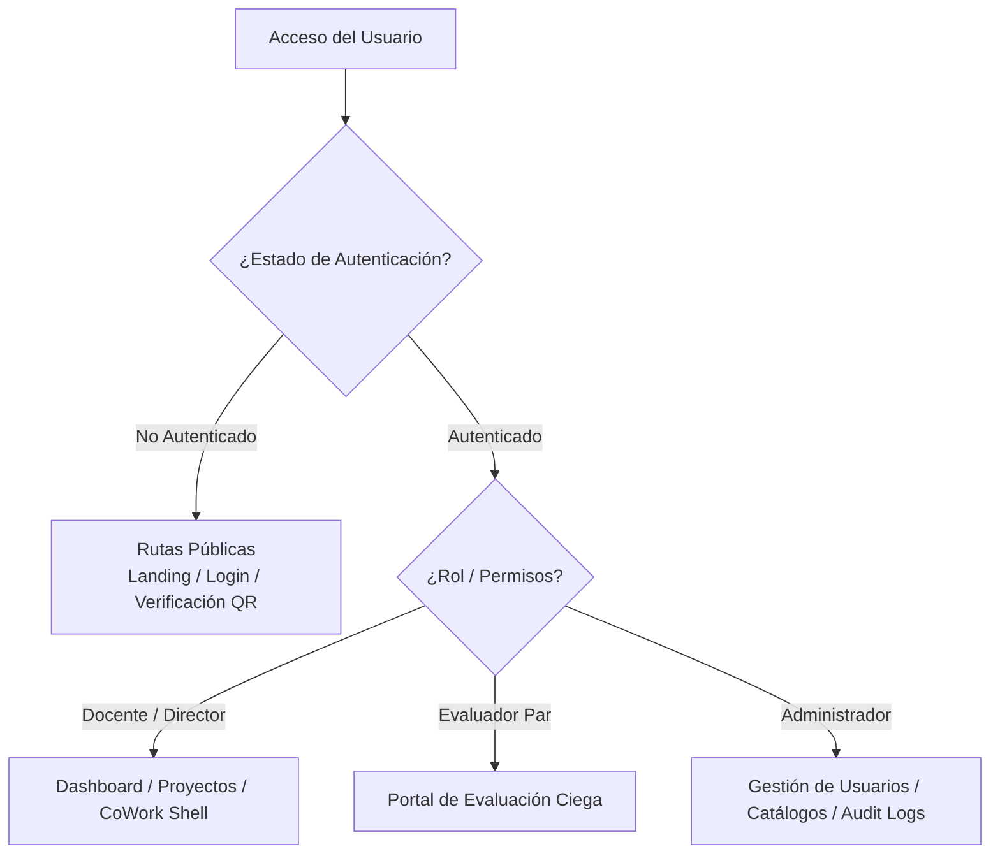

# Arquitectura Frontend Web (React SPA + Vite)

## 1. Visión General del Cliente Web

El cliente web de DOSIER (`dosier_web`) es una aplicación de página única (**SPA**) construida sobre **React 18**, **TypeScript** y el compilador **Vite**.

La aplicación proporciona la interfaz de usuario para la formulación de proyectos, edición colaborativa en tiempo real, evaluación por pares ciegos, firma digital y administración del sistema.

---

## 2. Estructura de Directorios del Código Fuente (`src/`)

El código fuente del frontend se organiza en módulos dentro de `dosier_web/src/`:

```text
dosier_web/src/
├── api/             # Configuración del cliente HTTP Axios e interceptores
├── components/      # Componentes UI reutilizables y específicos de DOSIER
│   ├── Common/      # Modales, botones, campos de entrada y alertas
│   ├── DOSIER/      # Componentes del constructor (DOSIERBuilderShell, CollaborationSidebar)
│   └── Layout/      # Barras de navegación, cabeceras y estructura de página
├── core/            # Configuración de context providers e instancias globales
├── hooks/           # Custom React Hooks (autenticación, WebSocket, formularios)
├── pages/           # Vistas principales del enrutador React Router
│   ├── Admin/       # Vistas de administración de usuarios y configuraciones
│   ├── Analytics/   # Indicadores y reportes de producción científica
│   ├── Auth/        # Vistas de login, Magic Link y recuperación
│   ├── Dashboard/   # Panel principal según rol de usuario
│   ├── Investigacion/ # Vistas de proyectos, wizard e informes de avance
│   └── Lopdp/       # Formularios de consentimiento y solicitudes ARCO
├── services/        # Capa de comunicación REST con los controladores del backend
├── styles/          # Hojas de estilo CSS Vanilla modulares
└── utils/           # Helper functions, formateadores de fecha y constantes
```

---

## 3. Enrutamiento y Gestión de Estado

### 3.1. Enrutamiento (`App.tsx`)
El enrutamiento de la aplicación utiliza **React Router**. Las rutas se dividen en tres categorías protegidas por componentes guardián:



### 3.2. Gestión de Estado
La aplicación utiliza una estrategia de estado híbrida:
* **Estado Local (`useState` / `useReducer`):** Para el control de formularios y modales.
* **Context API (`useContext`):** Para la sesión del usuario autenticado, estado del tema visual y notificaciones en tiempo real.
* **Estado Colaborativo (Yjs CRDT):** Para el contenido de los documentos editados concurrentemente en el CoWork.
