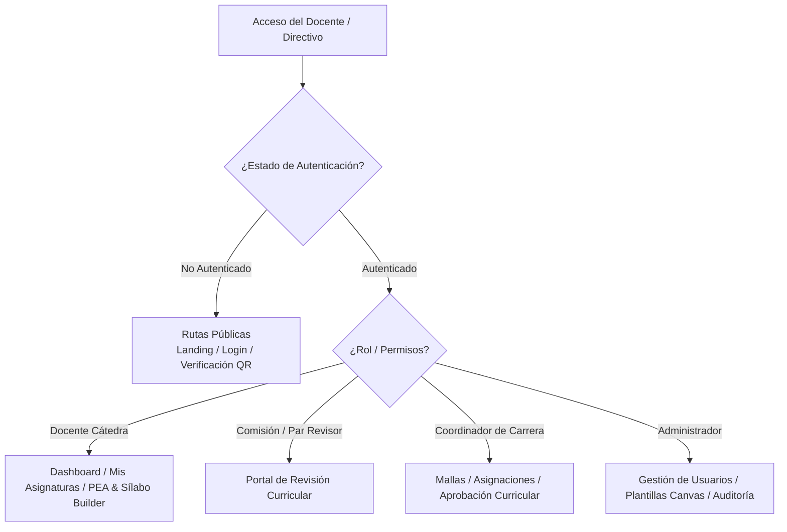

# Arquitectura Frontend Web (React SPA + Vite)

## 1. Visión General del Cliente Web

El cliente web de DOSIER (`dosier_web`) es una aplicación de página única (**SPA**) construida sobre **React 18**, **TypeScript**, **Vite** y el sistema de diseño **Vercel Geist**.

La aplicación proporciona la interfaz de usuario para la planificación curricular, co-redacción en tiempo real de PEAs y Sílabos (19 semanas), elaboración de Guías APE, validación por comisiones académicas, firma electrónica y gestión del portafolio docente.

---

## 2. Estructura de Directorios del Código Fuente (`src/`)

El código fuente del frontend se organiza en módulos dentro de `dosier_web/src/`:

```text
dosier_web/src/
├── api/             # Configuración del cliente HTTP Axios e interceptores (snake_case)
├── components/      # Componentes UI reutilizables y específicos de DOSIER
│   ├── Common/      # GeistCalendar, GeistDatePicker, GeistSelect, MemberSearchSelector, modales
│   ├── DOSIER/      # Componentes del constructor curricular (DOSIERBuilderShell, CollaborationSidebar)
│   │   └── sections/# Secciones de formulario (GeneralSection, TeamSection, ObjectivesSection, etc.)
│   └── Layout/      # Barras de navegación, cabeceras y estructura de página
├── core/            # Configuración de context providers e instancias globales
├── hooks/           # Custom React Hooks (autenticación, WebSocket SignalR, formularios)
├── pages/           # Vistas principales del enrutador React Router
│   ├── Admin/       # Vistas de administración, plantillas y Canvas Builder
│   ├── Analytics/   # Indicadores y reportes de cumplimiento curricular
│   ├── Auth/        # Vistas de login, autenticación y recuperación
│   ├── Dashboard/   # Panel principal según rol (Docente, Coordinador, Comisión, Admin)
│   ├── Documentacion/ # Vistas de asignaturas, PEA, Sílabos e informes de avance
│   └── Lopdp/       # Formularios de consentimiento y solicitudes ARCO
├── services/        # Capa de comunicación REST con los controladores del backend
├── styles/          # Hojas de estilo CSS y catálogo Geist Design System (base.css)
└── utils/           # Helper functions, generadores HTML, formateadores y constantes
```

---

## 3. Enrutamiento y Gestión de Estado

### 3.1. Enrutamiento (`App.tsx`)
El enrutamiento de la aplicación utiliza **React Router**. Las rutas se dividen en categorías protegidas por roles y permisos:



### 3.2. Gestión de Estado
La aplicación utiliza una estrategia de estado híbrida y desacoplada:
* **Estado Local (`useState` / `useReducer`):** Para el control de formularios, bloques dinámicos y modales.
* **Context API (`useContext`):** Para la sesión del usuario autenticado, roles, estado del tema visual y notificaciones en tiempo real.
* **Estado Colaborativo (Yjs CRDT + `<CoWorkField>`):** Para la edición concurrente de secciones curriculares en tiempo real.
