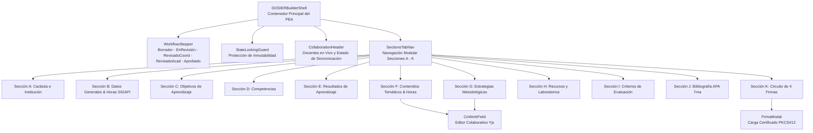

# Componentes UI Especializados, Sistema Geist Editorial y Shell del PEA

## 1. Visión General del Constructor Curricular

La experiencia de usuario de DOSIER se centra en el **Constructor del Programa de Estudio de la Asignatura (PEA)**, una interfaz avanzada diseñada para simplificar la planificación pedagógica docente, validar restricciones matemáticas de carga horaria en tiempo real y permitir la co-redacción concurrente entre docentes de cátedra.

El sistema de componentes se rige por el estándar **Geist Editorial / Enterprise Docs** (inspirado en Mintlify y GitBook Enterprise), asegurando alta densidad informativa, sobriedad académica, confort prolongado de lectura y cumplimiento estricto de la regla de **fondos 100% sólidos sin transparencias**.

---

## 2. Diagrama de Jerarquía del Shell Curricular

---

## 3. Desglose de Secciones Modulares del PEA Oficial (A - K)

| Sección | Componente React | Ubicación | Funcionalidad y Validación |
| :--- | :--- | :--- | :--- |
| **Sección A: Datos Generales** | `PeaGeneralSection.tsx` | `src/components/DOSIER/sections/pea/` | Muestra código, nivel, modalidad, carrera, créditos y distribución de horas (CD, APE, TA). Sincronizado con SIGAFI e interactivo con CoWork. |
| **Sección B y C: Objetivo y Prerrequisitos** | `PeaCharacterizationSection.tsx` | `src/components/DOSIER/sections/pea/` | Objetivo formativo de la asignatura en CoWorkEditor y tabla dinámica de asignaturas prerrequisito. |
| **Sección D y E: Resultados de Aprendizaje** | `PeaCompetenciesSection.tsx` | `src/components/DOSIER/sections/pea/` | Articulación con el perfil de egreso de la carrera y RDA específicos observables de la asignatura en CoWorkEditor. |
| **Sección F: Contenidos Temáticos y Horas** | `PeaContentsSection.tsx` | `src/components/DOSIER/sections/pea/` | Desglose modular de unidades y subtemas. Validador matemático en tiempo real que suma CD + APE + TA y alerta discrepancias contra el total normado de SIGAFI. |
| **Sección G: Metodología** | `PeaMethodologySection.tsx` | `src/components/DOSIER/sections/pea/` | Métodos didácticos activos basados en el Modelo Educativo Institucional ISTPET y recursos de informatización. |
| **Sección H: Recursos y Prácticas** | `PeaResourcesSection.tsx` | `src/components/DOSIER/sections/pea/` | Tabla de prácticas de laboratorio, talleres y actividades de aprendizaje práctico-experimental (APE). |
| **Sección I: Evaluación del Aprendizaje** | `PeaEvaluationSection.tsx` | `src/components/DOSIER/sections/pea/` | Criterios pedagógicos y matriz oficial de 3 componentes (Parcial 1: 10 pts, Parcial 2: 10 pts, Examen Final: 10 pts). |
| **Sección J: Bibliografía** | `PeaBibliographySection.tsx` | `src/components/DOSIER/sections/pea/` | Bibliografía básica y de consulta en formato APA 7.ª edición articulada a la biblioteca virtual institucional. |
| **Sección K: Firmas de Responsabilidad** | `PeaSignaturesSection.tsx` | `src/components/DOSIER/sections/pea/` | Circuito institucional de 4 firmas (Docente Elaborador, Coordinador de Carrera, Coordinador Académico, Vicerrectorado). |

---

## 4. Componentes UI Especializados y Regla de Opacidad Sólida

### 4.1. `<CoWorkField>`: Co-Redacción Concurrente en Tiempo Real
* **Ubicación:** `src/components/DOSIER/CoWorkField.tsx`
* **Mecanismo:** Utiliza la librería **Yjs** junto con el proveedor de transporte WebSocket vía **SignalR**.
* **Características:**
  * Edición simultánea sin conflictos gracias al algoritmo CRDT (*Conflict-free Replicated Data Type*).
  * Renderizado de cursores remotos identificados por colores distintivos y etiquetas con los nombres de los co-docentes.
  * Autoguardado silencioso con debounce hacia la tabla `cowork_documentos` del backend.

### 4.2. `StateLockingGuard.tsx`: Control de Inmutabilidad Curricular
* Evalúa el estado del workflow del PEA. Si el estado se encuentra en `RevisadoCoord`, `RevisadoAcad` o `Aprobado`, deshabilita de manera global todos los campos de entrada, botones de edición y acciones de modificación en el formulario, previniendo alteraciones no autorizadas en fases colegiadas.

### 4.3. Componentes Geist con Fondos 100% Sólidos (`src/components/Common/`)

* **`GeistSelect.tsx`:** Selector desplegable accesible. Su menú flotante utiliza exclusivamente la clase `bg-white dark:bg-zinc-950` con bordes nítidos `border border-zinc-200 dark:border-zinc-800`, eliminando transparencias para garantizar contraste óptimo.
* **`GeistDatePicker.tsx` & `GeistCalendar.tsx`:** Selectores de fecha para cronogramas y fechas de evaluación. Los paneles desplegables tienen fondo sólido opaco, evitando que las tablas o textos de la página se visualicen por debajo.
* **`MemberSearchSelector.tsx`:** Buscador dinámico de co-docentes y revisores institucionales. Presenta una lista de resultados con fondo completamente opaco y navegación por teclado.
* **`FirmaModal.tsx`:** Ventana modal de alta seguridad para la firma electrónica. Fondo modal 100% sólido, carga del archivo PKCS#12 (`.p12` o `.pfx`), campo de contraseña enmascarado y validación de certificado ante el backend.

### 4.4. `<NormativaDrawer>`: Asistente Regulatorio y Checklist Curricular
* **Ubicación:** `src/pages/Curriculum/Workspace/components/NormativaDrawer.tsx`
* **Servicio:** `src/services/normativaService.ts` conectado a `/api/normativas/checklist`.
* **Propósito:** Permite la consulta contextual inalterable de resoluciones vigentes del Consejo de Educación Superior (CES Art. 21 y 27), Modelo de Evaluación Externa CACES y Modelo Educativo Institucional (MED) durante la redacción del PEA.
* **Estándar Visual:** Panel deslizable con fondo 100% sólido (`bg-white dark:bg-zinc-950`), overlay opaco sin `backdrop-blur` y búsqueda en tiempo real por artículos y requisitos microcurriculares.

### 4.5. Tableros Analíticos Curriculares e Indicadores CACES
* **Ubicación:** `src/pages/Analytics/components/` (`AnalyticsOverviewTab.tsx`, `AnalyticsProjectsTab.tsx`, `AnalyticsCacesTab.tsx`, `cacesCalculator.ts`).
* **Métricas Pedagógicas:** En lugar de métricas financieras o presupuestos ajenos a la docencia, el sistema cuantifica:
  1. **Cobertura Curricular:** Porcentaje de asignaturas con PEA formulado y aprobado frente a la malla vigente.
  2. **Conformidad Horaria Art. 21 CES:** Consistencia de horas asignadas en Docencia (CD), Prácticas (APE) y Trabajo Autónomo (AA).
  3. **Circuito Colegiado de Firmas (Ley 67):** Tasa de instrumentos con dictamen favorable y firmas digitales formalizadas.

### 4.6. `<SupervisionCurricularPage>`: Bandeja de Supervisión Curricular Institucional
* **Ubicación:** `src/pages/Curriculum/SupervisionCurricularPage.tsx`
* **Integración:** Accesible en `/documentacion` para roles de supervisión (`DOSIER_ADMIN`, `DOSIER_COORD_CARRERA`, `DOSIER_COORD_ACAD`, `DOSIER_VICERRECTOR`).
* **Características Visuales y de UX:**
  * **Acceso Directo a Tabla y Filtros:** Erradicación de bloques artificiales de KPIs en la cabecera; la vista presenta de inmediato los filtros de búsqueda rápida y la cuadrícula de instrumentos.
  * **Filtros Institucionales:** Selectores con fondo 100% sólido para período lectivo (`GeistSelect`), carreras asignadas y estados del workflow.
  * **Stepper de Circuito de 4 Firmas:** Visualizador de avance del circuito legal (Docente -> Coordinador de Carrera -> Coordinador Académico -> Vicerrector).
* **Acceso Directo:** Botón de apertura directa en el Workspace concurrente (`/documentacion/workspace/PEA_OFICIAL/:uuid`) para revisión, co-redacción y emisión de dictamen/firma.

### 4.7. `<PeaWorkflowBar>` & `<PeaObservationsDrawer>`: Control de Estados Colegiados en el Workspace
* **Ubicación:** `src/components/DOSIER/shell/components/` (`PeaWorkflowBar.tsx`, `PeaObservationsDrawer.tsx`).
* **Integración en Shell:** Montado condicionalmente en `DOSIERBuilderShell.tsx` cuando `templateCode === 'PEA_OFICIAL'`.
* **Capacidades Operativas:**
  * **Semáforo Matemático de Horas:** Calcula en vivo sumatoria de horas de las unidades temáticas contra las horas oficiales normadas en SIGAFI, bloqueando el envío si existe déficit o exceso horario.
  * **Botón Contextual de Firma:** Muestra la acción correspondiente al rol del usuario autenticado (Docente: *Firmar y Enviar a Revisión*; Coordinador de Carrera: *Emitir Aval de Carrera*; Coordinador Académico: *Emitir Aval Académico*; Vicerrector: *Legalizar y Aprobar PEA*).
  * **Panel Deslizable de Observaciones:** Permite a las comisiones registrar observaciones directas por sección (`POST /api/pea/:id/observaciones`) y a los docentes responder formalmente con justificación de cambios para subsanar los requerimientos (`PATCH /api/pea/observaciones/:id/subsanar`).
  * **Estándar Visual:** Fondos 100% sólidos (`bg-surface dark:bg-zinc-950`), sin transparencias ni efectos de sangrado tipográfico.
  * **Navegación de Retorno Fluida:** El botón de cierre (*Volver*) en `BuilderHeader` invoca un retorno seguro por historial (`navigate(-1)`) con fallback a la bandeja de supervisión curricular (`/documentacion`), preservando el estado previo del usuario, filtros seleccionados y scroll.

### 4.8. Dashboard de Gobernanza Curricular y Paneles de Roles (`/dashboard`)
* **Ubicación:** `src/pages/Dashboard/` (`Dashboard.tsx`, `Roles/` `VicerrectorDashboard.tsx`, `CoordAcadDashboard.tsx`, `CoordCarreraDashboard.tsx`, `DocentePeaDashboard.tsx`, `AdminPeaDashboard.tsx`, `Components/RoleFlowBanner.tsx`).
* **Principios de Diseño e Implementación Vercel Geist:**
  * **Control Segmentado Discreto (`RoleFlowBanner`):** Selector horizontal compacto con fondo sólido `bg-zinc-100 dark:bg-zinc-900` para alternar fluidamente la perspectiva entre los 5 roles curriculares institucionales.
  * **Eliminación Total de KPIs Artificiales:** Erradicación del anti-patrón de tarjetas métricas gigantes con cifras aisladas que sobrecargan la vista inicial sin aportar valor operativo.
  * **Cero Iconos SVG Decorativos:** Supresión de iconos vectoriales superfluos en botones, tablas y encabezados para priorizar la legibilidad del texto, nombres de asignaturas, docentes y códigos institucionales.
  * **Acciones Directas y Textuales:** Botones de alta nitidez y contraste (`Ver`, `Firmar PEA`, `QR CACES`, `Emitir Aval`, `Auditar`) enmarcados en tablas con tipografía monoespaciada para códigos y plazos.
  * **Superficies Sólidas de 1 Capa:** Fondos monocromáticos `bg-white dark:bg-black`, bordes ultrafinos y eliminación total de cajas anidadas innecesarias.

### 4.9. Sistema de Superficies y Badges Sutiles (`--subtle` / Geist Muted)
* **Tokens de Color Globales:**
  * Modo Claro: `--subtle: #f2f4f7;`, `--subtle-border: rgba(0, 0, 0, 0.05);`, `--subtle-hover: #e4e7ec;`
  * Modo Oscuro: `--subtle: #181d27;`, `--subtle-border: rgba(255, 255, 255, 0.07);`, `--subtle-hover: #222938;`
* **Clases Semánticas Oficiales en `base.css`:**
  * `.surface-subtle`: Contenedores secundarios y bloques de detalle con fondo sutil y borde tenue.
  * `.badge-subtle`: Píldora con tipografía monoespaciada para códigos de asignatura (`#f2f4f7`), roles institucionales RBAC y parámetros normativos.
  * `.segmented-container` y `.segmented-item-active`: Estructura institucional para selectores de pestañas, barra de roles de gobernanza y filtros.

### 4.10. Modales de Gestión Curricular y Regla de Opacidad 100% Sólida
* **Ubicación:** `src/pages/Dashboard/Roles/Modals/`
* **Catálogo de Componentes:**
  * `AuditoriaCacesModal.tsx`: Verificación de consistencia horaria y cumplimiento normativo de distribución CES.
  * `ClonarPeaModal.tsx`: Duplicación y reutilización de PEAs validados de períodos lectivos anteriores.
  * `AperturaConvocatoriaModal.tsx`: Disparador de fechas límite y períodos de formulación para la planta docente.
  * `LegalizacionFirmaModal.tsx`: Estampado de firma digital de Vicerrectorado con previsualización del hash SHA-256.
  * `ObservacionesDisciplinarModal.tsx`: Registro formal de requerimientos de corrección por parte de Coordinación de Carrera.
  * `ProrrogaPlazoModal.tsx`: Extensión controlada de fechas de entrega para asignaturas observadas.
  * `RecordatorioDocentesModal.tsx`: Despacho multicanal de alertas de urgencia curricular.
* **Garantía de Diseño Visual:** Todos los contenedores, encabezados y pies de página aplican fondos 100% sólidos y opacos (`bg-white dark:bg-zinc-950` en el cuerpo, `bg-zinc-50 dark:bg-zinc-900` en cabeceras y footers). Se encuentra terminantemente prohibido el uso de opacidades translúcidas (`/50`, `/40`) o difuminados `backdrop-blur` para prevenir sangrado tipográfico.

### 4.11. Consola de Plantillas Oficiales y Visor PDF Embebido (`/admin/templates`)
* **Ubicación:** `src/pages/Admin/Templates/` (`DocumentTemplatesPage.tsx`, `components/TemplateCatalog.tsx`, `components/TemplatePreviewModal.tsx`, `components/OfficialTemplatesCatalogView.tsx`, `components/BlockProperties.tsx`).
* **Catálogo Desacoplado:** El panel izquierdo (`TemplateCatalog.tsx`) lista únicamente documentos y formatos oficiales vigentes (Currículo/PEA, Acreditación/CACES, Reportes/Analíticas). Se erradicó la pseudo-plantilla artificial `GLOBAL_THEME` para evitar confusiones de interfaz.
* **Acciones en Hover por Formato:** Cada fila del catálogo dispone de botones interactivos para previsualización inmediata (`Eye`) y descarga de PDF oficial (`Download`).
* **Previsualización en Caliente (`TemplatePreviewModal.tsx`):**
  * Panel lateral deslizable con fondo 100% sólido y visor PDF integrado vía iframe (`src={`${pdfUrl}#toolbar=0&navpanes=0&scrollbar=1&view=FitH"}`).
  * Compilación en caliente: Si se solicita la vista previa de la plantilla en edición, el frontend empaqueta los bloques actuales y el tema fusionado mediante `POST /api/admin/templates/{code}/render-pdf`, reflejando instantáneamente los cambios sin requerir publicación previa.
  * Funcionalidades adicionales: Descarga con nomenclatura oficial normalizada, impresión de documento y botón para abrir en pestaña independiente.
* **Ajuste de Identidad Visual Institucional (`ThemeEditorTab.tsx`):** La personalización de colores primarios, márgenes de página A4, tipografía y membretes se realiza de forma directa en la pestaña *Estilos* del panel derecho de propiedades, vinculada al `themeConfigJson` de la plantilla seleccionada.
* **Catálogo Bento para Comunidad Académica (`OfficialTemplatesCatalogView.tsx`):** Vista en cuadrícula responsiva tipo Bento Grid con buscador reactivo, filtros por categoría normativa y copia de especificaciones curriculares para docentes y autoridades.

### 4.12. Barra Lateral de Navegación (Sidebar) y Menús Desplegables de Acceso Total
* **Ubicación:** `src/components/Layout/` (`Sidebar.tsx`, `Sidebar/hooks/useSidebar.ts`, `Sidebar/components/SidebarNav.tsx`, `Sidebar/components/SidebarFooter.tsx`).
* **Cobertura Total para el Rol Administrador (`DOSIER_ADMIN`):**
  * Acceso irrestricto y visualización simultánea de todos los módulos del sistema agrupados jerárquicamente:
    * **Grupo 1 (Operación Diaria):** Tablero General (`/dashboard`), Notificaciones (`/notificaciones`), Calendario y Cronograma Curricular (`/calendario`).
    * **Grupo 2 (Gestión Documental Curricular):** Documentación Institucional de Supervisión (`/documentacion`), Mis Instrumentos PEA (`/documentacion/mis-proyectos`), Verificación Forense (`/verificacion`).
    * **Grupo 3 (Gobernanza y Administración del Sistema):** Analíticas e Indicadores CACES (`/analiticas`), Gestión de Usuarios (`/usuarios`), Plantillas Oficiales (`/plantillas`), Motor de Correos (`/emails`) y Bitácora de Auditoría Forense (`/auditoria`). Se erradicaron duplicidades de acceso en el sidebar para *Privacidad LOPDP*, *Configuración* y *Ciclo Documental*, ya que se gestionan desde los centros dedicados en el perfil de usuario y el tablero institucional.
* **Menús Desplegables Tipo Acordeón (Sliders / Drawers de Navegación):**
  1. **Documentación:** Lista desplegable de instrumentos curriculares globales en supervisión con paginación y acceso directo al Workspace concurrente.
  2. **Mis Instrumentos PEA:** Lista desplegable de asignaturas e instrumentos asignados directamente al usuario docente/administrador.
  3. **Analíticas:** Despliegue de accesos a Métricas Curriculares (`?tab=general`), Cumplimiento CACES (`?tab=caces`) y Portafolio de Instrumentos (`?tab=proyectos`).
  4. **Usuarios:** Submenú desplegable filtrado por tipo de cuenta (Docentes institucionales y Usuarios externos).
* **Estándar Visual:** Fondos 100% sólidos (`bg-surface dark:bg-[#131720]`), selectores de hover sobrios sin difuminados translúcidos, tipografía Geist Editorial e iconografía técnica de Lucide React sin emojis.

