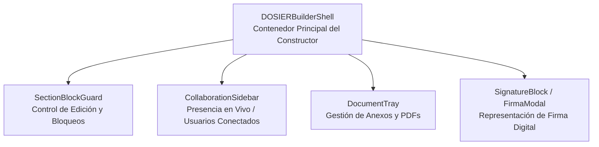

# Componentes UI Especializados y Shell del Constructor (DOSIERBuilder)

## 1. Visión General de Componentes UI

La interfaz de usuario de DOSIER (`dosier_web/src/components/DOSIER/`) incluye componentes desarrollados específicamente para soportar la formulación de proyectos, la edición colaborativa, la firma visual y la protección de secciones.

---

## 2. Componentes Principales del Constructor

### 2.1. `DOSIERBuilderShell.tsx`
Es el contenedor principal para la edición y visualización de propuestas de investigación e instancias documentales.
* Integra la barra de herramientas de edición de texto enriquecido (Rich Text Editor).
* Administra la disposición modular entre el cuerpo del documento y la barra lateral colaborativa.
* Procesa el guardado automático de borradores y la compilación previa en PDF.

### 2.2. `SectionBlockGuard.tsx`
Componente encargo de interceptar la interacción con campos del formulario:
* **Modo Bloqueado por Usuario:** Si otro colaborador está editando el campo en tiempo real, deshabilita la entrada de texto y despliega un indicador visual con el nombre y avatar del usuario que retiene el bloqueo.
* **Modo Bloqueado por Estado (*State Locking*):** Si el proyecto se encuentra en estado de evaluación o aprobación, inhabilita los controles de entrada de forma permanente.

### 2.3. `CollaborationSidebar.tsx`
Barra lateral de colaboración en tiempo real:
* Muestra la lista de docentes y colaboradores activos en la sesión actual.
* Despliega el registro de cambios recientes aplicados sobre las secciones.
* Permite el envío de comentarios puntuales vinculados a secciones específicas del documento.

### 2.4. `SignatureBlock.tsx` / `FirmaModal.tsx`
Componentes responsables del proceso de firma visual e inyección de certificados:
* `SignatureBlock.tsx`: Renderiza la casilla visual donde se posicionará la firma digital en la plantilla HTML/PDF.
* `FirmaModal.tsx`: Modal para la selección del archivo de certificado criptográfico (`.pfx` / `.p12`), ingreso del PIN de seguridad y despacho de la petición de firmado hacia `SignaturesController`.

### 2.5. `CreateProjectModal.tsx`
Wizard de formulación inicial de propuestas de investigación:
* Guía al docente a través de 5 pasos consecutivos (Información General, Equipo, Alineación UNESCO/PND, Cronograma y Presupuesto).
* Valida las restricciones de campos antes de emitir la petición de creación al backend.
