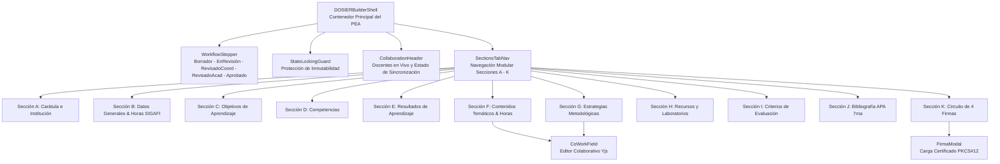

# Componentes UI Especializados, Sistema Geist y Shell del PEA

## 1. Visión General del Constructor Curricular

La experiencia de usuario de DOSIER se centra en el **Constructor del Programa de Estudio de la Asignatura (PEA)**, una interfaz avanzada diseñada para simplificar la planificación pedagógica docente, validar restricciones matemáticas de carga horaria en tiempo real y permitir la co-redacción concurrente entre docentes de cátedra.

El sistema de componentes se rige por el catálogo de diseño **Vercel Geist**, asegurando alta densidad informativa, legibilidad y un cumplimiento estricto de la regla de **fondos 100% sólidos sin transparencias**.

---

## 2. Diagrama de Jerarquía del Shell Curricular

---

## 3. Desglose de Secciones Modulares del PEA Oficial (A - K)

| Sección | Componente React | Funcionalidad y Validación |
| :--- | :--- | :--- |
| **Sección A: Carátula** | `SectionACover.tsx` | Presentación formal institucional del ISTPET, logotipos, carrera, período lectivo y código de verificación. |
| **Sección B: Datos Generales** | `SectionBGeneralData.tsx` | Muestra código, nivel, campo de formación, créditos y horas (CD, APE, TA). Sincronizado directamente desde `detallemallas` de SIGAFI. |
| **Sección C: Objetivos** | `SectionCObjectives.tsx` | Registro del objetivo general y específicos de la asignatura articulados con la titulación. |
| **Sección D: Competencias** | `SectionDCompetencies.tsx` | Competencias genéricas institucionales y específicas del perfil profesional. |
| **Sección E: Resultados** | `SectionELearningOutcomes.tsx` | Formulación de resultados de aprendizaje con ponderación y niveles de logro (Inicial, Medio, Alto). |
| **Sección F: Contenidos Temáticos** | `SectionFContents.tsx` | Matriz modular de unidades, temas y distribución horaria. Valida en tiempo real que la sumatoria de horas coincida con la malla de SIGAFI. Soporta co-redacción con `<CoWorkField>`. |
| **Sección G: Metodología** | `SectionGMethodology.tsx` | Selección de métodos didácticos alineados con el Modelo Educativo Institucional del ISTPET. |
| **Sección H: Recursos** | `SectionHResources.tsx` | Equipamiento de talleres, laboratorios tecnológicos y software requerido para la cátedra. |
| **Sección I: Evaluación** | `SectionIEvaluation.tsx` | Criterios y ponderaciones de evaluación sumativa y formativa reglamentadas por el ISTPET. |
| **Sección J: Bibliografía** | `SectionJBibliography.tsx` | Catálogo de textos básicos y complementarios con validación de normas APA 7ma edición y disponibilidad bibliotecaria. |
| **Sección K: Firmas Oficiales** | `SectionKSignatures.tsx` | Visualización del estado del circuito formal de 4 firmas con sellos de tiempo y validez criptográfica. |

---

## 4. Componentes UI Especializados y Regla de Opacidad Sólida

### 4.1. `<CoWorkField>`: Co-Redacción Concurrente en Tiempo Real
* **Ubicación:** `src/components/DOSIER/CoWorkField.tsx`
* **Mecanismo:** Utiliza la librería **Yjs** junto con el proveedor de transporte WebSocket vía **SignalR**.
* **Características:**
  * Edición simultánea sin conflictos gracias al algoritmo CRDT (*Conflict-free Replicated Data Type*).
  * Renderizado de cursores remotos identificados por colores distintivos y etiquetas con los nombres de los co-docentes.
  * Autoguardado silencioso con debounce hacia la tabla `cowork_documentos` del backend.

### 4.2. `StateLockingGuard.tsx`: Control de Inmutabilidad Curricular
* Evalúa el estado del workflow del PEA. Si el estado se encuentra en `RevisadoCoord`, `RevisadoAcad` o `Aprobado`, deshabilita de manera global todos los campos de entrada, botones de edición y acciones de modificación en el formulario, previniendo alteraciones no autorizadas en fases colegiadas.

### 4.3. Componentes Geist con Fondos 100% Sólidos (`src/components/Common/`)

* **`GeistSelect.tsx`:** Selector desplegable accesible. Su menú flotante utiliza exclusivamente la clase `bg-white dark:bg-zinc-950` con bordes nítidos `border border-zinc-200 dark:border-zinc-800`, eliminando transparencias para garantizar contraste óptimo.
* **`GeistDatePicker.tsx` & `GeistCalendar.tsx`:** Selectores de fecha para cronogramas y fechas de evaluación. Los paneles desplegables tienen fondo sólido opaco, evitando que las tablas o textos de la página se visualicen por debajo.
* **`MemberSearchSelector.tsx`:** Buscador dinámico de co-docentes y revisores institucionales. Presenta una lista de resultados con fondo completamente opaco y navegación por teclado.
* **`FirmaModal.tsx`:** Ventana modal de alta seguridad para la firma electrónica. Fondo modal 100% sólido, carga del archivo PKCS#12 (`.p12` o `.pfx`), campo de contraseña enmascarado y validación de certificado ante el backend.

### 4.4. `<NormativaDrawer>`: Asistente Regulatorio y Checklist Curricular
* **Ubicación:** `src/pages/Investigacion/Proyectos/Workspace/components/NormativaDrawer.tsx`
* **Servicio:** `src/services/normativaService.ts` conectado a `/api/normativas/checklist`.
* **Propósito:** Permite la consulta contextual inalterable de resoluciones vigentes del Consejo de Educación Superior (CES Art. 21 y 27), Modelo de Evaluación Externa CACES y Modelo Educativo Institucional (MED) durante la redacción del PEA.
* **Estándar Visual:** Panel deslizable con fondo 100% sólido (`bg-white dark:bg-zinc-950`), overlay opaco sin `backdrop-blur` y búsqueda en tiempo real por artículos y requisitos microcurriculares.
