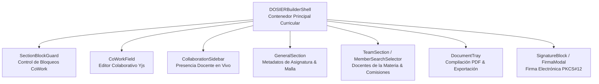

# Componentes UI Especializados, Sistema de Diseño Geist y Shell Curricular

## 1. Visión General de Componentes UI

La interfaz de usuario de DOSIER (`dosier_web/src/components/`) implementa el sistema de diseño **Vercel Geist**, proporcionando un catálogo de componentes accesibles, modulares y de alto rendimiento diseñados específicamente para la formulación curricular, co-redacción en tiempo real, validación de horas y renderizado Canvas de plantillas.

---

## 2. Jerarquía de Componentes del Constructor Curricular

---

## 3. Catálogo de Componentes UI y Geist Design System

### 3.1. Componentes Base Geist (`src/components/Common/`)
* **`GeistCalendar.tsx` & `GeistDatePicker.tsx`:** Calendario interactivo y selector de fechas con navegación mensual/anual rápida, estados disabled y estética minimalista Geist. Utilizado para fijar plazos de entrega y fechas de evaluaciones parciales.
* **`GeistSelect.tsx`:** Selector desplegable con soporte para búsqueda interna, badges semánticos y estados controlados.
* **`MemberSearchSelector.tsx`:** Selector de búsqueda en tiempo real para asignación de docentes de la materia y miembros de comisiones curriculares con prevención de duplicados.

### 3.2. Constructor Curricular (`src/components/DOSIER/`)
* **`DOSIERBuilderShell.tsx`:** Shell principal para la estructuración y redacción de PEAs y Sílabos (19 semanas). Administra pestañas por bloques, guardado de borradores y compilación previa.
* **`CoWorkField.tsx`:** Componente de co-redacción en tiempo real conectado al Hub de SignalR mediante CRDT (Yjs). Muestra cursores remotos, avatares de docentes activos y sincronización delta sin colisiones.
* **`SectionBlockGuard.tsx`:** Bloquea campos cuando otro docente está editando o cuando el documento se encuentra en estado inmutable (`State Locking`).
* **`TeamSection.tsx`:** Gestión del equipo docente de la materia con roles (Autor Principal, Co-Docente, Revisor), validación de dedicación horaria y selectores Geist.

### 3.3. Motores de Renderizado Canvas de Plantillas (`src/pages/Admin/Templates/components/canvasRenderers/`)
* **`RenderSections.tsx`:** Generador dinámico de secciones curriculares y bloques colapsables a partir del esquema JSON de la plantilla.
* **`RenderProgressSections.tsx`:** Renderizador de barras e indicadores de avance curricular para seguimiento de cumplimiento de horas y semanas.
* **`RenderTables.tsx`:** Generador de tablas matriciales para la distribución semanal de contenidos (CD, APE, TA), resultados de aprendizaje y rúbricas de evaluación.

### 3.4. Firma Electrónica y Certificados (`SignatureBlock.tsx` / `FirmaModal.tsx`)
* `SignatureBlock.tsx`: Renderiza el recuadro visual de firma en el documento oficial con sellos de tiempo y metadatos del firmante.
* `FirmaModal.tsx`: Modal para carga de archivo de firma digital (`.p12` / `.pfx`), ingreso de clave privada y despacho seguro al backend.
