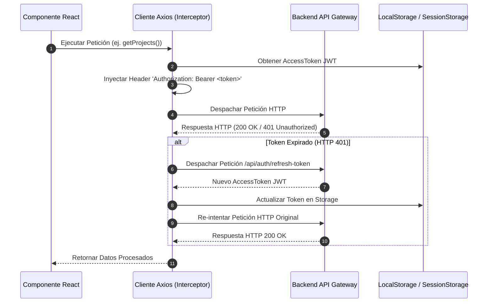

# Integración con API, Resiliencia y Tolerancia a Discrepancias

## 1. Visión General del Cliente HTTP

La comunicación entre el cliente React (`dosier_web`) y la API backend (`dosier_api`) se administra mediante una instancia centralizada de **Axios** ubicada en `dosier_web/src/api/axios.ts`.

El módulo incluye interceptores para la inyección de tokens de autorización JWT, renovación automática de sesión, manejo global de errores y patrones defensivos de lectura de propiedades JSON.

---

## 2. Interceptores de Axios y Flujo de Autenticación



---

## 3. Patrón de Tolerancia a Discrepancias de Casing (Local Fallback Pattern)

Dado que la API backend deserializa payloads `[FromBody]` en `lower_snake_case`, parámetros query en `camelCase` y metadatos universales en `PascalCase`, el frontend aplica el patrón de tolerancia defensiva mediante operadores de coalescencia (`||`) o helpers de lectura.

### 3.1. Ejemplo de Lectura Tolerante de Snapshot JSON

Al procesar campos que pueden variar su formato según la procedencia de la respuesta (API REST directa, WebSocket o snapshot inmutable), los servicios del frontend leen las propiedades evaluando las distintas convenciones:

```typescript
// Ejemplo de lectura defensiva en servicio de frontend (ts)
export const parseProjectSnapshot = (responseData: any) => {
  const snapshotStr = 
    responseData.data_snapshot_json || 
    responseData.dataSnapshotJson || 
    responseData.DataSnapshotJson;

  const projectUuid = 
    responseData.project_uuid || 
    responseData.projectUuid || 
    responseData.ProjectUuid;

  return {
    snapshot: typeof snapshotStr === 'string' ? JSON.parse(snapshotStr) : snapshotStr,
    projectUuid
  };
};
```

### 3.2. Reglas de Despacho desde el Frontend
* **Peticiones `POST`, `PUT`, `PATCH`:** Las funciones de servicio en `src/services/` convierten las claves de los DTOs salientes a **`lower_snake_case`** antes de enviarlas a la API.
* **Metadatos Documentales:** Los payloads enviados a `/documents/instances/{uuid}/metadata` se formatean en **`PascalCase`** para coincidir con las variables de las plantillas Handlebars/Scriban.

---

## 4. Control de Errores y Resiliencia de UI (`ErrorBoundary`)

* **Capas de Captura:** `ErrorBoundary.tsx` envuelve los módulos de la aplicación para evitar el colapso total del árbol de componentes de React ante un fallo en un componente hijo.
* **Notificación de Errores de API:** Las respuestas con códigos de error HTTP 400, 422 o 500 son formateadas por los interceptores de Axios y desplegadas mediante un sistema de alertas flotantes (Toasts / Notifications) en la interfaz de usuario.
