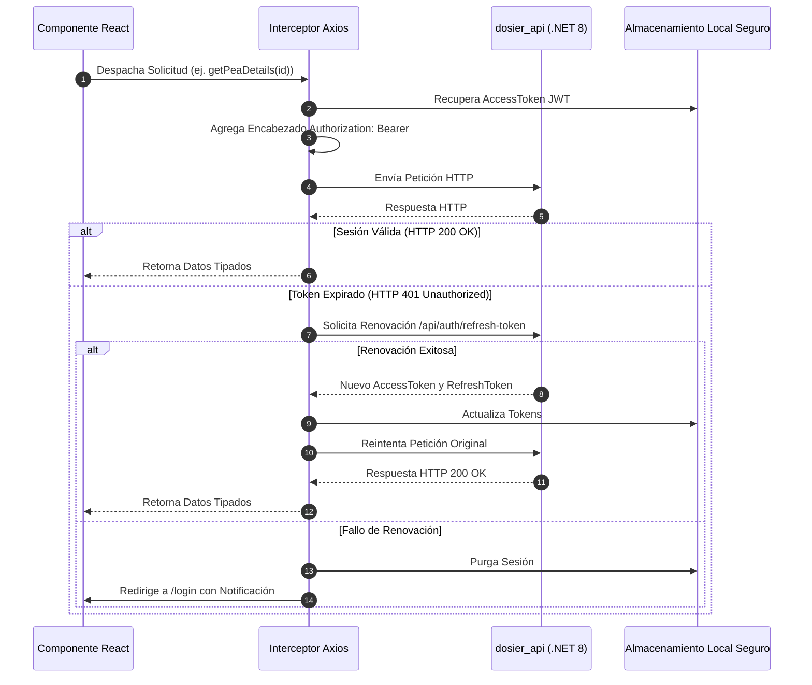

# Integración con API REST, Convenciones de Casing y Resiliencia

## 1. Visión General del Cliente HTTP Centralizado

La capa de comunicación entre el frontend React (`dosier_web`) y la API backend (`dosier_api`) opera a través de un cliente HTTP centralizado basado en **Axios** (`src/api/axios.ts`).

Este cliente administra automáticamente:
1. La inyección de credenciales mediante encabezados `Authorization: Bearer <token>`.
2. El refresco proactivo y reactivo del token JWT.
3. La normalización de respuestas según la convención `lower_snake_case` global del backend.
4. El manejo estructurado de excepciones de red, validaciones de dominio (códigos HTTP 400 y 422) y control de autorizaciones (HTTP 401 y 403).

---

## 2. Flujo de Interceptores y Gestión de Sesión



---

## 3. Convenciones de Serialización y Patrón de Fallback Dual

El backend de DOSIER utiliza una política global de serialización JSON que transforma todas las claves de propiedades a formato **`lower_snake_case`**.

### 3.1. Reglas para Peticiones Salientes (Frontend a Backend)
* Toda carga útil (`payload`) enviada mediante métodos `POST`, `PUT` o `PATCH` debe formatearse en **`lower_snake_case`**.
* Ejemplo de estructura:
  ```json
  {
    "id_detallemalla": 1420,
    "periodo_academico_id": 15,
    "objetivo_general": "Desarrollar aplicaciones empresariales seguras...",
    "horas_docencia": 64,
    "horas_ape": 32,
    "horas_autonomas": 48
  }
  ```

### 3.2. Reglas para Recepción de Respuestas (Patrón Dual Fallback)
Al consumir respuestas del backend o eventos de sincronización que puedan incluir datos mixtos o snapshots archivados, los componentes y servicios de React aplican el patrón de fallback defensivo para asegurar la estabilidad:

```typescript
// Patrón de acceso defensivo en servicios y componentes de React
export const parsePeaHeader = (data: any) => {
  return {
    id: data.id ?? data.Id,
    idDetallemalla: data.id_detallemalla ?? data.idDetallemalla,
    codigoAsignatura: data.codigo_asignatura ?? data.codigoAsignatura,
    nombreAsignatura: data.nombre_asignatura ?? data.nombreAsignatura,
    estadoWorkflow: data.estado_workflow ?? data.estadoWorkflow ?? 'Borrador',
    hashSha256: data.hash_sha256 ?? data.hashSha256,
    hasTemplateUpdate: data.has_template_update ?? data.hasTemplateUpdate ?? false
  };
};
```

---

## 4. Mapeo de Roles Curriculares en el Contexto de Autenticación

El `AuthContext` decodifica las demandas (*claims*) del JWT emitido por `dosier_api` y las sincroniza con los 5 roles curriculares oficiales de DOSIER:

```typescript
export interface AuthUser {
  uuid: string;
  cedula: string;
  nombres: string;
  apellidos: string;
  email: string;
  roles: CurricularRole[];
}

export type CurricularRole = 
  | 'DOSIER_ADMIN'
  | 'DOSIER_DOCENTE'
  | 'DOSIER_COORD_CARRERA'
  | 'DOSIER_COORD_ACAD'
  | 'DOSIER_VICERRECTOR';
```

### Funciones de Guardia en React
* `hasRole(role: CurricularRole): boolean`: Comprueba si el usuario autenticado posee un rol curricular específico.
* `canSignPea(stage: 'docente' | 'coordinador' | 'academico' | 'vicerrector'): boolean`: Verifica si el usuario cuenta con las credenciales reglamentarias para aplicar su firma electrónica en la etapa correspondiente del flujo curricular.

---

## 5. Resiliencia de Red y Manejo de Excepciones

1. **Captura Global con `ErrorBoundary`:** Envoltorio que atrapa fallos de renderizado en React, evitando que errores locales en un campo afecten la disponibilidad del formulario completo.
2. **Notificaciones Semánticas Geist:** Notificaciones no intrusivas con fondos sólidos opacos (`bg-zinc-900 text-white` o `bg-white text-zinc-900` con bordes contrastantes) que comunican claramente al usuario el resultado de sus acciones (guardado exitoso, validación horaria incorrecta o fallo de conexión).
3. **Reintentos Idempotentes:** Para operaciones de guardado de borradores curriculares, el cliente implementa reintentos con retraso exponencial ante pérdidas momentáneas de conectividad a internet.
