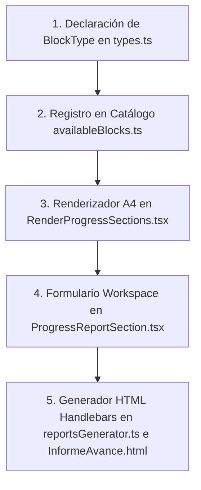

# Guía de Extensibilidad y Creación de Nuevos Bloques Documentales

## 1. Visión General del Patrón Metadata-Driven

El sistema de maquetación y generación documental de DOSIER opera bajo el patrón de arquitectura guiada por metadatos (*Metadata-Driven Architecture*). Los documentos institucionales (tales como proyectos de investigación, informes de seguimiento o resoluciones) se estructuran a partir de una serie de bloques modulares e independientes (`DocumentBlock`).

Cada bloque posee una clave de tipo única (`BlockType`) y una configuración en formato JSON (`config`). La integración de un nuevo bloque requiere sincronización a lo largo de cinco componentes clave del sistema:

1. **Definición de Tipos**: Declaración de la constante de tipo en el modelo TypeScript.
2. **Catálogo de Bloques**: Registro en el catálogo del constructor de plantillas para su arrastre y configuración en la interfaz de administración.
3. **Lienzo A4 (Canvas Renderer)**: Componente de representación visual en la hoja digital A4 del maquetador.
4. **Workspace del Investigador**: Formularios interactivos con sincronización colaborativa en tiempo real (Yjs / SignalR).
5. **Motor de Compilación PDF**: Generador de marcado HTML evaluado mediante Handlebars tanto en el cliente como en el backend C# (.NET 8 / PuppeteerSharp).

---

## 2. Diagrama de Flujo de Integración



---

## 3. Guía Paso a Paso de Implementación

### 3.1. Fase 1: Declaración del Tipo en TypeScript
Ubicación: `dosier_web/src/pages/Admin/Templates/types.ts`

Se añade la constante identificadora del nuevo bloque al tipo sintáctico `BlockType`:

```typescript
export type BlockType = 
    | 'cover'
    | 'header'
    | 'progress_activity_section'
    | 'progress_status_section'
    | 'nombre_del_nuevo_bloque';
```

### 3.2. Fase 2: Registro en el Catálogo del Constructor
Ubicación: `dosier_web/src/pages/Admin/Templates/utils/availableBlocks.ts`

Se registra la especificación del bloque en el arreglo `AVAILABLE_BLOCKS`. Esta entrada define el título predeterminado, la categoría, el icono y el objeto de configuración inicial:

```typescript
{
    type: 'nombre_del_nuevo_bloque',
    title: 'NUEVO BLOQUE INSTITUCIONAL',
    category: 'Investigación',
    description: 'Permite registrar y renderizar la información relativa a la nueva sección.',
    icon: 'FileText',
    config: {
        customTitle: 'TÍTULO PERSONALIZADO DEL BLOQUE',
        variant: 'default',
        showBorders: true,
        maxItems: 10
    }
}
```

### 3.3. Fase 3: Renderizador para el Lienzo Visual A4
Ubicación: `dosier_web/src/pages/Admin/Templates/components/canvasRenderers/RenderProgressSections.tsx`

Se crea el componente de React encargado de representar la apariencia exacta que tendrá la sección en la hoja A4 dentro del diseñador de plantillas:

```tsx
export const RenderNombreDelNuevoBloque: React.FC<{
    config: any;
    blockId?: string;
    onUpdateConfig?: (blockId: string, key: string, value: any) => void;
}> = ({ config }) => {
    const c = config || {};
    const title = c.customTitle || 'TÍTULO PERSONALIZADO DEL BLOQUE';

    return (
        <div className="w-full text-slate-900 font-sans my-2">
            <div className="w-full border border-slate-900 overflow-hidden rounded-xs bg-white p-4 space-y-3">
                <p className="font-bold text-[10pt] uppercase tracking-wider text-center text-slate-900">
                    {title}
                </p>
                <div className="border border-slate-900 p-3 text-[8.5pt] bg-white">
                    <p className="text-slate-600 italic">
                        [Representación previa del contenido del nuevo bloque]
                    </p>
                </div>
            </div>
        </div>
    );
};
```

Posteriormente, se agrega la bifurcación correspondiente en la función principal del lienzo en `dosier_web/src/pages/Admin/Templates/components/BlockCanvas.tsx`:

```tsx
case 'nombre_del_nuevo_bloque':
    return <RenderNombreDelNuevoBloque config={block.config} />;
```

### 3.4. Fase 4: Formulario de Edición en el Workspace del Investigador
Ubicación: `dosier_web/src/components/DOSIER/sections/ProgressReportSection.tsx`

Se implementa la sección del formulario donde el docente o investigador ingresará los datos de la sección. Si se requiere edición concurrente en tiempo real, se debe hacer uso del componente `CoWorkEditor`:

```tsx
{showNuevoBloque && (
    <div className="bg-bg-deep border border-border-thin p-6 rounded-3xl space-y-4">
        <div className="flex items-center gap-2 border-b border-border-thin pb-3">
            <FileText className="w-4 h-4 text-indigo-400" />
            <h4 className="text-xs font-bold uppercase tracking-wider text-text-main">
                Sección del Nuevo Bloque
            </h4>
        </div>
        <div className="border border-border-thin rounded-2xl overflow-hidden bg-bg-deep min-h-[120px]">
            <CoWorkEditor
                field="CampoNuevoBloque"
                cowork={cowork}
                onChange={(html, meta) => onUpdate('CampoNuevoBloque', html, meta)}
            />
        </div>
    </div>
)}
```

### 3.5. Fase 5: Generador HTML Handlebars y Plantilla Backend PDF

#### A. Generador HTML Frontend
Ubicación: `dosier_web/src/pages/Admin/Templates/utils/htmlGenerators/reportsGenerator.ts`

Se escribe la función generadora que transforma el objeto del bloque en una cadena con marcado HTML estático con sintaxis Handlebars:

```typescript
export const generateNombreDelNuevoBloqueHtml = (block: DocumentBlock): string => {
    const c: any = block.config || {};
    const title = c.customTitle || 'TÍTULO PERSONALIZADO DEL BLOQUE';
    return `
  <!-- BLOQUE: NUEVO BLOQUE -->
  <div style="margin-top: 25px; page-break-inside: avoid;">
    <p style="font-weight: bold; font-size: 10pt; text-transform: uppercase; text-align: center; color: #000000; margin-bottom: 12px;">${title}</p>
    <div style="padding: 8px; border: 1px solid #000000; font-size: 8.5pt; color: #000000;">
      {{{default CampoNuevoBloque campo_nuevo_bloque ""}}}
    </div>
  </div>`;
};
```

Esta función se enlaza dentro de la función dispatch `generateHtmlFromBlock`:

```typescript
case 'nombre_del_nuevo_bloque':
    return generateNombreDelNuevoBloqueHtml(block);
```

#### B. Plantilla Handlebars Backend C#
Ubicación: `backend/dosier_infrastructure/Common/Documents/Templates/Investigacion/InformeAvance.html`

Se incluye la misma estructura en la plantilla Handlebars compilada por el motor de backend:

```html
  <!-- BLOQUE: NUEVO BLOQUE -->
  {{#if CampoNuevoBloque}}
  <div style="margin-top: 25px; page-break-inside: avoid;">
    <p style="font-weight: bold; font-size: 10pt; text-transform: uppercase; text-align: center; color: #000000; margin-bottom: 12px;">TÍTULO PERSONALIZADO DEL BLOQUE</p>
    <div style="padding: 8px; border: 1px solid #000000; font-size: 8.5pt; color: #000000;">
      {{{default CampoNuevoBloque campo_nuevo_bloque ""}}}
    </div>
  </div>
  {{/if}}
```

---

## 4. Estrategia de Mapeo Dual de Variables (CamelCase y snake_case)

Debido a que el backend de C# serializa las entidades a `snake_case` de forma global, se debe asegurar que el acceso a variables en las plantillas Handlebars sea tolerante a ambas notaciones.

Para lograr esto, utilice siempre el helper `default` registrado en el motor:

```html
{{{default PropiedadCamelCase propiedad_snake_case "Valor Predeterminado"}}}
```

Para evaluaciones condicionales de igualdad, utilice la directiva resiliente `#if_eq`:

```html
{{#if_eq EstadoEjecucion "EN AVANCE"}}
  (X)
{{else}}
  {{#if_eq estado_ejecucion "EN AVANCE"}}
    (X)
  {{/if_eq}}
{{/if_eq}}
```

---

## 5. Reglas de Renderizado y Paginación

1. **Evitar Saltos de Página Huérfanos**: Todo contenedor de bloque principal debe incluir la propiedad CSS `page-break-inside: avoid;`.
2. **Estilo de Bordes Oficiales**: Las tablas institucionales deben emplear bordes negros delgados `border: 1px solid #000000;` con colapso de bordes `border-collapse: collapse;`.
3. **Encabezados de Tabla**: El color azul marino institucional oficial utilizado en los encabezados de tabla es `#1e2a4a`.

---

## 6. Sistema de Color Unificado y Selección Interactiva en Canvas

### 6.1. Componente Reutilizable `ColorPickerField`
Ubicación: `src/pages/Admin/Templates/components/properties/SharedColorPicker.tsx`

Todos los paneles de propiedades deben implementar este componente para garantizar consistencia visual y soporte para paletas libres y predefinidas:

* **Características:**
  - Rueda de selección de color nativa (`<input type="color">`).
  - Campo de entrada `#HEX` en mayúsculas (`w-20` con ancho estricto para evitar desbordamientos).
  - Presets rápidos de la paleta institucional (`#1e2a4a`, `#b8912e`, `#475569`, `#065f46`, `#000000`, `#ffffff`).
  - Compatibilidad transparente con tokens históricos mediante `resolveHeaderColor()`.
  - Cálculo automático de contraste (`getContrastFg`) para alternar el texto del encabezado entre blanco y oscuro según la luminancia del fondo.

### 6.2. Sincronización Bidireccional Canvas ↔ Propiedades
Al hacer clic o arrastrar un elemento visual en el lienzo A4 (ej. en `RenderCover.tsx`), el renderizador emite `onUpdateConfig(blockId, '_activeCoverTab', targetTab)`. El panel de propiedades escucha este cambio mediante un `useEffect` y activa inmediatamente la subpestaña correspondiente (`institution`, `title`, `carrera` o `periodo`), agilizando el flujo de diseño del usuario.
