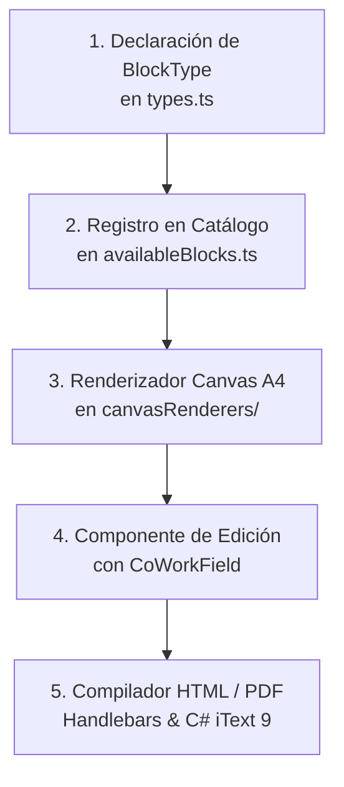

# Guía de Extensibilidad y Creación de Nuevos Bloques Curriculares

## 1. Visión General del Patrón Guiado por Metadatos Curriculares

El sistema de estructuración de documentos de DOSIER opera bajo el patrón de arquitectura guiada por metadatos (*Metadata-Driven Architecture*). Los documentos académicos oficiales (Programa de Estudio de la Asignatura PEA, Sílabos de 19 semanas, Guías APE e Informes de Avance Curricular) se componen a partir de bloques modulares e independientes denominados `DocumentBlock`.

Cada bloque curricular cuenta con:
* Un identificador de tipo único (`BlockType`).
* Una configuración en formato JSON (`config`).
* Un renderizador visual para la vista previa de hoja A4.
* Un componente de captura de datos con soporte de co-redacción concurrente vía `<CoWorkField>`.
* Una plantilla de marcado HTML evaluada por el motor de compilación documental.

---

## 2. Diagrama de Flujo de Extensibilidad de Bloques



---

## 3. Guía Paso a Paso para la Creación de un Nuevo Bloque

A continuación se detalla el procedimiento técnico para incorporar un nuevo bloque curricular (por ejemplo, `cur_rubrica_evaluacion_practica`):

### 3.1. Fase 1: Declaración del Tipo en TypeScript
Ubicación: `dosier_web/src/pages/Admin/Templates/types.ts`

Se añade el identificador del bloque a la unión de tipos `BlockType`:

```typescript
export type BlockType = 
    | 'pea_header_institucional'
    | 'pea_datos_generales'
    | 'pea_objetivos_competencias'
    | 'pea_matriz_contenidos'
    | 'pea_metodologia_recursos'
    | 'pea_criterios_evaluacion'
    | 'pea_referencias_bibliograficas'
    | 'pea_circuito_firmas'
    | 'cur_rubrica_evaluacion_practica'; // Nuevo bloque curricular
```

### 3.2. Fase 2: Registro en el Catálogo de Bloques Disponibles
Ubicación: `dosier_web/src/pages/Admin/Templates/utils/availableBlocks.ts`

Se define la configuración inicial, categoría pedagógica, icono de Lucide y metadatos por defecto:

```typescript
{
    type: 'cur_rubrica_evaluacion_practica',
    title: 'RÚBRICA DE EVALUACIÓN PRÁCTICO-EXPERIMENTAL',
    category: 'Evaluación y Acreditación',
    description: 'Matriz de criterios, niveles de desempeño y ponderaciones para prácticas de laboratorio y talleres.',
    icon: 'CheckSquare',
    config: {
        customTitle: 'RÚBRICA DE EVALUACIÓN DE TALLER / LABORATORIO',
        scaleType: 'cuantitativa_10_puntos',
        allowCoWork: true,
        showBorders: true,
        minPassingScore: 7.0
    }
}
```

### 3.3. Fase 3: Renderizador Visual para el Lienzo A4 (Canvas Renderer)
Ubicación: `dosier_web/src/pages/Admin/Templates/components/canvasRenderers/RenderRubricaPractica.tsx`

Se implementa el componente encargado de proyectar la apariencia exacta que tendrá la sección en el diseñador de plantillas, respetando la regla de fondos sólidos sin transparencias:

```tsx
import React from 'react';

interface RenderRubricaPracticaProps {
    config: any;
}

export const RenderRubricaPractica: React.FC<RenderRubricaPracticaProps> = ({ config }) => {
    const c = config || {};
    const title = c.customTitle || 'RÚBRICA DE EVALUACIÓN PRÁCTICO-EXPERIMENTAL';

    return (
        <div className="w-full text-zinc-900 font-sans my-2 bg-white">
            <div className="w-full border border-zinc-900 overflow-hidden rounded-none bg-white p-3 space-y-2">
                <p className="font-bold text-[10pt] uppercase tracking-wider text-center text-zinc-900 bg-zinc-100 py-1 border-b border-zinc-300">
                    {title}
                </p>
                <div className="border border-zinc-300 p-2 text-[8.5pt] bg-white">
                    <p className="text-zinc-600 italic">
                        [Vista previa: Matriz de criterios formativos y ponderación de prácticas APE]
                    </p>
                </div>
            </div>
        </div>
    );
};
```

Luego se registra en la bifurcación principal de `dosier_web/src/pages/Admin/Templates/components/BlockCanvas.tsx`:

```tsx
case 'cur_rubrica_evaluacion_practica':
    return <RenderRubricaPractica config={block.config} />;
```

### 3.4. Fase 4: Componente de Formulario con Co-Redacción Concurrente
Ubicación: `dosier_web/src/components/DOSIER/sections/RubricaPracticaSection.tsx`

Se construye la interfaz interactiva donde los docentes de cátedra definen los criterios. Para campos de texto colaborativo, se integra el componente `<CoWorkField>`:

```tsx
import React from 'react';
import { CoWorkField } from '../CoWorkField';

export const RubricaPracticaSection: React.FC<{ peaId: string; readOnly: boolean }> = ({ peaId, readOnly }) => {
    return (
        <div className="space-y-4 p-4 bg-white border border-zinc-200">
            <h3 className="font-semibold text-zinc-900 text-sm">Criterios de Evaluación Práctica</h3>
            <CoWorkField
                documentId={peaId}
                fieldKey="rubrica_practica_criterios"
                label="Descripción de Criterios y Niveles de Desempeño"
                readOnly={readOnly}
            />
        </div>
    );
};
```

### 3.5. Fase 5: Compilación en Plantilla HTML y Motor PDF
Ubicación: `backend/dosier_infrastructure/Documents/Templates/PeaOficial.html`

Se agrega el fragmento evaluable por el motor de plantillas para que el documento PDF oficial compilado en el backend refleje los datos guardados:

```html
<section class="pea-section rubrica-practica">
    <div class="section-header">{{RubricaPracticaTitle}}</div>
    <div class="section-content">
        {{{RubricaPracticaContenidoHtml}}}
    </div>
</section>
```
