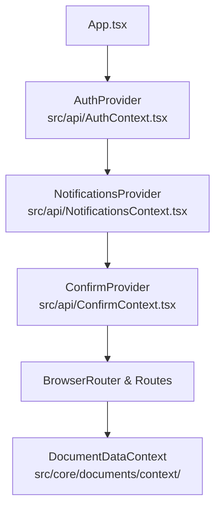

# Servicios, Hooks Especializados y Gestión del Estado Global (Frontend Web)

## 1. Visión General de la Capa de Lógica y Estado

El cliente web de DOSIER (`dosier_web`) implementa una arquitectura desacoplada donde la lógica de negocio, las peticiones HTTP, la sincronización en tiempo real y el ciclo de vida de los componentes se canalizan a través de tres pilares modulares:

1. **Servicios de Dominio REST (`src/services/`):** Clientes fuertemente tipados que consumen los controladores de la Web API.
2. **Contextos Globales (`src/api/` y `src/core/documents/context/`):** Manejadores del ciclo de vida de la sesión, notificaciones en tiempo real, confirmaciones modulares y datos del documento activo.
3. **Hooks de Orquestación y Shell (`src/hooks/`, `src/components/DOSIER/shell/hooks/`, `src/core/cowork/hooks/`):** Manejo de estados complejos, autoguardado con debounce, persistencia Yjs CRDT y monitoreo de conectividad.

---

## 2. Catálogo de Servicios de Dominio (`src/services/`)

### 2.1. `peaService.ts`: Orquestación Curricular del PEA
Es el servicio troncal del sistema. Conecta directamente con `/api/pea` e implementa:
* **Tipado Completo de Secciones (A - K):** DTOs para unidades (`PeaUnidadDto`), subtemas (`PeaTemaDto`), resultados de aprendizaje (`PeaResultadoAprendizajeDto`), actividades prácticas (`PeaActividadPracticaDto`), criterios de evaluación (`PeaEvaluacionDto`), bibliografía APA 7ma (`PeaBibliografiaDto`), observaciones colegiadas (`PeaObservacionDto`) y trazabilidad de firmas.
* **Operaciones CRUD Curriculares:**
  * `getPeaById(id: number | string)` / `getPeaByUuid(uuid: string)`: Obtiene el instrumento completo estructurado.
  * `createPea(payload)`: Inicialización formal del PEA articulado a `detallemallas`.
  * `updatePeaSection(peaId, sectionName, data)`: Actualización atómica de secciones individuales.
* **Control de Workflow y Circuitos de Firma:**
  * `cambiarEstadoPea(id, nuevoEstado, observaciones)`: Transición entre estados de la máquina colegiada.
  * `firmarPeaDocente(id, payloadFirma)`: Estampado de firma del docente elaborador y envío a revisión.
  * `emitirAvalCarrera(id, payloadFirma)`: Certificación técnica del Coordinador de Carrera.
  * `emitirAvalAcademico(id, payloadFirma)`: Certificación metodológica de Coordinación Académica.
  * `legalizarPeaVicerrector(id, payloadFirma)`: Aprobación final y congelamiento inmutable SHA-256.
* **Gestión de Observaciones Colegiadas:**
  * `crearObservacion(peaId, payload)`: Registro de inconsistencias disciplinares o metodológicas.
  * `subsanarObservacion(observacionId, respuesta)`: Respuesta formal y descargo del docente.
* **Bandeja de Supervisión y Balance de Horas:**
  * `getSupervisionTray(filters)`: Consulta optimizada de la nómina de PEAs con paginación, filtros por carrera y avance del circuito de firmas.
  * `verificarBalanceHoras(id)`: Validación matemática en tiempo real contra `detallemallas`.

### 2.2. `normativaService.ts`: Repositorio de Normativas y Checklist Curricular
Conecta con `/api/normativas` y provee:
* `getNormativas()`: Lista de resoluciones de nivel superior (CES, CACES, SENESCYT) y modelos educativos del ISTPET.
* `getChecklistCurricular()`: Matriz de verificación automática de cumplimiento normativo (Art. 21 y 27 del CES RRA).
* `getModeloEducativoVigente()`: Directrices pedagógicas activas para la formulación de estrategias didácticas.

### 2.3. `docenteAsignaturasService.ts`: Contexto Académico SIGAFI
Conecta con `/api/docente-asignaturas`:
* `getAsignaturasDocente()`: Recupera la carga horaria, paralelos, mallas y carreras asignadas al docente autenticado directamente desde la base de datos `sigafi_es`.

### 2.4. `signaturesService.ts`: Criptografía y Sellos Digitales
Conecta con `/api/signatures`:
* `firmarDocumentoP12(formData)`: Envío del archivo PKCS#12 (`.p12` / `.pfx`) con contraseña para firma avanzada.
* `firmarDocumentoHMAC(payload)`: Sellado institucional mediante credenciales seguras.
* `verificarFirmaPublica(traceabilityCode)`: Comprobación forense sin requerimiento de login.

### 2.5. `calendarioService.ts`: Cronograma Curricular e iCalendar
Conecta con `/api/calendario`:
* `getEventosCalendario()`: Fechas límite de entrega, períodos de subsanación y convocatorias académicas.
* `exportarICalendar()`: Generación de archivo `.ics` para sincronización con Microsoft Outlook y Google Calendar.

---

## 3. Contextos Globales del Sistema (`src/api/` y `src/core/`)

### 3.1. `AuthContext.tsx`: Sesión, Tokens JWT y Roles Curriculares
* **Gestión de Identidad:** Mantiene en memoria el objeto `user` con cédula, nombres, apellidos, correo institucional y el arreglo de roles asignados.
* **Control de Tokens:** Administra el ciclo de vida del JWT, persistencia segura en `localStorage` y renovación automática contra `/api/auth/refresh-token`.
* **Guardias y Evaluadores:**
  * `hasRole(role)`: Comprobación de membresía en roles institucionales (`DOSIER_DOCENTE`, `DOSIER_COORD_CARRERA`, etc.).
  * `canSignPea(stage)`: Autorización estricta para firma en etapas del workflow.

### 3.2. `NotificationsContext.tsx`: Alertas en Tiempo Real
* Conexión con el WebSocket de SignalR (`/collaborationHub`).
* Despacho de notificaciones emergentes (Toasts) y mantenimiento del contador de alertas no leídas en el encabezado.

### 3.3. `ConfirmContext.tsx`: Diálogos Modales Asíncronos
* Provee la función `confirm({ title, message, confirmText, cancelText })` retornando una promesa `Promise<boolean>`, sustituyendo diálogos nativos del navegador por modales con diseño Vercel Geist y fondos 100% sólidos.

### 3.4. `DocumentDataContext.ts`: Contexto del Instrumento en Edición
* Provee a todos los componentes hijos del constructor el snapshot activo del documento, estado de bloqueo (*StateLockingGuard*) y funciones de sincronización hacia el backend.

---

## 4. Hooks Especializados del Shell y CoWork

### 4.1. Hooks del Shell Curricular (`src/components/DOSIER/shell/hooks/`)
* **`useBuilderAutoSave.ts`:**
  * Implementa debounce configurable (1.5s a 3s) para guardar cambios automáticamente sin interrumpir la escritura del docente.
  * Control de bandera `isDirty` para advertir antes de cerrar la ventana con cambios pendientes.
* **`useBuilderLayout.ts`:**
  * Controla la visualización en vista de folios A4, alternancia de barras laterales y zoom tipográfico.
* **`useBuilderNetworkMonitor.ts`:**
  * Supervisa la latencia y estado de la conexión a internet, disparando avisos si se pierde la sincronización con el servidor.
* **`useBuilderPdfAndSign.ts`:**
  * Orquesta el renderizado en segundo plano del PDF oficial vía `/api/documents/preview`, cálculo del hash y despliegue del modal de firma.

### 4.2. Hooks del Subsistema CoWork (`src/core/cowork/hooks/`)
* **`useCoWork.ts`:**
  * Suscribe un campo de texto al tipo compartido Yjs (`Y.Text`).
  * Emite y recibe actualizaciones delta en formato binario comprimido mediante WebSocket SignalR.
* **`useCoWorkPresence.ts`:**
  * Mantiene la lista de docentes activos concurrentes en el mismo PEA, con indicadores de color y nombres en cursores remotos.

---

## 5. Catálogo de Componentes UI Comunes (`src/components/Common/`)

| Componente | Archivo | Funcionalidad y Especificación Visual |
| :--- | :--- | :--- |
| **`GeistSelect`** | `GeistSelect.tsx` | Selector desplegable accesible con búsqueda integrada. Menú con **fondo 100% sólido** (`bg-white dark:bg-zinc-950`) y cero transparencias. |
| **`GeistDatePicker`** | `GeistDatePicker.tsx` | Selector de fechas adaptado al calendario académico del ISTPET con validación de rangos. |
| **`GeistCalendar`** | `GeistCalendar.tsx` | Calendario mensual interactivo con marcadores visuales para hitos de entrega. |
| **`CommandPalette`** | `CommandPalette.tsx` | Paleta de comandos rápidos global (`Ctrl + K` / `Cmd + K`) para navegación inmediata a asignaturas, PEAs y configuraciones. |
| **`MemberSearchSelector`** | `MemberSearchSelector.tsx` | Selector predictivo de docentes de cátedra y miembros de comisiones con búsqueda por cédula o apellido. |
| **`TimedSuccessModal`** | `TimedSuccessModal.tsx` | Modal con temporizador visual para confirmar el sellado exitoso de un PEA o firma registrada. |
| **`StickyNotesFloatingButton`** | `StickyNotesFloatingButton.tsx` | Botón flotante para anotaciones rápidas de trabajo docente durante la planificación curricular. |
| **`ProximosEventosWidget`** | `ProximosEventosWidget.tsx` | Widget de escritorio para visualizar plazos perentorios del cronograma académico. |
| **`FullscreenLoader`** | `FullscreenLoader.tsx` | Pantalla de carga sobria con diseño editorial para transiciones de lazy loading en React Router. |
| **`BentoGrid`** | `BentoGrid.tsx` | Cuadrícula modular para distribución uniforme de indicadores y accesos directos. |
