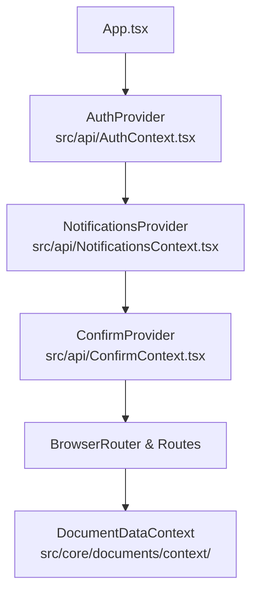

# Servicios, Hooks Especializados y Gestión del Estado Global (Frontend Web)

## 1. Visión General de la Capa de Lógica y Estado

El cliente web de DOSIER (`dosier_web`) implementa una arquitectura desacoplada donde la lógica de negocio, las peticiones HTTP, la sincronización en tiempo real y el ciclo de vida de los componentes se canalizan a través de tres pilares modulares:

1. **Servicios de Dominio REST (`src/services/`):** Clientes fuertemente tipados que consumen los controladores de la Web API.
2. **Contextos Globales (`src/api/` y `src/core/documents/context/`):** Manejadores del ciclo de vida de la sesión, notificaciones en tiempo real, confirmaciones modulares y datos del documento activo.
3. **Hooks de Orquestación y Shell (`src/hooks/`, `src/components/DOSIER/shell/hooks/`, `src/core/cowork/hooks/`):** Manejo de estados complejos, autoguardado con debounce, persistencia Yjs CRDT y monitoreo de conectividad.

---

## 2. Catálogo de Servicios de Dominio (`src/services/`)

### 2.1. `peaService.ts`: Orquestación Curricular del PEA
Es el servicio troncal del sistema. Conecta directamente con `/api/pea` e implementa:
* **Tipado Completo de Secciones (A - K):** DTOs para unidades (`PeaUnidadDto`), subtemas (`PeaTemaDto`), resultados de aprendizaje (`PeaResultadoAprendizajeDto`), actividades prácticas (`PeaActividadPracticaDto`), criterios de evaluación (`PeaEvaluacionDto`), bibliografía APA 7ma (`PeaBibliografiaDto`), observaciones colegiadas (`PeaObservacionDto`) y trazabilidad de firmas.
* **Operaciones CRUD Curriculares:**
  * `getPeaById(id: number | string)` / `getPeaByUuid(uuid: string)`: Obtiene el instrumento completo estructurado.
  * `createPea(payload)`: Inicialización formal del PEA articulado a `detallemallas`.
  * `updatePeaSection(peaId, sectionName, data)`: Actualización atómica de secciones individuales.
* **Control de Workflow y Circuitos de Firma:**
  * `cambiarEstadoPea(id, nuevoEstado, observaciones)`: Transición entre estados de la máquina colegiada.
  * `firmarPeaDocente(id, payloadFirma)`: Estampado de firma del docente elaborador y envío a revisión.
  * `emitirAvalCarrera(id, payloadFirma)`: Certificación técnica del Coordinador de Carrera.
  * `emitirAvalAcademico(id, payloadFirma)`: Certificación metodológica de Coordinación Académica.
  * `legalizarPeaVicerrector(id, payloadFirma)`: Aprobación final y congelamiento inmutable SHA-256.
* **Gestión de Observaciones Colegiadas:**
  * `crearObservacion(peaId, payload)`: Registro de inconsistencias disciplinares o metodológicas.
  * `subsanarObservacion(observacionId, respuesta)`: Respuesta formal y descargo del docente.
* **Bandeja de Supervisión y Balance de Horas:**
  * `getSupervisionTray(filters)`: Consulta optimizada de la nómina de PEAs con paginación, filtros por carrera y avance del circuito de firmas.
  * `verificarBalanceHoras(id)`: Validación matemática en tiempo real contra `detallemallas`.

### 2.2. `normativaService.ts`: Repositorio de Normativas y Checklist Curricular
Conecta con `/api/normativas` y provee:
* `getNormativas()`: Lista de resoluciones de nivel superior (CES, CACES, SENESCYT) y modelos educativos del ISTPET.
* `getChecklistCurricular()`: Matriz de verificación automática de cumplimiento normativo (Art. 21 y 27 del CES RRA).
* `getModeloEducativoVigente()`: Directrices pedagógicas activas para la formulación de estrategias didácticas.

### 2.3. `docenteAsignaturasService.ts`: Contexto Académico SIGAFI
Conecta con `/api/docente-asignaturas`:
* `getAsignaturasDocente()`: Recupera la carga horaria, paralelos, mallas y carreras asignadas al docente autenticado directamente desde la base de datos `sigafi_es`.

### 2.4. `signaturesService.ts`: Criptografía y Sellos Digitales
Conecta con `/api/signatures`:
* `firmarDocumentoP12(formData)`: Envío del archivo PKCS#12 (`.p12` / `.pfx`) con contraseña para firma avanzada.
* `firmarDocumentoHMAC(payload)`: Sellado institucional mediante credenciales seguras.
* `verificarFirmaPublica(traceabilityCode)`: Comprobación forense sin requerimiento de login.

### 2.5. `calendarioService.ts`: Cronograma Curricular e iCalendar
Conecta con `/api/calendario`:
* `getEventosCalendario()`: Fechas límite de entrega, períodos de subsanación y convocatorias académicas.
* `exportarICalendar()`: Generación de archivo `.ics` para sincronización con Microsoft Outlook y Google Calendar.

### 2.6. `authService.ts`: Autenticación, Credenciales y Recuperación
Conecta con `/api/auth`:
* `recuperarContrasenia(dto)`: Emite solicitudes de recuperación de contraseña institucional (cédula/correo).
* `verContrasenia(token)`: Valida el token de un solo uso y entrega la contraseña o delega al restablecimiento por hash.
* `restablecerContraseniaRecuperacion(dto)`: Restablece la contraseña mediante el token de recuperación de autoservicio.
* `revertirContraseniaAlerta(dto)`: Reversión de emergencia ante alertas de seguridad y revocación de sesiones.
* `cambiarContrasenia(dto)`: Actualización de contraseña para usuarios con sesión activa.

### 2.7. `recycleBinService.ts`: Gestión de Papelera y Restauración
Conecta con `/api/recyclebin`:
* `getDeletedProjects()`: Obtiene la nómina de proyectos o instrumentos curriculares archivados/eliminados.
* `restoreProject(uuid)`: Recupera un instrumento curricular a su estado activo previo.
* `purgeProject(uuid)`: Purgado irreversible del registro y sus dependencias.

### 2.8. `notificacionesService.ts`: Mensajería In-App y Transaccional
Conecta con `/api/Admin/notifications`:
* `getMyNotifications(limit)`: Consulta paginada o total de alertas del usuario autenticado.
* `markAsRead(uuid)`: Actualización del estado de lectura individual.
* `markAllAsRead()`: Limpieza global de marcas de lectura pendientes.
* `deleteNotification(uuid)`: Remoción individual de alertas del historial.
* `clearReadNotifications()`: Vaciado atómico de notificaciones leídas.

### 2.9. `verificationService.ts`: Verificación Forense Pública de Documentos
Conecta con `/api/documents`:
* `verifyDocument(code)`: Validación pública sin autenticación previa mediante código de trazabilidad o firma DFRM.

### 2.10. `lopdpService.ts`: Cumplimiento y Protección de Datos Personales
Conecta con `/api/lopdp`:
* `registrarConsentimiento(versionPolitica)`: Registro de consentimiento explícito e inmutable.
* `getConsentimientos()`: Auditoría y trazabilidad histórica de consentimientos para administradores.

### 2.11. `monitoreoService.ts`: Monitoreo y Avance Curricular
Conecta con `/api/projects`:
* `getProjectDetail(projectUuid)`: Resuelve el estado técnico, docente responsable y trazabilidad para la vista satélite de monitoreo.

### 2.12. `analyticsService.ts`: Indicadores y Reportes CACES
Conecta con `/api/projects` y `/api/catalogs`:
* `getProjects()`: Datos de proyectos para agregación analítica reactiva.
* `getStats()`: Totales, estados y presupuestos consolidados.
* `getCarreras()`: Catálogo de carreras para segmentación curricular.

### 2.13. `usersService.ts`: Administración de Usuarios y Roles Institucionales
Conecta con `/api/Admin`:
* `getUsers(params)`: Consulta paginada, tipada y filtrada de usuarios y docentes.
* `getUserByUuid(uuid, type)`: Perfil detallado de usuario.
* `getRoles()`: Catálogo oficial de roles del sistema.
* `getDepartments()`: Listado de departamentos institucionales.
* `assignRole(dto)` / `revokeRole(dto)`: Asignación y revocación segura de roles curriculares.
* `createExternalUser(dto)`: Registro de usuarios externos o pares evaluadores.
* `getUserMetadata(uuid)` / `updateUserMetadata(uuid, meta)`: Gestión de metadatos de usuario.

### 2.14. `auditService.ts`: Auditoría Forense y Trazabilidad
Conecta con `/api/Admin/audit`:
* `getAuditLogs(params)`: Consulta avanzada con filtros temporales, de módulo, de acción y paginación.

### 2.15. `emailService.ts`: Motor de Correos y Plantillas SMTP
Conecta con `/api/Admin/email-engine`:
* `getEmailHistory(limit)`: Bitácora de correos emitidos por el servidor.
* `getTemplates()`: Catálogo de plantillas institucionales.
* `createTemplate(dto)` / `updateTemplate(id, dto)` / `deleteTemplate(id)`: Operaciones CRUD sobre plantillas.
* `sendEmail(payload)`: Despacho manual o programado de notificaciones por correo.

### 2.16. `configuracionService.ts`: Configuración Curricular y Calendario Normativo
Conecta con `/api/catalogs` y `/api/calendario`:
* `getPeriodos()` / `createPeriodo(dto)` / `updatePeriodo(id, dto)` / `deletePeriodo(id)`: Ciclo de vida de períodos académicos institucionales.
* `getEventosNormativos()` / `createEventoNormativo(dto)` / `updateEventoNormativo(uuid, dto)` / `deleteEventoNormativo(uuid)`: Hitos y fechas límite institucionales obligatorias.

### 2.17. `documentMaintenanceService.ts`: Mantenimiento Físico y Copias de Seguridad
Conecta con `/api/documents/instances/maintenance` y `/api/admin/backups`:
* `getDiagnosis()`: Detección de versiones preliminares obsoletas en disco.
* `purgeSingle(uuid)` / `purgeAll()`: Depuración de PDFs físicos respetando la retención de 5 años exigida por CACES.
* `getBackups()` / `getDiskInfo()` / `triggerBackup()` / `verifyIntegrity(uuid)` / `purgeBackup(uuid)` / `downloadBackup(uuid)`: Gestión de copias de seguridad de base de datos y uploads.

### 2.18. `documentInstanceService.ts`: Instancias Documentales Curriculares
Conecta con `/api/documents/instances`:
* `getByEntity(entityUuid)`: Lista de instancias documentales asociadas a una entidad curricular.
* `getGlobal()`: Nómina de instancias documentales globales no vinculadas a una entidad específica.
* `resolve(params)`: Resolución dinámica y creación perezosa de la instancia de documento requerida.
* `getById(instanceUuid)`: Consulta de snapshot y metadatos del expediente.
* `createInstance(payload)`: Creación manual de un nuevo expediente documental.
* `updateMetadata(instanceUuid, metadata)`: Actualización del snapshot JSON y metadatos de la instancia.
* `getUiConfig(instanceUuid)`: Configuración de secciones e interfaz de una instancia activa.
* `getTemplateUiConfig(templateCode)`: Configuración de bloques por defecto de una plantilla documental.
* `getCatalogByUrl(url)`: Obtención de catálogos dinámicos vinculados a campos de la plantilla.
* `upgradeTemplate(instanceUuid)`: Adaptación del expediente a la última versión publicada de la plantilla.
* `renderDocumentPdf(templateCode, formData, isDraft, isBlind)`: Renderizado preliminar o definitivo de PDF en el motor documental.
* `getInstancePdf(instanceUuid)`: Descarga del PDF firmado o consolidado del documento.
* `getStorageFile(cleanPath)`: Descarga de adjuntos binarios desde el almacenamiento institucional.

### 2.19. `curriculumProjectService.ts`: Gestión de Proyectos Curriculares y Workspace
Conecta con `/api/projects` y `/api/pea`:
* `getProjectDetail(uuid, isPeaTemplate)`: Consulta detallada del PEA o proyecto curricular.
* `getAllProjects()`: Nómina global de proyectos curriculares (vista administrativa).
* `getMyProjects()`: Nómina de proyectos asociados al usuario autenticado.
* `deleteProject(uuid)`: Envío de proyecto a la papelera curricular.
* `generatePdf(projectData, isDraft)`: Generación de PDF de borrador o consolidado.
* `getConvocatorias()`: Nómina oficial de convocatorias curriculares e institucionales.
* `searchGroups(queryClean, options)`: Búsqueda reactiva de grupos de investigación y cuerpos colegiados.
* `getActivity(uuid, params)`: Bitácora de actividad curricular en el workspace.
* `getTeamChangeRequests(uuid)` / `createTeamChangeRequest(uuid, payload)` / `reviewTeamChangeRequest(uuid, reqUuid, payload)`: Solicitudes y resoluciones de cambio de integrantes de equipo.
* `transferDirector(uuid, payload)`: Reasignación de dirección institucional de proyecto.
* `updateTeam(uuid, payload)`: Actualización de integrantes de equipo.
* `iniciarEjecucion(uuid)`: Habilitación de la fase de ejecución.
* `getTraceability(uuid)`: Historial de cambios de estado curricular.
* `transitionState(uuid, newState, observation)`: Transición formal entre etapas con registro de observaciones.
* `getDocenteCarreras()`: Catálogo de carreras asignadas al docente autenticado.

### 2.20. `documentTemplateService.ts`: Gestión de Plantillas Documentales y Tema Global
Conecta con `/api/admin/templates`:
* `getTemplates()`: Catálogo completo de plantillas institucionales habilitadas.
* `getGlobalTheme()` / `updateGlobalTheme(themeConfigJson)`: Configuración del diseño visual global institucional (portada, colores, tipografía).
* `getTemplateByCode(code)`: Definición estructural y bloques de la plantilla.
* `getTemplateUsageCount(code)`: Contador de documentos activos que emplean la plantilla.
* `publishTemplate(code, payload)`: Publicación oficial de una nueva versión estructural de la plantilla.
* `resetToDefault(code)`: Restablecimiento de fábrica a los bloques estándar institucionales.
* `reorderTemplates(codes)`: Persistencia del orden de visualización de plantillas.
* `updateSignatureConfig(code, signatureConfigJson)`: Configuración de ranuras y requerimientos de firma digital para la plantilla.

### 2.21. `collaborationService.ts`: Colaboración en Tiempo Real, Comentarios y Archivos
Conecta con `/api/collaboration`:
* `getComments(entityUuid)`: Lista de comentarios y retroalimentación técnica de una sección o documento.
* `createComment(payload)`: Creación de nueva observación curricular o nota técnica.
* `updateComment(id, payload)`: Modificación de contenido de un comentario.
* `deleteComment(id)`: Eliminación de observación técnica.
* `getPulse(projectUuid)`: Pulso de concurrencia, comentarios acumulados y estados de secciones.
* `uploadFile(formData, onProgress)`: Carga segura de adjuntos y notas de voz para retroalimentación curricular.
* `deleteImage(imageUrl)`: Eliminación física de imágenes embebidas en el editor colaborativo.

---

## 3. Contextos Globales del Sistema (`src/api/` y `src/core/`)

### 3.1. `AuthContext.tsx`: Sesión, Tokens JWT y Roles Curriculares
* **Gestión de Identidad:** Mantiene en memoria el objeto `user` con cédula, nombres, apellidos, correo institucional y el arreglo de roles asignados.
* **Control de Tokens:** Administra el ciclo de vida del JWT, persistencia segura en `localStorage` y renovación automática contra `/api/auth/refresh-token`.
* **Guardias y Evaluadores:**
  * `hasRole(role)`: Comprobación de membresía en roles institucionales (`DOSIER_DOCENTE`, `DOSIER_COORD_CARRERA`, etc.).
  * `canSignPea(stage)`: Autorización estricta para firma en etapas del workflow.

### 3.2. `NotificationsContext.tsx`: Alertas en Tiempo Real
* Conexión con el WebSocket de SignalR (`/collaborationHub`).
* Despacho de notificaciones emergentes (Toasts) y mantenimiento del contador de alertas no leídas en el encabezado.

### 3.3. `ConfirmContext.tsx`: Diálogos Modales Asíncronos
* Provee la función `confirm({ title, message, confirmText, cancelText })` retornando una promesa `Promise<boolean>`, sustituyendo diálogos nativos del navegador por modales con diseño Vercel Geist y fondos 100% sólidos.

### 3.4. `DocumentDataContext.ts`: Contexto del Instrumento en Edición
* Provee a todos los componentes hijos del constructor el snapshot activo del documento, estado de bloqueo (*StateLockingGuard*) y funciones de sincronización hacia el backend.

---

## 4. Hooks Especializados del Shell y CoWork

### 4.1. Hooks del Shell Curricular (`src/components/DOSIER/shell/hooks/`)
* **`useBuilderAutoSave.ts`:**
  * Implementa debounce configurable (1.5s a 3s) para guardar cambios automáticamente sin interrumpir la escritura del docente.
  * Control de bandera `isDirty` para advertir antes de cerrar la ventana con cambios pendientes.
* **`useBuilderLayout.ts`:**
  * Controla la visualización en vista de folios A4, alternancia de barras laterales y zoom tipográfico.
* **`useBuilderNetworkMonitor.ts`:**
  * Supervisa la latencia y estado de la conexión a internet, disparando avisos si se pierde la sincronización con el servidor.
* **`useBuilderPdfAndSign.ts`:**
  * Orquesta el renderizado en segundo plano del PDF oficial vía `/api/documents/preview`, cálculo del hash y despliegue del modal de firma.

### 4.2. Hooks del Subsistema CoWork (`src/core/cowork/hooks/`)
* **`useCoWork.ts`:**
  * Suscribe un campo de texto al tipo compartido Yjs (`Y.Text`).
  * Emite y recibe actualizaciones delta en formato binario comprimido mediante WebSocket SignalR.
* **`useCoWorkPresence.ts`:**
  * Mantiene la lista de docentes activos concurrentes en el mismo PEA, con indicadores de color y nombres en cursores remotos.

---

## 5. Catálogo de Componentes UI Comunes (`src/components/Common/`)

| Componente | Archivo | Funcionalidad y Especificación Visual |
| :--- | :--- | :--- |
| **`GeistSelect`** | `GeistSelect.tsx` | Selector desplegable accesible con búsqueda integrada. Menú con **fondo 100% sólido** (`bg-white dark:bg-zinc-950`) y cero transparencias. |
| **`GeistDatePicker`** | `GeistDatePicker.tsx` | Selector de fechas adaptado al calendario académico del ISTPET con validación de rangos. |
| **`GeistCalendar`** | `GeistCalendar.tsx` | Calendario mensual interactivo con marcadores visuales para hitos de entrega. |
| **`CommandPalette`** | `CommandPalette.tsx` | Paleta de comandos rápidos global (`Ctrl + K` / `Cmd + K`) para navegación inmediata a asignaturas, PEAs y configuraciones. |
| **`MemberSearchSelector`** | `MemberSearchSelector.tsx` | Selector predictivo de docentes de cátedra y miembros de comisiones con búsqueda por cédula o apellido. |
| **`TimedSuccessModal`** | `TimedSuccessModal.tsx` | Modal con temporizador visual para confirmar el sellado exitoso de un PEA o firma registrada. |
| **`StickyNotesFloatingButton`** | `StickyNotesFloatingButton.tsx` | Botón flotante para anotaciones rápidas de trabajo docente durante la planificación curricular. |
| **`ProximosEventosWidget`** | `ProximosEventosWidget.tsx` | Widget de escritorio para visualizar plazos perentorios del cronograma académico. |
| **`FullscreenLoader`** | `FullscreenLoader.tsx` | Pantalla de carga sobria con diseño editorial para transiciones de lazy loading en React Router. |
| **`BentoGrid`** | `BentoGrid.tsx` | Cuadrícula modular para distribución uniforme de indicadores y accesos directos. |
