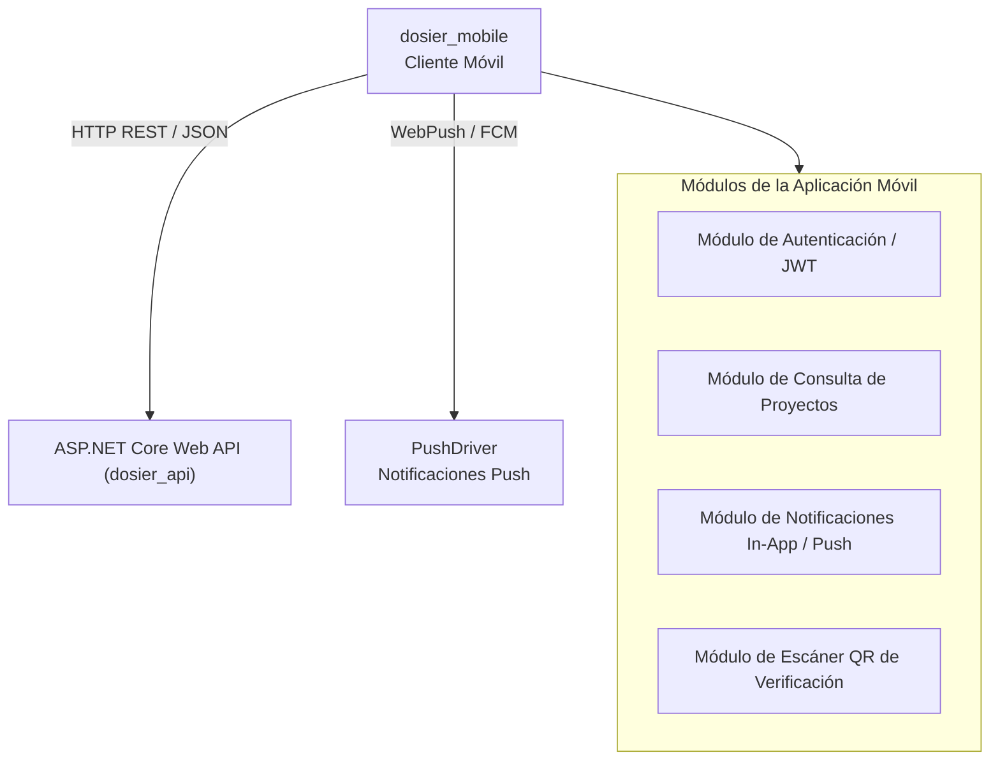

# Arquitectura de Aplicación Móvil Docente

## 1. Visión General del Cliente Móvil

El proyecto `dosier_mobile` proporciona la interfaz móvil para el cuerpo docente y las autoridades del ISTT, permitiendo la consulta del estado de proyectos de investigación, la recepción de notificaciones push transaccionales, la aprobación de resoluciones y la verificación de documentos.

El cliente interactúa directamente con los controladores RESTful expuestos por `dosier_api`.

---

## 2. Diagrama de Integración Móvil

---

## 3. Funcionalidades y Módulos de la Aplicación Móvil

### 3.1. Autenticación y Gestión de Sesión
* Permite el inicio de sesión mediante credenciales institucionales o Single Sign-On (SSO).
* Almacena de forma segura el JWT AccessToken en el almacenamiento encriptado del dispositivo (`SecureStorage` / `Keychain`).

### 3.2. Consulta de Proyectos y Notificaciones Push
* Expone el panel de seguimiento de proyectos asignados al docente (como Investigador Principal o Co-Investigador).
* Recibe notificaciones push en segundo plano enviadas a través de `PushDriver` (protocolo VAPID / FCM) ante eventos de aprobación, observaciones de evaluadores o cambios de estado.

### 3.3. Escáner e Inspección de Documentos vía QR
* Integra un lector de código QR con la cámara del dispositivo para la lectura instantánea de sellos institucionales.
* Redirige al endpoint público de validación de `DocumentInstancesController` para verificar la autenticidad e integridad del hash SHA-256 del documento físico.
