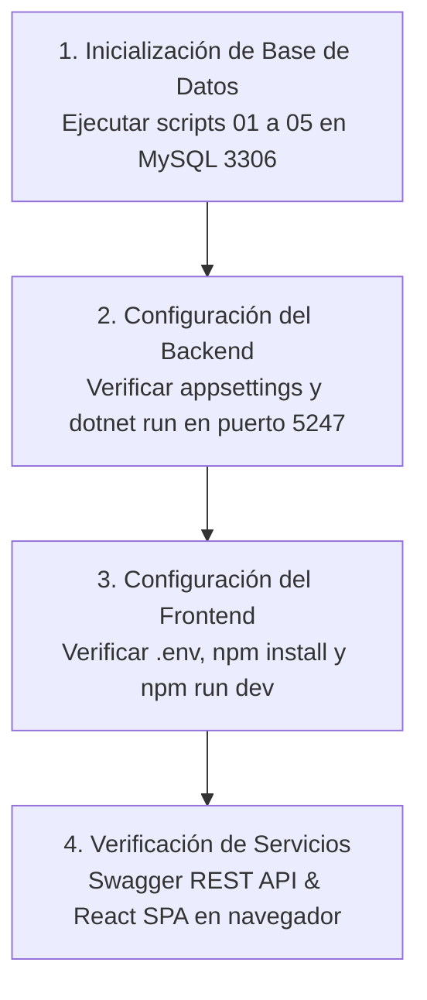

# Guía de Instalación y Configuración en Entorno de Desarrollo Local

## 1. Requisitos Previos del Sistema

Para la puesta en marcha, compilación y ejecución de la plataforma DOSIER en un entorno de desarrollo local, se requieren los siguientes entornos y herramientas:

| Componente | Versión Mínima | Propósito |
| :--- | :--- | :--- |
| **.NET SDK** | `8.0.x` | Compilación y ejecución de la solución backend (`backend/dosier.slnx`). |
| **Node.js** | `18.x` o `20.x LTS` | Entorno de ejecución para la SPA React (`dosier_web`). |
| **npm** | `9.x` o superior | Gestor de paquetes de dependencias del frontend. |
| **MySQL / MariaDB** | `8.0+` / `10.5+` | Motor de base de datos relacional (Puerto `3306`). |

---

## 2. Procedimiento de Instalación Paso a Paso



### Paso 1: Inicialización de la Base de Datos (`sigafi_es`)

1. Inicie el servicio de base de datos MySQL en el puerto local `3306`.
2. Asegúrese de que exista la base de datos `sigafi_es`. Si no existe, créela con cotejamiento compatible:
   ```sql
   CREATE DATABASE IF NOT EXISTS sigafi_es CHARACTER SET latin1 COLLATE latin1_swedish_ci;
   ```
3. Ejecute en orden estricto los **4 scripts SQL oficiales** ubicados en el directorio `scripts/base_datos/`:
   * **`01_sistema_base.sql`:** Crea la infraestructura base de plantillas, instancias documentales, firmas electrónicas, bitácora forense de auditoría, tablas de co-redacción concurrente CoWork y tablas LOPDP.
   * **`02_gobernanza_y_antecedentes_curriculares.sql`:** Despliega el repositorio de normativas de nivel superior (CES, CACES, SENESCYT), modelos educativos institucionales del ISTPET, proyectos de carrera aprobados y matriz de antecedentes epistemológicos de asignaturas.
   * **`03_curriculum_pea_oficial.sql`:** Crea la tabla maestra `cur_pea`, las 10 tablas específicas para las secciones oficiales A a la K del PEA institucional, colaboradores y versiones.
   * **`04_seguridad_rbac_roles_curriculares.sql`:** Registra a DOSIER como sistema oficial (ID 6: `"Gestión Curricular y Acreditación ISTPET"`), formaliza los 4 módulos curriculares, da de alta los 5 roles curriculares (`DOSIER_ADMIN`, `DOSIER_DOCENTE`, `DOSIER_COORD_CARRERA`, `DOSIER_COORD_ACAD`, `DOSIER_VICERRECTOR`), asocia permisos y sincroniza usuarios.

### Paso 2: Configuración y Ejecución del Backend (.NET 8.0)

1. Navegue al directorio del controlador API del backend:
   ```bash
   cd backend/dosier_api
   ```
2. Verifique o ajuste los parámetros de conexión en el archivo `appsettings.Development.json`:
   ```json
   {
     "ConnectionStrings": {
       "default_connection": "Server=127.0.0.1;Port=3306;Database=sigafi_es;User=root;Password=12345;"
     },
     "Jwt": {
       "Secret": "CLAVE_SECRETA_DE_ALTA_ENTROPIA_PARA_DESARROLLO_32_BYTES",
       "Issuer": "dosier.traversari.edu.ec",
       "Audience": "dosier-clients"
     }
   }
   ```
3. Restaure paquetes y ejecute el servidor de desarrollo:
   ```bash
   dotnet build
   dotnet run
   ```
4. El backend quedará escuchando en `http://localhost:5247` (o `https://localhost:7194`). La documentación interactiva OpenAPI/Swagger estará accesible en:
   ```text
   http://localhost:5247/swagger
   ```

### Paso 3: Configuración y Ejecución del Frontend (React 18 + Vite)

1. Navegue al directorio del cliente web:
   ```bash
   cd dosier_web
   ```
2. Verifique la configuración en el archivo `.env`:
   ```env
   VITE_API_BASE_URL=http://localhost:5247/api
   VITE_WS_URL=ws://localhost:5247/collaborationHub
   ```
3. Instale las dependencias de Node:
   ```bash
   npm install
   ```
4. Inicie el servidor de desarrollo de Vite:
   ```bash
   npm run dev
   ```
5. Acceda a la aplicación a través del navegador en la URL indicada por Vite (habitualmente `http://localhost:3010` o `http://localhost:5173`).

---

## 3. Verificación de Funcionamiento de la Plataforma

1. **Prueba de Autenticación y RBAC:** Ingrese a la plataforma con una cuenta docente o administrativa. Compruebe que el endpoint `/api/auth/login` emita el JWT y que `AuthContext` active la vista correspondiente a su rol.
2. **Prueba de Carga Horaria Curricular:** Acceda a la formulación de un PEA. Compruebe que los datos generales y la distribución horaria de docencia (CD), APE y autónomo se precarguen automáticamente desde `detallemallas`.
3. **Prueba de Co-Redacción Concurrente:** Abra la misma sección de contenidos temáticos del PEA en dos navegadores distintos con credenciales de docentes colaboradores. Verifique que la edición simultánea fluya sin bloqueos mediante SignalR y el componente `<CoWorkField>`.
